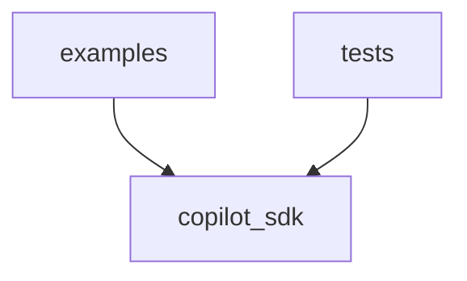

# Code Graph Review — copilot-sdk

**Generated by:** code_graph_review.py
**Root:** C:\Users\baner\CopyFolder\IoT_thoughts\python-projects\kaggle_experiments\claude_projects\copilot-sdk

## Summary

| Metric | Value |
|--------|-------|
| Total modules | 35 |
| Source modules | 30 |
| Test modules | 5 |
| Total lines | 3,616 |
| Source lines | 3,276 |
| Test lines | 340 |
| Classes | 27 |
| Top-level functions | 44 |
| External dependencies | 18 |
| Circular dependencies | 0 |
| Dead export candidates | 50 |

## Module Inventory

| Module | Lines | Classes | Functions | Internal Imports | External |
|--------|-------|---------|-----------|-----------------|----------|
| copilot_sdk\__init__.py | 21 | 0 | 0 | 1 | 0 |
| copilot_sdk\framework\__init__.py | 14 | 0 | 0 | 0 | 0 |
| copilot_sdk\framework\agent.py | 374 | 2 | 0 | 0 | 3 |
| copilot_sdk\framework\audit.py | 277 | 0 | 8 | 2 | 3 |
| copilot_sdk\framework\checkpoint.py | 164 | 1 | 0 | 0 | 6 |
| copilot_sdk\framework\composite_gate.py | 195 | 1 | 0 | 1 | 4 |
| copilot_sdk\framework\convergence_math.py | 45 | 0 | 2 | 0 | 1 |
| copilot_sdk\framework\decision_history.py | 66 | 1 | 0 | 0 | 3 |
| copilot_sdk\framework\economics.py | 90 | 1 | 0 | 0 | 1 |
| copilot_sdk\framework\event_bus.py | 119 | 4 | 0 | 0 | 4 |
| copilot_sdk\framework\feedback_base.py | 172 | 0 | 4 | 1 | 4 |
| copilot_sdk\framework\feedback_store.py | 14 | 0 | 0 | 0 | 1 |
| copilot_sdk\framework\iks_base.py | 120 | 0 | 4 | 0 | 4 |
| copilot_sdk\framework\intervention_controls.py | 362 | 1 | 0 | 1 | 6 |
| copilot_sdk\framework\learning_state.py | 166 | 0 | 4 | 1 | 9 |
| copilot_sdk\framework\narrative_base.py | 127 | 1 | 4 | 0 | 4 |
| copilot_sdk\framework\ols_status.py | 120 | 0 | 1 | 0 | 2 |
| copilot_sdk\framework\provenance.py | 354 | 3 | 6 | 0 | 4 |
| copilot_sdk\framework\shadow_mode.py | 118 | 1 | 0 | 0 | 3 |
| copilot_sdk\framework\similar_cases_base.py | 177 | 1 | 0 | 0 | 6 |
| copilot_sdk\protocols\__init__.py | 7 | 0 | 0 | 4 | 0 |
| copilot_sdk\protocols\domain_config.py | 23 | 1 | 0 | 0 | 1 |
| copilot_sdk\protocols\factor_computer.py | 16 | 1 | 0 | 0 | 1 |
| copilot_sdk\protocols\referral_rule.py | 18 | 1 | 0 | 0 | 1 |
| copilot_sdk\protocols\source_connector.py | 15 | 1 | 0 | 0 | 1 |
| examples\__init__.py | 0 | 0 | 0 | 0 | 0 |
| examples\hello_world\__init__.py | 0 | 0 | 0 | 0 | 0 |
| examples\hello_world\config.py | 35 | 1 | 0 | 0 | 0 |
| examples\hello_world\demo.py | 44 | 0 | 0 | 1 | 5 |
| examples\hello_world\factors.py | 23 | 2 | 1 | 1 | 1 |
| tests\__init__.py (test) | 0 | 0 | 0 | 0 | 0 |
| tests\test_discipline.py (test) | 155 | 3 | 0 | 1 | 5 |
| tests\test_framework_discipline.py (test) | 96 | 0 | 3 | 1 | 6 |
| tests\test_hello_world.py (test) | 59 | 0 | 3 | 1 | 5 |
| tests\test_protocols.py (test) | 30 | 0 | 4 | 1 | 4 |

## Class & Function Index

### copilot_sdk\framework\agent.py
- **class** `DecisionResult` (line 16)
- **class** `SOCAgent` (line 32)

### copilot_sdk\framework\audit.py
- **def** `_entry_to_dict` (line 67)
- **def** `record_decision` (line 90)
- **def** `record_outcome` (line 124)
- **def** `get_decisions` (line 148)
- **def** `reconstruct_from_memory` (line 157)
- **def** `reset_audit_state` (line 209)
- **def** `record_reset_marker` (line 216)
- **def** `verify_chain` (line 237)

### copilot_sdk\framework\checkpoint.py
- **class** `CheckpointService` (line 23)

### copilot_sdk\framework\composite_gate.py
- **class** `CompositeDiscriminant` (line 30)

### copilot_sdk\framework\convergence_math.py
- **def** `predict_n_half` (line 20)
- **def** `decisions_to_days` (line 39)

### copilot_sdk\framework\decision_history.py
- **class** `DecisionHistoryService` (line 18)

### copilot_sdk\framework\economics.py
- **class** `FrozenROICalculator` (line 4)

### copilot_sdk\framework\event_bus.py
- **class** `DecisionMade` (line 24)
- **class** `OutcomeVerified` (line 38)
- **class** `GraphMutated` (line 52)
- **class** `EventBus` (line 70)

### copilot_sdk\framework\feedback_base.py
- **def** `update_trust` (line 41)
- **def** `get_trust_status` (line 95)
- **def** `get_all_trust_scores` (line 115)
- **def** `get_reward_summary` (line 147)

### copilot_sdk\framework\iks_base.py
- **def** `_mean_centroid_drift` (line 34)
- **def** `compute_iks` (line 57)
- **def** `interpret` (line 99)
- **def** `interpret_iks_v2` (line 110)

### copilot_sdk\framework\intervention_controls.py
- **class** `InterventionControls` (line 31)

### copilot_sdk\framework\learning_state.py
- **def** `make_state` (line 41)
- **def** `load_from_file` (line 59)
- **def** `read_checkpoint_metadata` (line 105)
- **def** `save_state` (line 112)

### copilot_sdk\framework\narrative_base.py
- **class** `NarrativeProvider` (line 34)
- **def** `register_narrative_provider` (line 51)
- **def** `create_narrative_provider` (line 67)
- **def** `get_narrative_provider` (line 108)
- **def** `set_narrative_provider` (line 123)

### copilot_sdk\framework\ols_status.py
- **def** `get_ols_status` (line 16)

### copilot_sdk\framework\provenance.py
- **class** `FactorProvenance` (line 27)
- **class** `DecisionProvenance` (line 37)
- **class** `ProvenanceService` (line 230)
- **def** `_explain_travel_match` (line 49)
- **def** `_explain_asset_criticality` (line 73)
- **def** `_explain_threat_intel_enrichment` (line 101)
- **def** `_explain_pattern_history` (line 129)
- **def** `_explain_time_anomaly` (line 158)
- **def** `_explain_device_trust` (line 187)

### copilot_sdk\framework\shadow_mode.py
- **class** `ShadowModeService` (line 19)

### copilot_sdk\framework\similar_cases_base.py
- **class** `SimilarCasesBase` (line 40)

### copilot_sdk\protocols\domain_config.py
- **class** `DomainConfig` (line 10)

### copilot_sdk\protocols\factor_computer.py
- **class** `FactorComputer` (line 10)

### copilot_sdk\protocols\referral_rule.py
- **class** `ReferralRule` (line 9)

### copilot_sdk\protocols\source_connector.py
- **class** `SourceConnector` (line 9)

### examples\hello_world\config.py
- **class** `HelloWorldConfig` (line 10)

### examples\hello_world\factors.py
- **class** `ScoreAFactor` (line 5)
- **class** `ScoreBFactor` (line 12)
- **def** `compute_factor_vector` (line 22)

## Dependency Graph

## Coupling Metrics

| Directory | Efferent (Ce) | Afferent (Ca) | Instability |
|-----------|--------------|--------------|-------------|
| ci_platform | 0 | 1 | 0.0 |
| copilot_sdk | 11 | 6 | 0.647 |
| examples | 2 | 0 | 1.0 |
| gae | 0 | 1 | 0.0 |
| tests | 4 | 0 | 1.0 |

## Circular Dependencies

None detected.

## Dead Export Candidates

(Public names defined but never imported internally)

- `DecisionResult` at copilot_sdk\framework\agent.py:16
- `SOCAgent` at copilot_sdk\framework\agent.py:32
- `get_decisions` at copilot_sdk\framework\audit.py:148
- `reconstruct_from_memory` at copilot_sdk\framework\audit.py:157
- `record_decision` at copilot_sdk\framework\audit.py:90
- `record_outcome` at copilot_sdk\framework\audit.py:124
- `record_reset_marker` at copilot_sdk\framework\audit.py:216
- `reset_audit_state` at copilot_sdk\framework\audit.py:209
- `verify_chain` at copilot_sdk\framework\audit.py:237
- `CheckpointService` at copilot_sdk\framework\checkpoint.py:23
- `CompositeDiscriminant` at copilot_sdk\framework\composite_gate.py:30
- `decisions_to_days` at copilot_sdk\framework\convergence_math.py:39
- `predict_n_half` at copilot_sdk\framework\convergence_math.py:20
- `DecisionHistoryService` at copilot_sdk\framework\decision_history.py:18
- `FrozenROICalculator` at copilot_sdk\framework\economics.py:4
- `DecisionMade` at copilot_sdk\framework\event_bus.py:24
- `EventBus` at copilot_sdk\framework\event_bus.py:70
- `GraphMutated` at copilot_sdk\framework\event_bus.py:52
- `OutcomeVerified` at copilot_sdk\framework\event_bus.py:38
- `get_all_trust_scores` at copilot_sdk\framework\feedback_base.py:115
- `get_reward_summary` at copilot_sdk\framework\feedback_base.py:147
- `get_trust_status` at copilot_sdk\framework\feedback_base.py:95
- `update_trust` at copilot_sdk\framework\feedback_base.py:41
- `compute_iks` at copilot_sdk\framework\iks_base.py:57
- `interpret` at copilot_sdk\framework\iks_base.py:99
- `interpret_iks_v2` at copilot_sdk\framework\iks_base.py:110
- `InterventionControls` at copilot_sdk\framework\intervention_controls.py:31
- `load_from_file` at copilot_sdk\framework\learning_state.py:59
- `make_state` at copilot_sdk\framework\learning_state.py:41
- `read_checkpoint_metadata` at copilot_sdk\framework\learning_state.py:105
- `save_state` at copilot_sdk\framework\learning_state.py:112
- `NarrativeProvider` at copilot_sdk\framework\narrative_base.py:34
- `create_narrative_provider` at copilot_sdk\framework\narrative_base.py:67
- `get_narrative_provider` at copilot_sdk\framework\narrative_base.py:108
- `register_narrative_provider` at copilot_sdk\framework\narrative_base.py:51
- `set_narrative_provider` at copilot_sdk\framework\narrative_base.py:123
- `get_ols_status` at copilot_sdk\framework\ols_status.py:16
- `DecisionProvenance` at copilot_sdk\framework\provenance.py:37
- `FactorProvenance` at copilot_sdk\framework\provenance.py:27
- `ProvenanceService` at copilot_sdk\framework\provenance.py:230
- `ShadowModeService` at copilot_sdk\framework\shadow_mode.py:19
- `SimilarCasesBase` at copilot_sdk\framework\similar_cases_base.py:40
- `DomainConfig` at copilot_sdk\protocols\domain_config.py:10
- `FactorComputer` at copilot_sdk\protocols\factor_computer.py:10
- `ReferralRule` at copilot_sdk\protocols\referral_rule.py:9
- `SourceConnector` at copilot_sdk\protocols\source_connector.py:9
- `HelloWorldConfig` at examples\hello_world\config.py:10
- `ScoreAFactor` at examples\hello_world\factors.py:5
- `ScoreBFactor` at examples\hello_world\factors.py:12
- `compute_factor_vector` at examples\hello_world\factors.py:22

## External Dependencies

- __future__
- abc
- ast
- copilot_sdk
- dataclasses
- datetime
- examples
- gae
- importlib
- json
- logging
- numpy
- os
- pathlib
- sys
- tempfile
- typing
- uuid
