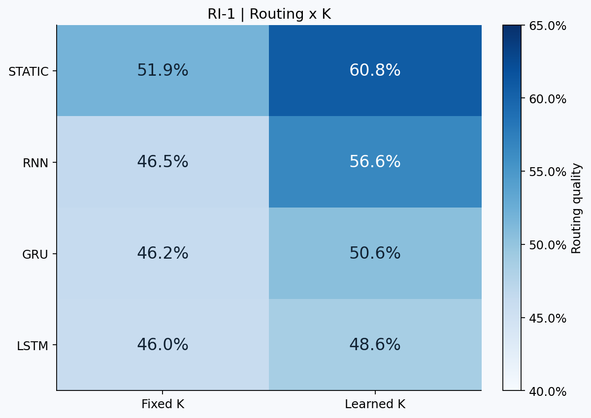
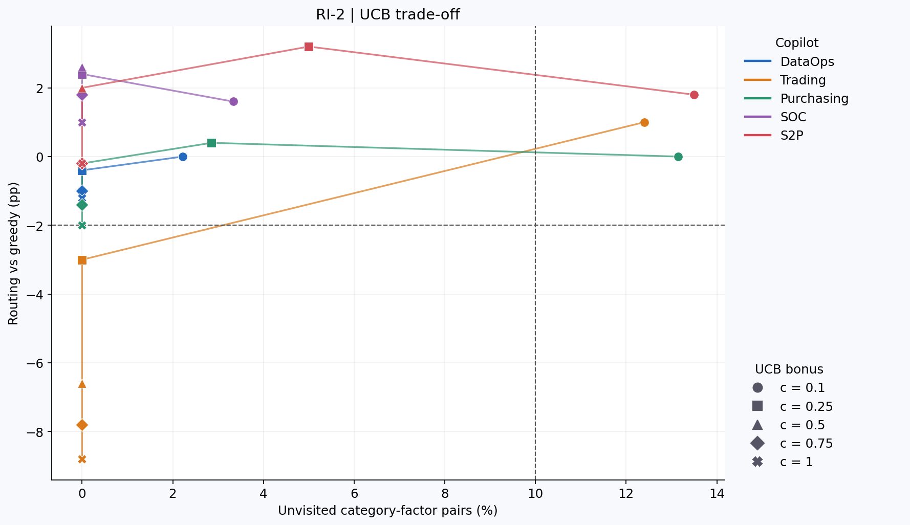
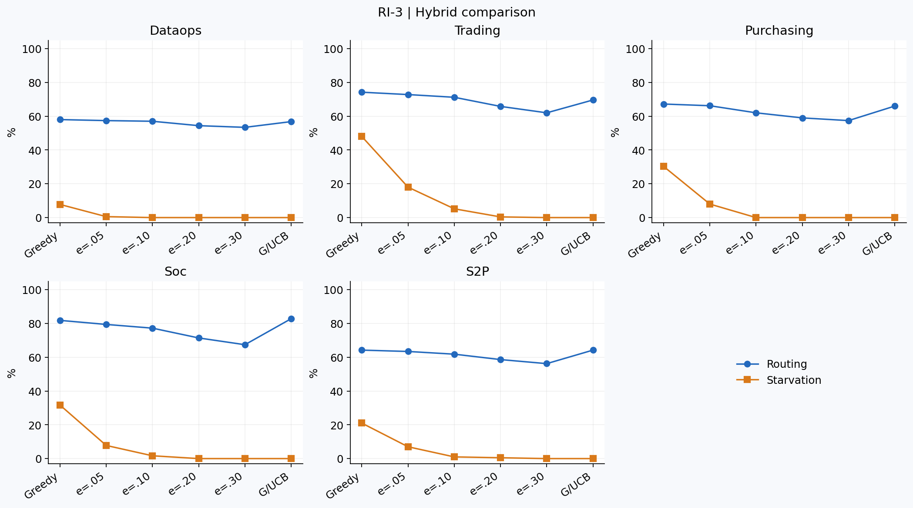
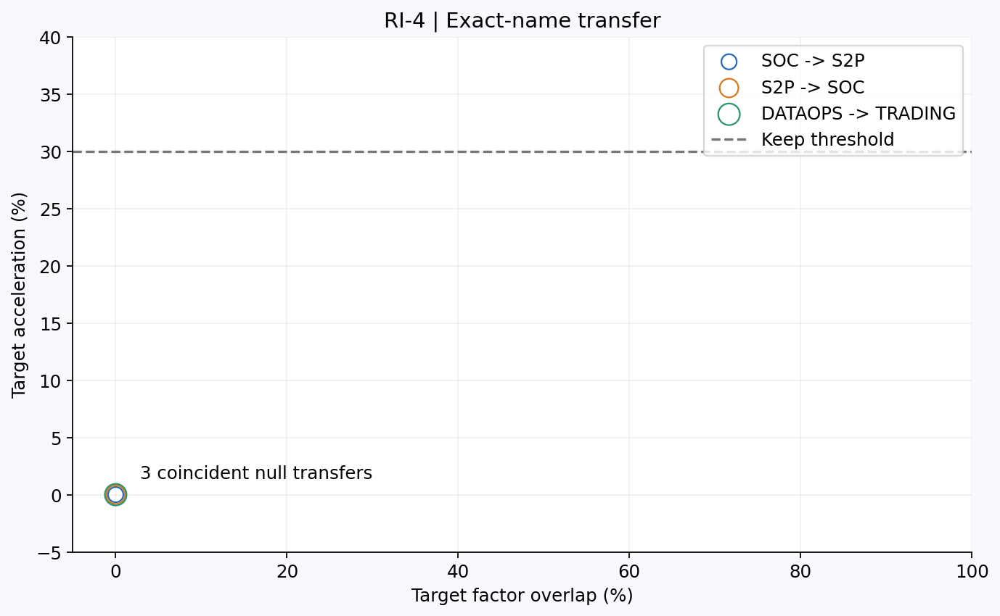
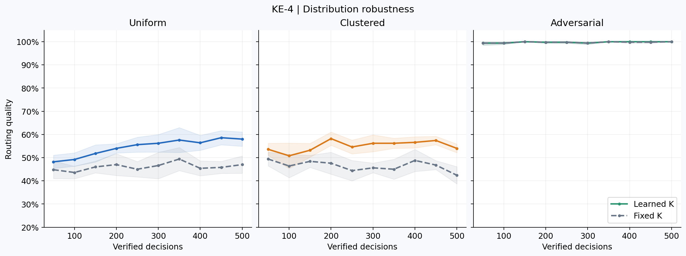
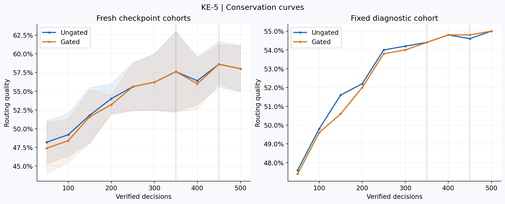

# Compounding Intelligence with Score-Conditioned Graph Investigation
## Recursive Graph Improvement for Enterprise Decisions

**Version:** v10 (Submission Draft) · **Date:** Sep 13, 2026

**Changes v9→v10**

1. Replaced the introduction with the RGI mechanism and measured, explicitly synthetic evidence.
2. Replaced §5.5's unmeasured recursion discussion with KE-1 and RI-1 findings.
3. Updated §0.10's L3 evidence tier and retained the operational-lifecycle gap.
4. Revised §1.4's safety claims to bounded risk mitigation; corrected EVOMAL's threat model.
5. Completed §10.4 with all five K curves, exact endpoint deltas, starvation definitions and the 2000-decision extension.
6. Added §10.5: state×K, exploration, learned-Q, negative results and category indexing, retaining preregistered failures.
7. Added §10.6's matched distribution and canonical conservation results.
8. Replaced §12.2 with four-axis routing findings and a qualified configuration recommendation.
9. Added five recurrence levels R1–R5 plus the R0 baseline; distinguished this manuscript taxonomy from the companion report's provisional numbering.
10. Replaced the current Q equation with the code's three additive terms and multiplicative K.
11. Replaced S2P-SC2's unreachable weights with a bounded PLANTED FIXTURE and conditional threshold arithmetic.
12. Recorded scorer parity paths, oracle separation, empty reads, ordered sweep checks, Tier 5 snapshot/contrast/halt behavior and reported test counts.
13. Corrected C4 classifier status, per-decision improvement claims and universal safety language throughout.
14. Updated L4 to NOT TESTABLE for the three zero-overlap transfer pairs.
15. Updated version/date, current tensor dimensions, terminology, source hashes and evidence qualifications; retained historical experiment geometry as historical.
16. Added Appendix A.1–A.25 with the complete requested tables, per-seed endpoint data, checkpoint trajectories, three metrics, raw-data provenance and interpretation rules.

**Evidence and source policy.** This is a complete submission draft derived from v9 and the supplied experiment artifacts. Existing simulation results retain their original cohorts and metrics. New efficacy evidence is exported production geometry with synthetic verification, not customer outcomes. When proposed prose conflicts with raw data or inspected code, the measured result and implementation take precedence. Appendix A includes the requested published result data and per-seed summaries; the linked JSONs retain the larger event-level records. This document does not claim to embed hundreds of megabytes of every training event.

### 0.0 Abstract — The RGI Story

Enterprise AI needs an explicit path from verified decisions to better future evidence acquisition. CI supplies such a mechanism. Usage alone does not update a fixed model or retrieval policy; a deployment must retain outcomes and use them to revise its decision process. We do not claim that every other enterprise AI system is incapable of adaptation.

CI introduces **Recursive Graph Improvement (RGI)**: retained decision experience changes the judgment graph's geometry and acquisition utilities. Centroids encode action profiles, precision records factor variability, K weights prioritize evidence, and conservation governs eligible adaptation. During an investigation, the system chooses which evidence to check before recommending an action. Across investigations, the intended production mechanism learns those priorities from verified human decisions. The experiments here isolate K updates on fixed exported centroids using synthetic verification.

Across five domains—security operations, procurement, trading, purchasing and data operations—the initial 500-decision study reports final learned-minus-fixed routing gains of **+0.03 to +0.21**, or **3–21 percentage points**, with zero observed final-checkpoint hurts. Relative gains are 4.8–43.2%; these are different denominators. A paired state×K experiment on DataOps finds Static+K at **60.8%** routing versus RNN+K at **56.6%**. Hand-set GRU and LSTM gates underperform both. RNN has the higher action-accuracy point estimate, so routing efficiency and decision accuracy must remain distinct.

The routing studies cover four design axes and fifteen new experiment families, plus two prior routing studies. They contain many more than fifteen individual parameter configurations. Category-conditional exploration in RI-7 reduces Trading selection starvation from **48.0% to 0.0%**, with routing **74.2%→74.8%**. It satisfies the later cross-domain routing/starvation screen, but fails its original requirement to improve the worst-routing copilot, DataOps. Learned linear Q coefficients provide **+1.4pp headroom** in the specified DataOps probe; this supports retaining the closed-form baseline, not a theorem of near-optimality over all trained routers.

RGI is positioned within the field of **Recursive Self-Improvement (RSI)** discussed by [Duan et al. (2026)](https://arxiv.org/abs/2609.11873). CI's declared scope reaches the L3 experience-acquisition mechanism and excludes L5 meta-improvement by design; operational L3 validation remains open. “Graph” names the retained, outcome-grounded substrate. It does not redefine “self” in the wider RSI literature. The separate EVOMAL threat model concerns malicious retrieved skills copied into persistent agent-authored tools (§1.4). Verified outcomes, bounded updates and read-only investigation address specified feedback risks, while leaving label error, source compromise, selection bias and distribution shift to be tested.

---

## §0: The Compounding Intelligence Platform

### 0.1 The Enterprise Learning Gap

A deployment can retain thousands of analyst decisions without using them to improve evidence selection. A fixed inference model, retrieval index or acquisition policy changes only when an explicit update process changes its state. The problem studied here is that missing feedback connection.

CI proposes a small, inspectable judgment state, updated through a governed process, that future investigations can reuse. This is an architectural choice and an empirical hypothesis about evidence acquisition. It is not a universal claim that agents, RAG pipelines or competing enterprise systems cannot learn. The measurements compare specified routing policies under matched synthetic conditions; they do not benchmark the entire enterprise AI market.

### 0.2 What CI Is

Compounding Intelligence (CI) uses a shared scoring engine across security operations, source-to-pay, DataOps, Trading and Purchasing. Its intended feedback path retains verified outcomes as inspectable decision state.

Four artifacts matter for RGI: category/action centroids, per-factor precision or noise diagnostics, category-specific acquisition utilities K, and conservation/governance state. Centroids summarize decision profiles; precision changes the scoring/acquisition geometry; K changes evidence priorities; governance controls eligible learning and action publication. These are distinct mechanisms, and this paper's new experiments isolate K while freezing centroid geometry and sigma.

The canonical tensors contain 140–200 centroid cells across the five domains. Their coordinates are named factors rather than opaque model embeddings. Prototype scoring has established precedents; CI's evaluated contribution is the composition with retained acquisition utility and explicit governance/evidence accounting. The production human-verification-to-K lifecycle remains incomplete.

### 0.3 Three Graphs — Read, Route, Reshape

The architecture distinguishes three roles. They can all change over time; this experiment isolates retained acquisition utility in the judgment state.

| Role | Stored structure | Operation | Change mechanism |
|---|---|---|---|
| Knowledge/context graph | Entities and relations | Retrieve eligible evidence | Ingestion, correction and source updates |
| Agent graph | Agents and task connections | Route workflow | Governed developer or policy changes |
| Judgment graph | Action prototypes and category/factor utility | Score and prioritize evidence | Eligible verified-outcome updates |

RGI concerns the third role while depending on the quality and availability of the first two. The measured K effect is not a claim that only one kind of graph can improve.

### 0.4 Four Clocks

Every system runs some subset of four clocks. Most enterprise AI
runs one or two; compounding needs all four:

| Clock | Question | What it measures |
|---|---|---|
| **State** | What's true now? | assets, users, policies |
| **Event** | What happened? | decision traces, causal chains |
| **Decision** | How did the investigation change? | scoring weights, pattern confidence |
| **Insight** | What connects across domains? | correlations surfaced by cross-graph attention |

The divide is at Clock 3. Clock 4 is where judgment emerges.

### 0.5 Judgment Memory — the Fourth Cognitive Type

CI produces a fourth long-term memory type beyond the episodic,
semantic, and procedural memory the standard agent taxonomy already
names (CoALA; Sumers et al., 2023): not *what happened* or *what
is true*, but *how well decisions are made, and where they are
noise*. Verified outcomes physically move centroids — a single,
nameable point you can audit back to the decision that moved it,
and roll back.

### 0.6 Five Copilots, One Engine

| Copilot | Domain | Decisions | Value |
|---|---|---|---|
| SOC | Security alert triage | Suppress/monitor/investigate/escalate | Reduce MTTR, capture analyst judgment |
| S2P | Invoice exception handling | Approve/flag/hold/reject/escalate | Reduce processing cost, catch fraud |
| DataOps | Pipeline failure triage | Auto-resolve/queue/investigate/escalate/rollback | Reduce downtime, preserve SLAs |
| Trading | Trade decision support | Execute/reduce/hold | Enforce thesis discipline, manage concentration |
| Purchasing | Reorder optimization | Reorder/defer/switch/escalate | Optimize coverage, reduce waste |

### 0.7 What CI Does Not Do

CI is not a large language model. The ProfileScorer is a geometric
classifier operating in a 6-10 dimensional factor space. CI does not
replace analysts — it codifies what analysts already know into a
computable form. CI does not require GPU infrastructure — the scoring
kernel is computationally small. Operational source latency remains unmeasured here.

### 0.8 The Problem VLD Solves

If identity context, contract terms or schema history is missing, the scorer can recommend an action from incomplete evidence. VLD uses a bounded acquisition policy to choose which evidence to read and records the resulting vector and score changes. Two reads are the main experimental budget, not a guarantee of matching an expert's choices. A trace supports inspection; it does not by itself establish correctness.

### 0.9 Six Scoped Claims

The following claims separate implemented mechanisms, measured effects and remaining deployment work.

**C1 — Geometry-conditioned acquisition.** The base policy scores each unattempted dimension with precision + centroid separation + leverage, multiplied by category K (§3.3). No separately trained router or LLM is required by this rule. Historical synthetic accuracy comparisons and the new informative-read metric are reported separately.

**C2 — Within-episode adaptation is available, but does not universally help.** Production investigation recomputes Q after evidence. RI-1 shows a fixed initial plan leads routing on DataOps even when K learns between decisions. Conditional graph-frontier cases require a separate static-versus-adaptive test; a recomputation mechanism alone does not prove their value.

**C3 — Routing and learning interact.** Historical four-cell centroid-learning studies include harmful and beneficial outcomes (§5.3). The 57:0 Astra saves:hurts result applies to a constructed hard-tail suite. Neither result proves that a specific router is universally necessary or sufficient for safe learning.

**C4 — Situation classification is partly implemented.** The inspected deployment uses a heuristic classifier fallback; trained model simulation-only. A synthetic random forest achieved 47.7% classification accuracy. The fallback emits only S1/S3/S6, and RV-5 fails its cross-domain budget-efficiency gate.

**C5 — Retained K improves routing under the measured regime.** KE-1 reports positive final deltas in all five exported geometries; RI-1 supplies paired multi-seed K evidence on DataOps. Improvement is not guaranteed per decision—stochastic, bounded updates can help, do nothing or hurt under other distributions. The operational verification-to-K lifecycle remains separate work.

**C6 — The graph carries reusable acquisition experience.** RGI locates retained utility in named category/factor state. Graph engineering and learned acquisition are complementary: better ingestion can also improve decisions. No universal exclusivity claim or unmeasured percentage of wasted competitor reads is made.

### 0.10 RGI and the Field's Autonomy Ladder

We use the RSI field's distinction between executing an improvement process, choosing its strategy, acquiring experience, adapting to environments and changing the improvement machinery itself as context. CI's L1–L5 placement below is an explicit architectural interpretation, not a certification by the survey authors.

**L1 — Prescribed execution.** The factor-acquisition loop reads evidence, updates the request vector and re-scores. Component and fixture integration tests validate this behavior. They do not establish operational outcome improvement.

**L2 — Geometry-conditioned strategy.** Q chooses eligible unattempted dimensions from the current scorer state. The deployed recurrent loop can revise its next choice after a read; the static experiment fixes its plan. The current situation classifier is heuristic. A trained six-class budget policy remains unvalidated on operational episodes.

**L3 — Experience acquisition through RGI.** Your team's verified decisions are intended to teach the system which evidence to check first, with retained K reused in future investigations. Measured on production geometry, synthetic verification: DataOps's final fixed-K control is 0.440 and learned-K result is 0.630, a +0.190 difference or +43.2% relative. These are concurrent endpoint arms, not a measured N=0→500 trajectory. All five geometries show final gains of +0.03 to +0.21 with zero observed final-checkpoint hurts. Static+K leads DataOps routing; category-conditional exploration reduces Trading starvation 48%→0% at a +0.6pp routing point estimate. The learned-Q probe adds +1.4pp headroom on DataOps.

Evidence tier: **production geometry, synthetic verification**. Not operational: a committed human outcome→eligible trace→bounded candidate K→governed publication→later request chain, with independent benefit evaluation, is the remaining production RGI lifecycle gap.

**L4 — Cross-copilot transfer.** **NOT TESTABLE** with the current tested factor schemas. SOC→S2P, S2P→SOC and DataOps→Trading have zero exact factor-name overlap. Their warm and cold initializations are identical. Shared factor semantics or an independently validated semantic mapping layer is required before testing transfer efficacy. Operator adaptation and pattern promotion are separate architectural extensions.

**L5 — Meta-improvement excluded by design.** CI's intended runtime does not rewrite its objective, verifier, allowed operators or policy code. This scope boundary reduces the permissions available to recursive adaptation; it is not evidence that all feedback attacks or regressions are impossible.

The manuscript calls CI's mechanism RGI. RSI is retained for field context and comparison. “Self” is not a synonym for self-generated labels, and human verification does not automatically make a feedback system reliable.

## Contributions

**C1. A scorer-conditioned evidence acquisition mechanism.** A closed-form Q uses the scorer's centroid geometry and factor precision, with persistent category-specific K weights. The contribution is this explicit composition and its evaluation on exported enterprise decision geometry.

**C2. Matched routing×K evidence.** An eight-cell paired DataOps experiment isolates between-decision K learning from within-decision state recurrence. Static leads informative-read quality; RNN retains a higher accuracy point estimate. GRU/LSTM results concern the tested hand-set gates.

**C3. Exploration with explicit coverage tradeoffs.** UCB, epsilon-greedy, greedy-then-explore, rich Thompson and category-conditional policies are compared on five geometries. Selection starvation, action accuracy and preregistered outcomes accompany routing quality.

**C4. A bounded recurrence taxonomy and negative results.** Temporal decay, sequence bias, risk-sensitive budgets, heuristic classification and centroid lookahead identify regimes where additional machinery fails its stated objective. R0 is the baseline alongside five recurrence levels R1–R5.

**C5. Reproducible, evidence-tiered reporting.** Appendix A supplies all requested report tables, seed endpoints, checkpoint trajectories, canonical geometry, hashes and metric conventions. Production geometry is distinguished from synthetic verification, planted fixtures and operational evidence.

**C6. A governed deployment design with explicit gaps.** Tier 5 adds snapshot metadata, faithful contrast and bounded halt behavior. The production verified-feedback lifecycle, full atomic model snapshot and operational efficacy remain identifiable requirements.

---

## Part I: Architecture Overview

### 1.1 The Problem

A verified decision is useful training information only when a system records its provenance, links it to the evidence actually acquired and applies an authorized update. Without that connection, repeated use does not change a fixed acquisition policy. This paper studies the retained K mechanism that can make such a connection measurable, while distinguishing synthetic tests from production learning.

### 1.2 The Architecture: Five Compounding Loops

The inherited architecture defines five loops at different timescales. Their coupling is a design hypothesis; not every loop is exercised in the experiments here:

```
Loop 1: VLD Investigation     (milliseconds)  — which evidence to read
Loop 2: RL Scoring + Learning (seconds)       — centroid + precision updates
Loop 3: AgentEvolver          (minutes-hours)  — runtime rule evolution
Loop 4: Situation Analysis    (pre-investigation) — context classification
Loop 5: Conservation Law      (always-on)      — safety envelope
```

**Coupled adaptation:** The base Q coefficients are fixed. Q reads scorer geometry (μ, σ) and retained category K. Changes in these inputs can change routing without a separately trained router; whether they improve routing is measured rather than assumed. Metaphorically, loops 2-5 change the rate of change of
decision quality; precisely, they update the operating parameters
that VLD's acquisition function reads.

### 1.3 The Graph Substrate

All five loops operate on a shared knowledge graph (Universal
Context Layer, UCL) stored in PostgreSQL+AGE. Three write sources:
(1) external ingestion, (2) verified decisions writing back via
[:TRIGGERED_EVOLUTION] edges, (3) cross-graph discovery via
[:CALIBRATED_BY] edges.


### 1.4 RGI Safety and Its Limits

RGI is CI's response to the safe-recursion problem: K from round N can affect evidence selection in round N+1, while the intended learning signal comes from verified outcomes. The retained state is bounded, K ∈ [0.1, 3.0], and learning publication is intended to be governed. The studies in §10 use synthetic verification to isolate the mechanism. They do not demonstrate a live human-feedback lifecycle.

[EVOMAL (Wu et al., 2026)](https://arxiv.org/abs/2608.25776) studies an attack in which retrieved malicious skills are copied into newly authored tools and persist in the skill library. That is a relevant warning about persistent feedback artifacts, not evidence that all self-generated training data inevitably degrades a system. CI's “Graph” terminology names its intended retained judgment state; renaming the substrate does not itself prevent poisoning.

Three design properties reduce specified risks:

1. **Conservation governs eligible learning and promotion.** A gate can block updates under its configured conditions. It does not prove nondegradation or that the system cannot unlearn. KE-5 blocks early updates without changing final routing or the primary late dips.
2. **K bounds limit utility amplification.** The interval caps one weight at six times the 0.5 baseline and thirty times the lower bound. Because Q also depends on geometry, this cannot guarantee that no dimension dominates. Negative updates are permitted.
3. **Investigation is read-only with respect to learned decision state.** The investigator changes only the request vector and trace; it never calls learn(). Logging an episode is distinct from changing centroids or K. Learning belongs after an eligible verification event, with its own gate.

These properties **reduce specified risks; they do not eliminate all failure modes**. Incorrect human labels, compromised evidence, selective verification, unsupported counterfactual attribution and distribution shift remain possible. A frozen request prevents mid-episode K drift, but does not establish that the frozen model is correct.

Autonomy attribution requires explicit origin and measurement labels. PLANTED FIXTURE marks a designed demonstration; it cannot be promoted to operational evidence by a correct action. M-GOV in the experiments describes inspectable state and accounting checks, not measured regulatory compliance. The ten VLD Guards remain presentation and claim requirements; documentation alone is not proof of complete enforcement.

Verification uses complementary tiers: historical synthetic simulations; the constructed Astra hard-tail suite; exported production geometry with synthetic labels; and component/fixture integration tests. Tier 5 reports 3,467 SDK-root, 52 investigation and 37 integration tests. Those counts are source-reported validation, not tests rerun for this document. Operational outcomes and independent prospective evaluation are still needed to establish deployed RGI benefit.

## Part II: Mathematical Foundation

### 2.1 Scoring: The Compounding Intelligence Equation

```
Eq. SCORE:
  P(a | f, c) = softmax(-K(f, μ[c, a, :]) / τ)
  a* = argmax_a P(a | f, c)
```

f ∈ [0,1]^d: factor vector. μ[c,a,:] ∈ [0,1]^d: centroid for
category c, action a. τ = 0.1 (validated ECE=0.036).

### 2.2 Kernel Functions

```
Eq. L2 (cold-start fallback):
  K(f, μ) = ||f - μ||² = Σ_k (f_k - μ_k)²

Eq. DK (DiagonalKernel, v6.0 default):
  K(f, μ) = (f - μ)ᵀ W (f - μ) = Σ_k w_k (f_k - μ_k)²
  where W = diag(w₁,...,w_d), w_k = 1/σ²_k
  σ_k = per-factor noise standard deviation
```

Kernel selection: noise_ratio = max(σ)/min(σ) > 1.5 → DK, else L2.
Validated: +13.2pp SOC, +6.8pp S2P (V-MV-KERNEL, 390-cell factorial).

### 2.3 Centroid Learning (Two-Phase)

**Phase 1: Mean Convergence (~200 decisions per category-action pair)**

```
Eq. PULL (confirm):
  μ[c, a*, :] ← μ[c, a*, :] + η_confirm × (f - μ[c, a*, :])
  η_confirm = 0.05

Eq. PUSH (override):
  μ[c, a_wrong, :] ← μ[c, a_wrong, :] - η_override × (f - μ[c, a_wrong, :])
  μ[c, a_correct, :] ← μ[c, a_correct, :] + η_override × (f - μ[c, a_correct, :])
  η_override = 0.01
```

PULL/PUSH is LVQ2.1-style online prototype learning (Kohonen, 1990).
CI adds: asymmetric η (confirmations less noisy than overrides),
count decay (early decisions carry more weight), conservation gating.

**Phase 2: Variance Learning (ongoing, after mean saturation)**

```
Eq. DK-WEIGHT:
  w_k = 1/σ²_k (Gaussian surrogate form)
  Shrinkage: w̃_k = α_s × w_DK_k + (1 - α_s) × 1.0
```

(α_s = shrinkage coefficient, distinct from α = auto-approve rate.)

### 2.4 Conservation: Versioned Definitions

The inherited architectural shorthand is α·q·N_ver ≥ 23.53, where α was described as an autonomy fraction and q as rolling verified accuracy. It is retained here as historical design notation, not asserted to be algebraically identical to the executable KE-5 gate.

The canonical calibration function used by KE-5 instead computes:

~~~text
theta_min = 23.53 / (alpha * V)
signal = alpha * q * V
GREEN if signal >= 2 * theta_min
AMBER if signal >= theta_min and below GREEN
RED otherwise
~~~

In that experiment, alpha is category coverage, q is cumulative accuracy and V is the verified count. The positive-V and positive-alpha domain is explicit; early no-support states cannot authorize an update. Learning is allowed only on GREEN; outcomes still accumulate while it is blocked.

Penalty ratios are SOC 20:1, DataOps 10:1, S2P 5:1, Purchasing 3:1 and Trading 2:1. The invoked canonical function accepts the penalty ratio but does not use it in its threshold/status calculation. Other scorer learning and action-eligibility paths can have distinct bootstrap, window and risk semantics. The paper therefore requires policy/version and operand definitions whenever conservation is reported.

This is a governance/control design, not a proof that every future learned model preserves accuracy. KE-5's measured contribution is scoped to the exact gate above (§10.6, Appendix A.7).

### 2.5 Re-Convergence Theorem

```
Eq. GAMMA:
  γ > 1  ⟺  ε_firm > ε_firm★ ≈ 0.125
```

Under category-sparse disruption, Phase 2 recovery is faster than
Phase 1 cold-start (γ ≈ 1.2, L2 kernel). Four proof paths.
Validated by four independent LLMs (GPT-4.1, Opus 4, Grok 3,
Gemini 1.5 Pro) plus a fifth centroid-distance proof (Grok 3,
April 16 2026). DK with stale weights reverses the effect (γ < 1,
CLAIM-DK-STALE).

### 2.6 Canonical Exported Centroid Tensors

| Copilot | C | A | d | Cells | Penalty |
|---|---|---|---|---|---|
| SOC | 6 | 4 | 6 | 144 | 20:1 |
| DataOps | 6 | 5 | 6 | 180 | 10:1 |
| S2P | 5 | 5 | 8 | 200 | 5:1 |
| Purchasing | 5 | 4 | 7 | 140 | 3:1 |
| Trading | 5 | 4 | 10 | 200 | 2:1 |

Source: real_centroids_v1.json and the experiment metadata. Earlier simulation and Astra tables retain their historical dimensions and action spaces; they are not rewritten as if run on this newer export. Appendix A.22 supplies exact schema names and exact exported schema order for cross-session interpretation.

---

## Part III: VLD — Score-Conditioned Graph Investigation

### 3.1 What CI Computes and Discards

The scoring equation computes per-dimension residuals:

```
r[k] = f[k] - μ[c, a*, k]    for k = 1, ..., d
```

The scalar kernel K = Σ_k w_k · r[k]² aggregates this into a
single distance, discarding the per-dimension structure.

VLD recovers this structure. Large |r[k]| on dimension k signals
that the factor value is far from what the centroid expects — either
a genuine anomaly or an enrichment opportunity.

### 3.2 The VLD Step

At request start, capture the available geometry and K inputs, preserve v_0, and compute the surface prediction and same-input single-pass contrast. For each permitted attempt:

1. Score the current v_t with the supplied prediction function.
2. Compute the three-term K-weighted Q from the current top-two actions.
3. Select the highest-priority unattempted dimension.
4. Read its evidence and record acquired, empty or error status.
5. On acquisition, replace or confidence-blend that coordinate and re-score.
6. Stop on the implemented residual, oscillation or budget condition (§3.5).

The production loop recomputes Q on subsequent attempts. Static in RI-1 is a separate experimental policy: compute Q once from v_0, select the top B dimensions and read that fixed plan. K can still change between decisions. Neither version trains K inside an investigation.

### 3.3 Q: The Implemented Geometric Acquisition Priority

Source: copilot_sdk/scoring/investigation.py, VLDInvestigator.compute_Q(). For an unattempted dimension d:

~~~text
Q_d = K_d × [ 1/(100 × max(σ_d², 0.001))
              + |μ_{a1,d} − μ_{a2,d}|
              + |(v_d − μ_{a1,d})² − (v_d − μ_{a2,d})²| ]
~~~

Here a1 is the highest-probability action and a2 the second-highest under the supplied P(a|v). The implementation obtains them using NumPy's descending argsort; action ties inherit that ordering. Dimension selection uses argmax, whose first maximum wins. K defaults to an implicit one when absent; the experiments initialize it uniformly at 0.5.

**Precision** is inverse variance with a 0.001 floor on σ² and a fixed divisor of 100. **Discriminative value** is the absolute separation of the two action centroids on that dimension. **Leverage** is the absolute difference between their squared residuals at the current coordinate. These three terms are additive: precision + discriminative + leverage. K modulates their sum multiplicatively.

The formula is not precision×separation, is not divided directly by temperature, and does not normalize precision by its mean. Those descriptions belong to earlier approximations or ablations. τ can affect the supplied scorer probabilities; Q itself receives only P, v, geometry and K. With a simple positive-temperature distance softmax, changing temperature alone preserves action rank, so it need not alter Q's top-two pair.

An attempted dimension receives a -1 sentinel and is excluded from later choices. Empty and error reads still count as attempts. Q recomputes from updated v_t and a potentially different top-two pair after acquired evidence; K and σ remain fixed within the episode.

Uniform positive K leaves greedy ordering unchanged, but scales Q relative to an additive exploration bonus. Consequently a UCB coefficient is meaningful only with a specified K initialization and Q scale. The exported unit σ makes the precision term 0.01 on every dimension in these experiments; they do not independently validate learning of heterogeneous precision.

RV-8 measures **+1.4pp headroom** from a specified three-coefficient online regression model on DataOps. This supports the closed-form Q as a strong baseline under this probe, not an exact value-of-information estimator or a global upper bound on learned routing. Appendix A.20 retains the equation, selection rules and a bounded S2P numerical example.

### 3.4 V: Adaptive State Update

```
Calibrated source:    v_{t+1}[k*] = conf × e* + (1 - conf) × v_t[k*]
Uncalibrated source:  v_{t+1}[k*] = e*
```

Source classification determined by Situation Analyzer (§7.2).
Gating helps on calibrated data (+0.004), hurts on noisy data
(-0.074) when confidence values are themselves unreliable (§9.4).

### 3.5 Implemented Halting and Historical Ablations

Tier 5's current loop uses normalized residual:

~~~text
r_t = ||v_after − v_before||₂ / sqrt(||v_after||₂² + 1e−10)
~~~

With default delta=0.01, residual_below_threshold is eligible only after at least two acquired reads. Empty/error attempts do not increment the acquired count and cannot manufacture residual convergence. The controller also detects A→B→A oscillation or the configured flip limit (default two) and records oscillation_detected. Budget exhaustion is explicitly recorded.

Earlier simulation sections evaluated unnormalized shift magnitude with δ=0.05. Those results do not validate every aspect of the current normalized halt. The fixed-B=2 routing experiments intentionally exercise their declared policy loops rather than production early halting.

Investigation does not call the learner or conservation calibration. A request can carry not_evaluated_read_only status. Learning/promotion and executable action eligibility require separate governance decisions; confidence, a halt reason or a successful read is not authorization to execute.

## Part IV: Routing Theory

### 4.1 Four-Level Routing Hierarchy

```
Level 0: Graph routing     — topology → reachability
Level 1: VLD routing       — acquisition priority → which dimension
Level 2: VLD-RNN routing   — state-dependent priority → trajectory
Level 3: CI routing        — enriched centroids → action
```

Level 2 (VLD-RNN) is the state-dependent extension: Q recomputes
from v_t, so the investigation trajectory adapts to intermediate
evidence. This permits an S4-like policy to revise the next read when available evidence changes priorities. RI-1 shows that this flexibility does not improve every routing benchmark.

### 4.2 Situation Taxonomy (S1-S6)

| Code | Name | Description | Budget | VLD advantage | p |
|---|---|---|---|---|---|
| S1 | Sufficient Surface Evidence | v near correct centroid | B=0 | 0.000 | — |
| S2 | Diffuse Uncertainty | v equidistant from multiple | B=2-3 | +0.360 | <0.001 |
| S3 | Localized Evidence Gap | 1-2 wrong dims, rest correct | B=1-2 | +0.072 | 0.009 |
| S4 | Conditional Investigation | 2-3 wrong, dependent | B=2 | +0.136 | <0.001 |
| S5 | Misleading Evidence | some evidence pushes wrong | B=2-3 | +0.060 | 0.301 |
| S6 | Joint Evidence Threshold | multi-dim boundary crossing | B=3+ | +0.200 | <0.001 |

Defined as evaluation regimes for simulation; an observable
production classifier using margin, per-dim Q dispersion, and
evidence availability is §12.2 future work.

### 4.3 Context Complexity Manifold

VLD's value is a property of the context graph complexity around
each decision, not the domain. Six dimensions: entity density,
jurisdictional overlay, cross-process coupling, information
asymmetry, temporal depth, stakeholder authority.

---

## Part V: Compounding Theory

### 5.1 The Compounding Cycle

```
VLD routes (Q uses σ, μ) → reads informative evidence →
better v_enriched → analyst verifies →
μ updates (centroid migration) → σ sharpens (precision) →
Q improves → VLD routes better → ...
```

### 5.2 μ Learning

```
Eq. MU-LEARN:
  μ[a_verified] ← μ[a_verified] + η_μ · (v_enriched - μ[a_verified])
```

μ learning is 2.3× stronger than σ learning: +0.023 vs +0.010 over
15 epochs (§9.6). μ improvement affects all dimensions simultaneously.

### 5.3 Directed Routing and Centroid Learning

The historical controlled four-cell study reports:

~~~text
random + static: 0.793
random + CI:     0.747
VLD + static:    0.887
VLD + CI:        0.893
~~~

Random routing with centroid updates has a lower accuracy than its no-learning control. The original unrounded report quotes −0.047 and interaction +0.053; the displayed rounded cells give −0.046 and +0.052. These are rounding/source-resolution differences, not new estimates.

In the fresh-data η_mu sweep, the interaction is subadditive, reported −0.014. Thus the positive interaction is not stable across protocols. The controlled recurring-scenario result motivates testing routing and learning jointly; it does not establish that directed routing is universally necessary or sufficient for safe learning. No conservation guarantee follows from the four cell means.

The later K-only studies freeze centroids and sigma. Their gains therefore concern acquisition utility rather than reproducing a centroid-learning interaction. Any claim that joint μ+K updates compound safely requires its own matched factorial evaluation, independent labels and harmful-update accounting.

### 5.4 Combined Compounding Rate

```
Eq. GAMMA-TOTAL:
  γ_total = γ_scoring × γ_routing ≈ 1.2 × 1.07 ≈ 1.28
```

γ_total ≈ 1.28 is estimated under an independence assumption that §5.3 already falsifies; this value should not travel outside §5.4.

Caveat: assumes independence. The interaction result (§5.3) shows
the factors are not independent — actual combined rate is an
empirical question. γ_routing = 1.07 is measured as routing quality
improvement over 15 epochs; not independently validated.


### 5.5 Structural and Effective RGI

Structural RGI means revised acquisition state is retained and reused. Effective RGI additionally requires better measured acquisition under an appropriate matched-budget comparator. The experiments demonstrate retention and reuse inside their synthetic learning harnesses; the operational lifecycle requires canonical verification and deployed version lineage.

The K learning curve (§10.4) measures effective RGI on exported production geometry: after 500 decisions, the DataOps learned arm routes at 0.630 versus a fixed-K control at 0.440, **+0.190 or +43.2% relative**. Across the five copilots, final gains range from +0.03 to +0.21, with zero observed final-checkpoint hurts. The two DataOps values compare endpoint arms. They are not a time series beginning at N=0, and the relative +43% magnitude is not universal.

The interaction experiment (§10.5.1) isolates K learning from state design. **Static+K (60.8%) outperforms RNN+K (56.6%) on routing**, while RNN+K has a 78.2% versus 75.2% accuracy point estimate. Static's K lift is +8.9pp; RNN's is +10.1pp. Thus between-decision K persistence, R2, is sufficient for the leading routing result. Within-decision recurrence, R1, adds scorer work and does not improve this routing metric, although it may trade that cost for accuracy.

“The graph is the memory” denotes retained named acquisition state. The GRU/LSTM comparisons use hand-set, untrained gates; they do not establish superiority to every trained neural memory. Joint centroid/K adaptation, conditional graph-frontier value, long-term operational benefit and human verification quality remain separate questions.

The re-convergence diagnostic γ in §2.5 concerns a different experiment and should not be multiplied by a K lift to claim an overall recursive growth rate. RGI's measured K effect is a paired or controlled acquisition comparison, with a finite horizon and an explicit evidence tier.

### 5.6 Five Recurrence Levels Plus a Static Baseline

This manuscript uses the requested **5-level taxonomy** R1–R5, with R0 as an additional baseline: six displayed rows. It is independent of the RSI autonomy ladder. R0 identifies the within-episode plan; an R0 static planner can simultaneously use R2 K learning between episodes.

| Level | What recurs | Finding |
|---|---|---|
| R0 | Nothing within the episode: static plan | Leads DataOps routing, 60.8% with R2 K |
| R1 | Hidden/current state within an episode | Tested recurrence underperforms static routing |
| R2 | K weights between decisions | Positive final K gains, +0.03 to +0.21 |
| R3 | Patterns across episodes | Not tested by this experiment inventory |
| R4 | K transfer across copilots | NOT TESTABLE on the three zero-overlap pairs |
| R5 | Time-weighted or regime-indexed K | Decay fails; category indexing improves final quality but not the global recovery gate |

R2 supplies the retained acquisition utility measured here. The graph is the memory in this specific sense. Appendix A.23 expands state location, experiment mapping and differences from Group B/C's provisional taxonomy.

---

## Part VI: Graph Engineering

### 6.1 Universal Context Layer

PostgreSQL + Apache AGE. Labeled property graph with typed edges.
The UCL supplies typed evidence for investigation; this is distinct from an LLM retrieval index.

### 6.2 Graph Schema Per Copilot

| Copilot | Key nodes | Key edges | Demo size |
|---|---|---|---|
| SOC | Alert, Entity, ThreatIntel, Campaign | HAS_FACTOR, ASSOCIATED_WITH | 8,751 |
| DataOps | Pipeline, SchemaChange, SLA | DEPENDS_ON, BOTTLENECK_AT | ~2,000 |
| S2P | Invoice, Supplier, Contract | FULFILLS, RECEIPT_MATCH | ~1,500 |
| Trading | Trade, Thesis, Position | SUPPORTS, CORRELATES | ~800 |
| Purchasing | Item, Supplier, Demand | SUPPLIES, COVERS | ~600 |

### 6.3 Graph Read Protocol

Each factor dimension maps to a specific Cypher traversal pattern:

```cypher
-- SOC dim k=3 (identity_context):
MATCH (a:Alert {id: $id})-[:ASSOCIATED_WITH]->(e:Entity)
OPTIONAL MATCH (e)-[:DELEGATED_TO]->(d:Entity)
RETURN e.name, d.name, e.trust_score

-- DataOps dim k=1 (schema_stability):
MATCH (p:Pipeline {id: $id})-[:SCHEMA_CHANGED]->(sc:SchemaChange)
WHERE sc.date > datetime() - duration({days: 30})
RETURN sc.impact, sc.code_count, sc.migration_type
```

### 6.4 Evidence Quality Architecture

| Source type | Examples | Confidence | V rule |
|---|---|---|---|
| System of Record | SAP master data, signed contracts | 0.90-1.00 | Gated |
| Operational | SIEM telemetry, pipeline metrics | 0.70-0.90 | Gated |
| Partner | Supplier reports, partner APIs | 0.30-0.60 | Raw |
| Derived | NLP extractions, anomaly scores | 0.40-0.70 | Raw |
| Process mining | Celonis activities, cycle times | 0.80-0.95 | Gated |

### 6.5 GraphStore Protocol

```python
class GraphStore(Protocol):
    def read_factor(self, node_id, dimension) -> Evidence
    def write_decision(self, decision) -> None
    def get_neighbors(self, node_id, edge_type) -> List[Node]
```

Three backends: InMemoryGraphStore (test, <1ms), SQLiteGraphStore
(dev, ~5ms), AGEGraphStore (production design, ~20ms estimate). These inherited latency figures are not benchmarks run for v10.

---

## Part VII: Governed Agent Infrastructure

### 7.1 AgentEvolver

The inherited design proposes three promotion mechanisms at Loop 3. This experiment inventory does not demonstrate their operational VLD lifecycle:

1. **Factor freezing:** Dimension k consistently correct (95%+ across
   50+ decisions) → skip. Reduces effective d for Q.

2. **Edge deprioritization:** Edge type E producing misleading
   evidence → decrease past_utility. VLD routes away.

3. **Pattern promotion:** Investigation sequence k₁→k₂ consistently
   correct → standing template for that category.

### 7.2 Situation Analyzer

Pre-investigation classification (Loop 4). Uses observable signals:
initial margin, per-dim Q dispersion, action entropy, evidence
availability per dimension. The current classifier supplies a heuristic budget recommendation; it has no demonstrated authority to override conservation. A trained operational policy remains to be evaluated.

### 7.3 Conservation as Harness

Three safety layers:

```
Layer 1: Shrinkage         (mathematical, within scoring)
Layer 2: Promotion gate    (operational, at batch boundary)
Layer 3: Rollback          (recovery, if promotion degrades)
```

The intended governance design gates learning and promotion separately from read-only investigation and executable action eligibility. The current investigation loop does not invoke conservation as a read halt.

### 7.4 Harness Composition

```
DECISION → Capture governance context → Situation Analyzer (classify)
  → S1: single-pass (no investigation needed)
  → S2-S6: VLD investigation → Scoring → Analyst verifies
    → RL reward (μ+σ update) → AgentEvolver (pattern promotion)
```

---

## Part VIII: Related Work

### 8.1 Active Feature Acquisition

VLD is most closely related to active feature acquisition (AFA):
methods that sequentially obtain features for a specific instance
at query time. Key references: EDDI (sequential acquisition via
expected information gain; Ma et al. 2018), generative-surrogate
AFA (Li & Oliva, 2020), template-based AFA (Huang et al., 2025),
rational metareasoning (Hay et al., 2012), adaptive submodularity
(Golovin & Krause, 2010).

VLD differs from standard AFA: the acquisition function is
closed-form (no learned router), derived entirely from the scorer's
own parameters (μ, σ), and operates on a graph-structured evidence
space rather than a flat feature vector.

### 8.1a Adaptive Retrieval and the Scope of the Contribution

Adaptive retrieval and active feature acquisition already condition evidence collection on uncertainty, difficulty or previous observations. The paper does not claim ownership of that general idea. Its evaluated composition uses enterprise action centroids, named factor utilities, an explicit acquisition budget and retained K on exported geometry.

The no-trained-router property describes the baseline Q rule, not every experimental configuration or all surrounding application components. RV-8 explicitly trains coefficients; a future learned C4 classifier would also be a trained component. Real graph traversal, operational verification, customer latency and a matched GraphRAG/ReAct comparison remain separate evidence requirements.

The available studies compare the named internal policies. They do not establish that no other system combines governed learning and retrieval, that graph engineering cannot improve, or that all competitor traversals are wasteful. RGI's claim is the observed effect of retained acquisition state under the specified controls.

### 8.2 Centroid-Mean Distance Routing

Our "embedding-distance" baseline routes by distance from the
centroid mean — selecting dimensions where the factor value is
most distant from the average centroid position. This is a
simplified proxy for embedding-based retrieval approaches. A sentence-embedding cosine baseline over node text would provide a stronger comparison; the +0.078 result should not be read as 'VLD beats embedding retrieval' without that test. VLD
outperforms: +0.078, p<0.001, bootstrap 95% CI [0.042, 0.114].
On S2 (Diffuse Uncertainty): centroid-mean 0.54 vs VLD 0.96.

Note: this baseline is NOT a faithful implementation of GraphRAG
(Edge et al., 2024), which uses community detection + hierarchical
summarization for LLM QA — a different task. GraphRAG is discussed
as a different problem in §8.5.

### 8.3 Informative-Dimension Oracle

Our oracle baseline has perfect knowledge of which dimensions are
designated "informative" in the scenario generator and reads those
first. VLD outperforms: +0.048.

This is NOT an upper bound on LLM routing — a real LLM can do
conditional reasoning ("check identity BECAUSE timing is
suspicious") and can discount misleading evidence (S5). The oracle
is an upper bound on *fixed-informative-set* knowledge only.

Note: the oracle exhibits an anomaly on S2 (0.30 vs random 0.70),
likely due to tie-breaking when all dimensions are equally
"informative." Under investigation (§12.1).

### 8.4 GNN Message Passing (Kipf & Welling, 2017)

Aggregates all neighbors. VLD reads selectively: budget=2 achieves
95% of exhaustive on S3/S4. Routing conditioned on the scorer's
own uncertainty (same σ, μ).

### 8.5 Other Related Work

**GraphRAG (Edge et al., 2024):** Community-based retrieval for LLM
QA. A different task from per-instance evidence acquisition, but
relevant to the broader graph reasoning landscape.

**ReAct (Yao et al., 2023):** LLM-prompted interleaving of reasoning
and observation. Powerful but expensive per hop.

**MCTS:** VLD as degenerate MCTS — single rollout, geometric value,
deterministic. Faster but limited to geometrically informative
problems.

**RSI field context:** [Duan et al. (2026), The Last AI Built by Humans](https://arxiv.org/abs/2609.11873), provides the autonomy roadmap used as context in §0.10. CI calls its outcome-grounded graph mechanism RGI and states its intended permissions separately from demonstrated efficacy.

**Persistent-artifact attacks:** [EVOMAL (Wu et al., 2026)](https://arxiv.org/abs/2608.25776) motivates attention to malicious retrieved skills becoming persistent authored tools. CI's centroid/K corruption risks are analogous feedback concerns, not the same experiment or a demonstrated defense against that attack.

**Prototypical Networks (Snell et al., 2017):** Same geometric
foundation (prototype-based classification). Different training
regime (episodic meta-learning vs online from verified outcomes).

**LVQ / GLVQ (Kohonen 1990, Hammer & Villmann 2002):** CI's
PULL/PUSH is LVQ2.1-style. CI adds asymmetric η, DK precision
learning, and conservation gating.

### 8.6 Positioning Summary

| Approach | Router | Cost/hop | Learns | LLM |
|---|---|---|---|---|
| Centroid-mean distance | Distance to mean | 1 distance calc | No | 0 |
| Informative-dim oracle | Perfect knowledge | — | No | 0 |
| ReAct | LLM prompt | LLM call | No | 1+ |
| GNN | Learned weights | Forward pass | Training | 0 |
| AFA (EDDI etc.) | Learned policy | Model inference | Training | 0 |
| **VLD** | **Geometric Q** | **Matrix-vector** | **Yes (σ+μ)** | **0** |

---

## Part IX: Experimental Results — Simulation

Six simulation rounds. All scenarios reproducible from stated seeds.

### 9.1 Simulation Framework

ScenarioGenerator(d, A, seed) produces controlled scenarios with
configurable situation mix. Centroids randomly placed, min
separation 0.25. Per-dimension σ ~ U(0.05, 0.30). Factor vectors
placed per situation rules (§4.2).

Baselines: single-pass, random routing, centroid-mean distance
routing, informative-dim oracle, exhaustive.

### 9.2 Round v1: Baseline Validation

All-wrong-side scenarios (S2 only). VLD routing NEGATIVE (-0.189 to
-0.247). Lesson: VLD requires situation diversity. Motivated S1-S6
taxonomy.

### 9.3 Round v2: Situation Mix — VLD Routing Validated

S1-S6 mix (20/10/25/25/10/10%). Q component sweep: precision +
decision leverage dominates. Discriminative is secondary (D0≈D1).

### 9.4 Round v3: Composition and Halting

| Method | Accuracy |
|---|---|
| Additive (P+leverage) | 0.878 |
| Max | 0.878 |
| Multiplicative | 0.846 |
| Random | 0.780 |
| Exhaustive | 0.926 |

All adaptive halting strategies halt at step 1 (softmax saturation).
shift_mag is the only working criterion (1.78 hops, τ-independent).

Evidence quality: gating helps on calibrated data (+0.004), hurts
on noisy data (-0.074).

### 9.5 Round v4: Routing Comparison

| Method | Accuracy |
|---|---|
| Single pass | 0.692 |
| Random B=2 | 0.796 |
| Centroid-mean distance | 0.806 |
| Informative-dim oracle | 0.848 |
| **VLD additive** | **0.896** |
| Exhaustive | 0.938 |

Per-situation breakdown: VLD strongest on S2 (0.96 vs centroid-mean
0.54) and S4 (0.98 vs 0.90). S6 remains hard for all methods
(VLD 0.24, exhaustive 0.42).

Complexity scaling: VLD advantage always positive (+0.040 to +0.187)
across 9 configs (d=4-10, A=2-6).

S5 crossover at ~50% misleading ratio: when half of evidence is
misleading, VLD loses its advantage over random.

With-without decomposition: 61 saves, 11 hurts (5.5:1 ratio) vs
random routing.

### 9.6 Round v5: Halting, Compounding, and Interaction

Halting: 114-config sweep (6τ × 19 strategies). shift_mag only
working criterion.

Compounding (15 epochs): μ learning (+0.023) > σ learning (+0.010)
> utility learning (+0.007). Same-data compounding always negative
(experiment design artifact — production provides fresh data).

4-cell interaction: see §5.3.

### 9.6.1 Round v6: Gap-Closer Experiments

**H1 (P×D routing):** P×D alone = 0.860, HIGHER than P×D×L
multiplicative (0.810). Leverage term introduces noise in
multiplicative composition. Additive (P/100 + D + L) = 0.872
(best). S4 leverage effect only +0.008 — P×D suffices even for
conditional situations.

**H2 (Z_p sensitivity):** Range = 0.006 excluding Z_max outlier.
Z_p = mean_k(w_k) is robust.

**H3 (P@2 metric):** P@2 = 0.728 for Q_full. Spearman r = −0.004
(noise — the wrong statistic). P@2 replaces r=0.176 as the
routing quality metric.

**H4 (Weighted halting):** Neither ||Δv||₂ nor ||Δv||_W halting
beats fixed B=2 in simulation. Fixed budget is Pareto-optimal;
adaptive halting's value is production latency cost.

**H5 (η_μ sweep):** VLD×CI interaction is subadditive at all
nonzero η_μ (−0.014). The +0.053 from round v5 does not reproduce
in fresh-data simulation. Honest finding: superadditivity requires
distributional stability (recurring decision types). In fresh i.i.d.
data, interaction ≈ 0.

**H6 (S2 oracle fix):** Bug was tie-breaking: all S2 dims
informative → oracle picked dim 0 by list order. Fixed with random
tiebreak. Oracle now 0.60 on S2 (was 0.30). VLD dominates S2 at
0.98. VLD ties oracle overall (0.872 vs 0.872); VLD dominates on S2/conditional situations.

**M1 (Situation Analyzer):** Rule-based classifier achieves only
20% accuracy — margin/entropy features don't separate situations
with hard-coded thresholds. Observable classifier is future work
(needs learned thresholds per domain geometry).

**M2 (Conservation ablation):** Conservation gate never activated
in simulation — σ learning rate too gentle to trigger. Conservation
value is in aggressive learning regimes or with concept drift.

**M3 (Extended compounding, 100 epochs):** Accuracy flat (first-10
mean 0.889, last-10 mean 0.888). Fresh i.i.d. data tests
generalization, not compounding. The Astra controlled benchmark
(fixed recurring scenarios) remains the right test for compounding.

**DG1 (Domain use cases):** 30 scenarios generated across 5
copilots (6 per domain, one per situation type). SOC, S2P, Trading,
Purchasing, DataOps — each with concrete factor-to-graph-traversal
mappings.

### 9.7 Round v6: Statistical Significance

Bootstrap 95% CI (10,000 resamples):

| Comparison | Mean Δ | 95% CI | p |
|---|---|---|---|
| VLD vs Single-Pass | +0.222 | [0.182, 0.262] | <0.001 |
| VLD vs Random | +0.114 | [0.080, 0.150] | <0.001 |
| VLD vs Centroid-mean | +0.078 | [0.042, 0.114] | <0.001 |
| VLD vs Exhaustive | -0.040 | [-0.064, -0.016] | — |

Note: VLD vs Exhaustive has a wholly negative CI — VLD is
significantly worse than exhaustive, as expected (budget=2 vs
reading all d dimensions). The gap varies by scenario seed across
rounds (§9.4: -0.042, §9.3: -0.048); the v6 number (-0.040) is
consistent.

Per-situation significance (VLD vs Random):

| Sit | Mean Δ | 95% CI | p |
|---|---|---|---|
| S1 | 0.000 | [0.0, 0.0] | — |
| S2 | +0.360 | [0.22, 0.50] | <0.001 |
| S3 | +0.072 | [0.016, 0.136] | 0.009 |
| S4 | +0.136 | [0.064, 0.208] | <0.001 |
| S5 | +0.060 | [-0.12, 0.24] | 0.301 ns |
| S6 | +0.200 | [0.08, 0.32] | <0.001 |

### 9.8 Round v8: Learned Situation Analyzer (C4)

RF classifier (100 trees) trained on 5,000 scenarios across 10
centroid geometries. 10 observable features extracted at surface
score time (no graph reads required).

**Cross-validation accuracy: 47.7% ± 1.0% (5-fold stratified).**
Uniform six-class chance is 16.7%. The historical report lists a 20% comparator without a sufficient class-prior definition; the rule-based v6 M1 result is 20%.

Feature importance ranking:

| Feature | Importance | What it measures |
|---|---|---|
| d_min | 0.253 | Distance to nearest centroid |
| d_gap | 0.163 | Gap between nearest two centroids |
| q_mean | 0.133 | Mean Q value across dimensions |
| q_entropy | 0.130 | Entropy of Q distribution |
| q_spread | 0.126 | Max Q / mean Q ratio |
| q_max | 0.125 | Highest Q value |
| entropy | 0.024 | Entropy of action probabilities |
| margin | 0.016 | Top-2 action probability gap |
| p_second | 0.015 | Second-highest action probability |
| p_max | 0.014 | Highest action probability |

Key finding: centroid distance geometry (d_min, d_gap) dominates
situation classification. Action probability features (margin,
p_max) are near-irrelevant. The Q distribution shape provides a
second tier of predictive power.

Budget assignment: adaptive accuracy 0.880 versus fixed-B=2 0.888, at 1.80 average reads (10% fewer). This is a 0.8pp accuracy reduction, not demonstrated non-inferiority.

### 9.9 Round v8: Category K Utility Memory (C5)

30-epoch experiment with 300 categorized decisions per epoch
(3 decision categories, each with specific informative dimensions).

**K weights learn:** dimensions consistently informative for
recurring categories accumulate utility (0.5 → 3.0 over 30 epochs).
Neutral dimensions stay flat or decrease.

**Routing quality improves:** informative read rate increases from
30.0% to 37.5% (+25%) with global K learning.

**Per-category K required:** global K boosts the most-common
informative dimensions at the expense of less-common categories.
Production architecture: one K vector per decision category
(alert type, invoice class, pipeline system), provided by the
copilot's category field.

---

## Part X: Experimental Results — Controlled Benchmarks and Production Geometry

### 10.1 Astra Benchmark Suite

250 domain-specific decision scenarios across 5 copilots (50 per
copilot), generated by Astra with verified ground-truth actions.
Each scenario includes domain-realistic factor values, graph
traversal paths, evidence narratives, and a known correct action
determined by the enriched centroid geometry.

Scenario types are domain-differentiated — SOC includes privilege
chains, insider policy violations, and malware variant detection;
S2P includes hidden contract amendments, duplicate detection, and
supplier trust verification; DataOps includes cascade failures,
schema drift, and transformation breakage; Trading includes thesis
reversals, concentration risk, and correlated positions; Purchasing
includes seasonal spikes, shelf life, and vendor reliability.

Each copilot's scenarios span 10 domain-specific types with a
controlled distribution: 30 strong (≥3 factor corrections), 10
moderate (2 factor corrections), 5 flat controls (surface-correct,
VLD should not investigate), and 5 instrument checks (ρ=0.50
boundary validation).

### 10.2 With-Without Results (Astra, 250 scenarios)

**At budget B=3 (3 graph reads per decision):**

| Copilot | d | SP | VLD | Saves | Hurts | Ratio | Uplift |
|---|---|---|---|---|---|---|---|
| SOC | 6 | 0.100 | 0.180 | 4 | 0 | 8:1 | +8.0% |
| S2P | 7 | 0.300 | 0.540 | 12 | 0 | 24:1 | +24.0% |
| DataOps | 6 | 0.520 | 0.760 | 12 | 0 | 24:1 | +24.0% |
| Trading | 6 | 0.440 | 0.800 | 18 | 0 | 36:1 | +36.0% |
| Purchasing | 6 | 0.460 | 0.680 | 11 | 0 | 22:1 | +22.0% |
| **Total** | | | | **57** | **0** | **114:1** | **+22.8%** |

57 decisions where VLD investigation recovered the correct action
from an incorrect surface score. Zero decisions where investigation
degraded a correct surface score. Mean accuracy uplift +22.8%
across all 5 copilots.

The investigation traces are domain-appropriate: SOC reads
threat_intel_enrichment → pattern_history; S2P reads
price_conformance → contract_coverage → policy_conformance;
DataOps reads schema_stability → transformation_health →
impact_scope; Trading reads portfolio_concentration →
fundamental_strength → liquidity_risk. Each trace maps to the
graph traversal an analyst would perform.

**Budget sensitivity:**

| Copilot | B=2 | B=3 | B=4 |
|---|---|---|---|
| SOC | 0:0 | 4:0 | 13:0 |
| S2P | 6:0 | 12:0 | 14:0 |
| DataOps | 8:0 | 12:0 | 15:0 |
| Trading | 13:0 | 18:0 | 22:0 |
| Purchasing | 11:0 | 11:0 | 11:0 |

SOC scenarios require deeper investigation (B=4 for 13 saves)
because the scenario types involve 4-factor corrections (privilege
chains, insider threats). Trading achieves the highest routing value
at every budget — the 6-factor geometry with 3 actions produces
sharp Q discrimination. Purchasing plateaus at B=2 — the correct 2
dimensions are identified immediately.

### 10.2.1 Simulation With-Without (v7, production tensor shapes)

Independent validation on 250 simulation scenarios per copilot
(5 seeds × 250 = 1,250 per copilot) using production centroid
tensor shapes:

| Copilot | (d,A) | SP | VLD | Saves:Hurts | Uplift |
|---|---|---|---|---|---|
| SOC | (6,4) | 0.668 | 0.884 | 8.1:1 | +21.6% |
| S2P | (7,5) | 0.704 | 0.882 | 11.6:1 | +17.8% |
| DataOps | (6,5) | 0.642 | 0.846 | 9.2:1 | +20.4% |
| Trading | (5,3) | 0.609 | 0.873 | 10.4:1 | +26.4% |
| Purchasing | (5,4) | 0.604 | 0.838 | 8.3:1 | +23.4% |
| **Mean** | | | | **9.5:1** | **+21.9%** |

The simulation uses synthetic centroids and generated situations
(S1-S6 mix). The directional agreement is descriptive across two synthetic constructions. It does not rule out shared generator assumptions, dependence on informative-set definitions or a different outcome on operational data.

### 10.3 Universal Evaluator (ρ-based)

| Copilot | VLD ρ≥0.70 | Flat baseline | ρ=0.50 control |
|---|---|---|---|
| SOC | 100% (35/35) | ✅ | ❌ 0.900 |
| DataOps | 91.4% (32/35) | ✅ | ❌ 1.000 |
| S2P | 88.6% (31/35) | ✅ | ❌ 1.000 |
| Trading | 85.7% (30/35) | ✅ | ❌ 0.900 |
| Purchasing | 91.4% (32/35) | ✅ | ❌ 1.000 |


Legend: ρ≥0.70 is the routing-quality pass threshold for a useful score-keyed investigation policy at fixed budget. The flat baseline check asks whether an uninformative router stays near chance; a ✅ means it does not masquerade as useful signal. A control such as ρ=0.50 ❌ 0.900/1.000 means the evaluator or fixture is not discriminating enough for that slice because the supposedly weak control is scoring too well; it should be treated as a diagnostic failure, not production evidence.

### 10.4 K Utility Learning on Production Geometry

Protocol: 500 synthetic decisions per copilot on exported production centroids. K starts uniformly at 0.5 and is bounded to [0.1, 3.0]; the protocol specifies +0.02/−0.005 updates. A fixed-K control uses the same decision stream with K frozen at 0.5. There are ten checkpoints, every 50 decisions, with 50 evaluation scenarios and budget B=2. These initial curves are single-seed reports, distinct from the paired multi-seed studies in §10.5.

| Copilot | Tensor (cells) | Routing fixed → learned | Routing Δ (relative) | Accuracy Δ | Starvation | Hurts |
| --- | --- | --- | --- | --- | --- | --- |
| DataOps | 6×5×6 (180) | 0.440 → 0.630 | +0.190 (+43.2%) | +0.320 | 8.3% | 0 |
| Purchasing | 5×4×7 (140) | 0.510 → 0.720 | +0.210 (+41.2%) | +0.300 | 28.6% | 0 |
| Trading | 5×4×10 (200) | 0.630 → 0.750 | +0.120 (+19.0%) | +0.140 | 48.0% | 0 |
| SOC | 6×4×6 (144) | 0.690 → 0.810 | +0.120 (+17.4%) | +0.140 | 36.1% | 0 |
| S2P | 5×5×8 (200) | 0.620 → 0.650 | +0.030 (+4.8%) | +0.060 | 22.5% | 0 |


These are the first reported effective RGI measurements on the exported geometries in this artifact series. Positive final routing deltas occur on all five. Relative gains range from 4.8% to 43.2%; “+3% to +21%” would incorrectly conflate percentage points with relative percent.

Starvation in KE-1 is the reported fraction of category-dimension weights at their baseline. Later RI studies use never-read selection counts. Tensor size versus starvation correlation is **0.0002627650953970705**, rounding to ρ=0.000; five geometry points cannot establish general independence. The smaller S2P gain is consistent with several possible explanations. Low causal/topological complexity is a hypothesis, not measured here: these experiments do not manipulate graph topology or count causal chains.

Extended DataOps results at 2000 decisions show routing 0.630 at N=500, 0.640 at N=1000 and 0.630 at N=2000. The full twenty checkpoints range over a noisy near-plateau, including 0.540 at N=1800 and 0.680 at N=1900. At N=2000 the fixed control is 0.460, yielding +0.170. The extension uses a ±0.02 baseline-weight starvation criterion: 19.4% at N=500 declines to 13.9% at N=2000. Its 19%→14% summary is not directly comparable with KE-1's 8.3% exact-baseline figure.

Greedy learning appears to saturate under this fixed geometry and generator. Exploration is therefore a motivated extension, evaluated in §10.5.2; it does not follow that more exploration always improves quality. The +43% endpoint magnitude is distribution-dependent (§10.6).

The older learner's executable update path includes a doubled positive contribution for an action-flipping step. Group A/D deliberately excludes that bonus and rewards informative, correct reads at +0.02. The advertised learning rates therefore do not establish identical learning semantics across artifact generations. Appendix A.17–A.18 preserve their results separately.

**Evidence tier: REAL_COMPONENT (exported production geometry) + SYNTHETIC (decision generation and verification). Not operational.** The export includes constructed presets/startup state, unit-sigma fallback and live_age_verified=false; “production geometry” is not a claim of a contemporaneous live AGE data extract.

### 10.5 Routing Variant Experiments

We tested state design, exploration policy, granularity and objective. Fifteen new experiment families comprise RI-1–RI-9, KE-4–KE-5 and RV-4/RV-5/RV-8/RV-9. Prior RV-0/RV-1 provide two additional routing studies. The requested 21-entry inventory also counts KE-1/KE-2/KE-3 and the Q reference. Q-REF is a code audit, not a randomized experiment; parameter sweeps contain many more than 15 configurations. Appendix A preserves the complete tables, decision gates and M-VALUE/M-COST/M-GOV results.

#### 10.5.1 The Graph Is Its Own Memory

| Variant | K-Fixed routing | K-Learning routing | K Lift | Accuracy, learned |
|---|---|---|---|---|
| Static | 51.9% | 60.8% | +8.9pp | 75.2% |
| RNN | 46.5% | 56.6% | +10.1pp | 78.2% |
| GRU | 46.2% | 50.6% | +4.4pp | 71.4% |
| LSTM | 46.0% | 48.6% | +2.6pp | 69.2% |

The ranking does not flip: Static > RNN > GRU > LSTM with and without K, by mean routing. Static−RNN learned routing is +4.2pp, paired 95% CI [+1.1,+7.3]; accuracy is −3.0pp, CI [−6.3,+0.3]. The accuracy point estimate favors RNN but does not establish a significant advantage in this ten-seed sample. The difference-in-differences is −1.2pp [−3.2,+0.8], so the data do not establish a routing×K interaction different from zero.

Static plans once and uses two policy scorer calls; RNN recomputes and uses three in the optimized Group A/D harness. These counts exclude scenario generation and synthetic oracle work. GRU/LSTM use RV-0's untrained hand-set gates. The prior LSTM−GRU difference is −1.8pp and fails the preregistered +2pp gate; the new RI-1 difference is −2.0pp. They are different runs.

The paper recommends Static+K as the DataOps routing-efficiency baseline, with RNN+K retained as the accuracy comparator. It does not establish a universal preference across all five geometries or trained recurrent models.

#### 10.5.2 Category-Conditional Routing and Starvation

Greedy selection leaves some category-factor cells unexplored. Thompson eliminates selection starvation at substantial routing loss in several domains; UCB's outcome depends on coefficient and geometry. SOC benefits from UCB, so “pure exploration always reduces routing” is not supported.

| Copilot | Greedy routing / starvation | RI-7 category-conditional adaptive |
|---|---|---|
| Trading | 74.2% / 48.0% | 74.8% / 0.0% |
| SOC | 81.8% / 31.7% | 82.4% / 0.0% |
| Purchasing | 67.2% / 30.3% | 66.6% / 1.1% |
| DataOps | 58.0% / 7.8% | 57.8% / 0.0% |
| S2P | 64.2% / 21.0% | 65.8% / 0.5% |

RI-7 selects an exploration mode per category using baseline-weight occupancy, refreshed every 50 decisions. Its bonus follows RV-1: c×σ/sqrt(N_d+1), with c=.5 above 30% baseline-weight cells, .25 at 10–30%, and zero below 10%. Reported starvation uses never-read counts, a different metric from the policy's trigger.

On a post hoc screen requiring at most 10% starvation and at most 2pp mean routing loss on every copilot, category-conditional routing is the only tested common policy here that passes all five. Trading reaches **74.8% routing with 0% starvation**, at a +0.6pp difference whose paired bootstrap CI [−0.6,+1.8] includes zero. DataOps and Purchasing lose 0.2pp and 0.6pp, respectively; “without routing loss” is only accurate as “within the stated tolerance.”

The original RI-7 gate also requires improvement on the worst-routing greedy copilot, DataOps. That requirement fails. The recorded verdict remains **DO NOT KEEP**, despite the favorable coverage tradeoff. Changing the gate after seeing results cannot convert it into a preregistered success.

RI-2 finds no qualifying Trading coefficient among c=.1,.25,.5,.75,1. The lowest qualifying c is .1 for DataOps and SOC, .25 for Purchasing and S2P; SOC c=.5 has the best measured qualifying routing. RI-3's greedy-then-explore clears the shared screen on four of five copilots, but loses 4.6pp routing on Trading. Static+K combined with RI-7 has not been jointly tested.

#### 10.5.3 The Geometric Q Heuristic and Learned-Weight Headroom

RV-8's learned three-coefficient Q reaches 58.0% routing versus 56.6% closed form: **+1.4pp headroom**, paired bootstrap interval approximately [−0.0,+2.8]pp. It uses privileged counterfactual training labels and seven additional training scorer calls per decision. The no-trained-router baseline remains competitive against this specified learner. No global optimality claim follows.

RV-9, named “MCTS” in the experiment inventory, actually implements finite centroid-branch expectimax. One-step lookahead loses 31.4pp routing at 15.25× baseline scorer cost; two-step loses 32.0pp at 210.25×. The shorthand **−31pp** refers to the one-step MCTS-labeled probe. Margin maximization can reinforce an incorrect confident action. This rejects that objective/model at B=2, not all search methods.

#### 10.5.4 Negative Results and Untestable Interventions

Temporal K decay, RI-6: every tested λ>0 lowers final routing. λ=.5 recovers 25% faster but loses pre-shift quality; λ=1 improves pre-shift quality yet recovers more slowly. None passes the combined gate. This is a controlled factor-availability shift, not evidence that recent decisions never matter.

Sequence-aware Q, RI-8: β=.5 adds 2.2pp on DataOps but loses 14.4pp on SOC. No tested β meets the +2pp gate on both. The learned pair count is an outcome-conditioned frequency, confounded by selection frequency.

Risk-sensitive budgets, RV-4: multiplying all Q values by a positive constant leaves fixed-B argmax unchanged. Increasing SOC to B=5 yields 100% action accuracy but reduces informative-read precision by 36.1pp. More reads can improve decisions while reducing routing precision; the result fails its routing gate.

Hierarchical C4→RNN, RV-5: the existing heuristic fallback emits only S1/S3/S6 and loses 15.6pp SOC accuracy. A trained six-class model was not available in the tested deployment. The result cannot be labeled a test of that absent model.

Cross-copilot K transfer, RI-4: **NOT TESTABLE**. All three pairs have zero factor overlap. Identical cold/warm arms establish the null mapping implementation, not transfer efficacy or L4 capability.

#### 10.5.5 Category-Indexed K and Rich Utility State

RI-9 compares one pooled K vector against category-indexed K under a category-frequency shift. Final routing improves by +9.0pp on Trading and +10.4pp on SOC. Production KUtilityStore is already category-indexed; the quality result supports that existing storage choice. It is not evidence of a new deployed regime detector.

The preregistered recovery gate fails globally. Trading improves its restricted mean recovery from 10 to 0 decisions; SOC's pooled control recovers immediately, while indexed K averages 40 decisions. A zero-time control cannot demonstrate percentage acceleration. RI-9 remains **DO NOT KEEP** for the stated two-copilot recovery criterion.

RI-5 rich-K Thompson is favorable on SOC by point estimate: +0.2pp routing and 0% starvation. Trading loses 5.8pp, so the cross-domain keep gate fails. Domain-specific candidacy does not reverse the global result.

### 10.6 Robustness

**Distribution sensitivity (KE-4): FRAGILE under the preregistered incremental-gain test.** Uniform K lift is +11.0pp; clustered +11.6pp; adversarial +0.0pp. All reported hurts are zero. Uniform means uniform category/action sampling with centroid-near corrupted vectors, not uniform positions in [0,1]^d. The clustered 60% two-category/40% all-category mixture puts an expected 73.3% in the first two categories.

Adversarial cases are exact midpoints of a closest weighted centroid pair, with random endpoint truth. Both learned and fixed arms achieve 100% routing and accuracy under this generator, leaving no headroom. The null lift is a ceiling effect, not absolute routing failure or proof that K cannot help any boundary case. The +43% magnitude is distribution-dependent rather than robustly reproduced.

**Conservation inert for the primary measured endpoints (KE-5).** The canonical gate blocks an average 10.2 decisions, or 20.4 factor updates, early in learning. Both arms finish at 58.0% routing and 79.6% accuracy; N350/N450 primary dips remain 1.6pp/1.0pp. HELPS=False and COSTS=False. The supplemental fixed-cohort dip reduction of 0.2pp at N450 does not override the primary null.

The gate receives α=covered categories/total categories, q=cumulative correct/verified and V=verified count. It computes θ_min=23.53/(α×V), then compares signal α×q×V against θ_min and 2θ_min. The canonical function accepts penalty_ratio=10 but does not use it in that status computation. This is not a validated asymmetric-loss ablation or the same formula as the older αqV≥23.53 narrative. Verification continues while learning is blocked; no bootstrap bypass is used.

Conservation acts on learning eligibility in this probe, not within investigation. Frozen geometry, short early blocking and growing V help explain the null result. It does not show that conservation is useless under aggressive learning, drift or corrupted labels. Fresh held-out cohorts can also produce curve dips without a harmful model update.

---

## Part XI: Showcase Scenarios

15 scenarios (3 per copilot). Two examples:

**SOC-SC1 (S4 — Conditional Investigation): Admin Delegation**
Alert on PowerShell execution. Surface: low severity + low recurrence
→ suppress. VLD reads identity_context → admin delegation to
contractor. Q recomputes, reads temporal_pattern → Saturday 3:14am.
Action: suppress → escalate. Two hops.

**S2P-SC1 (S3 — Localized Evidence Gap): Contract Amendment**
Invoice $47,200 vs PO $42,000. Surface: 12.4% variance → flag.
VLD reads contract_compliance → Q3 amendment with 15% escalation
clause. One hop. Action: flag_review → auto_approve.

**S2P-SC2 (L3 mechanism fixture): A Reachable Change in Evidence Priority**

**PLANTED FIXTURE.** The recommended K vector is injected to demonstrate bounded routing sensitivity. It is not a learned production checkpoint or a history of 250 human-verified invoices. KE-1 separately measures synthetic K learning on the same exported domain geometry.

~~~text
K = [0.5, 0.5, 0.5, 0.5, 0.5, 1.0, 0.5, 0.5]
~~~

For the price_variance fixture, uniform K=0.5 reads match_status then amount_variance_ratio (dimensions 0→1) and remains flag_leakage. With the vector above, reads are match_status then commodity_index_correlation (0→5), reaching auto_approve. In the frozen export/provider analysis, surface margin is 0.890894753779 and final margin 0.893492315669. A probability margin is not a correctness probability.

The available evidence supplies contract coverage at dim 0 (value .93), a pricing benchmark at dim 1 (.05), and volume context at dim 5 (.82). The S2P provider uses ungated replacement in this fixture. The same surface, geometry, providers and B=2 budget are used for both arms.

**Threshold conditions matter.** With every other K at 0.5, dim 5 must beat dim 1: .16×K5 > .1998×.5, so **K5 > 0.624375**. The first passing +.02 grid value from .5 is .64, requiring seven idealized positive dim-5 updates. Reaching the recommended 1.0 takes **25 credited +.02 updates**, assuming no negative updates, no partial credit and unchanged competing weights.

The rounded **K5>0.125** threshold belongs to a different background: K0=3.0 and the other non-dim5 weights at .1. Its exact strict boundary is .124875. It is not the threshold for the recommended vector. At equality, dim 1 wins the first-index tie.

Credited updates are not guaranteed decision counts. At uniform K this particular fixture never reads dim 5, so repeating it cannot by itself teach the missing preference. Other eligible decisions or an authorized exploration policy must first acquire useful dim-5 evidence. The source audit also shows dim 5 can be read before dim 0 and still flip; the provider does not enforce a contract-first prerequisite. This example demonstrates RGI's possible acquisition effect, not a causal chain or an operational learning history.

Source: [reachable K analysis](vld_s2p_k_range_analysis_2026-09-12.md). Its historical source hashes differ from Tier 5; the reported traces were rechecked within that audit, while this document transcribes its measurement rather than claiming a new execution.

Each copilot also includes an S1 conservation scenario (no
investigation, correct on single-pass) demonstrating that VLD
does NOT investigate when the answer is already clear.

---

## Part XII: Remaining Gaps and Future Work

### 12.1 Open Experimental Questions

| Gap | Status | Path |
|---|---|---|
| Real operational data with-without | **OPEN** — measures S2-S6 prevalence and production uplift | 20-50 labeled decisions per copilot |
| Oracle S2 anomaly | **✅ RESOLVED (v6 H6)** — tie-break bug, fixed with random noise | Oracle now 0.60 on S2 |
| Analyst trace comparison | **OPEN** — VLD path vs expert investigation sequence | 10 decisions: record analyst → compare |
| Latency benchmark | **OPEN** — confirms per-hop cost on AGE | Measure p50/p95/p99 per-hop |
| Cross-copilot transfer | **NOT TESTABLE** — zero exact overlap in three pairs | Shared factor semantics or validated mapping |
| P×D-only routing | **✅ RESOLVED (v6 H1)** — P×D alone = 0.860, better than multiplicative | Leverage is additive refinement |
| Z_p sensitivity | **✅ RESOLVED (v6 H2)** — range 0.006 excl. outlier, robust | Z_p = mean_k(w_k) confirmed |
| P@2 metric | **✅ RESOLVED (v6 H3)** — P@2 = 0.728. Replaces r=0.176 | Right statistic for routing quality |
| Weighted halting | **✅ RESOLVED (v6 H4)** — fixed B=2 Pareto-optimal in simulation | Adaptive value is production latency |
| η_μ sweep | **✅ RESOLVED (v6 H5)** — interaction subadditive at all η_μ > 0 | Superadditivity needs distributional stability |
| Observable Situation Analyzer | **PARTIAL** — simulation RF 47.7%; deployed heuristic; RV-5 fails | Trained six-class deployment evaluation |
| Conservation ablation | **MEASURED NULL in KE-5** — early blocking, unchanged final quality | Aggressive learning/drift remains open |
| Extended compounding | **✅ RESOLVED (v6 M3)** — flat over 100 epochs (i.i.d. data) | Compounding needs recurring patterns |

### 12.2 Routing-Variant Design Space

Four axes organize the completed studies. There are fifteen new experiment families and seventeen routing/robustness studies when prior RV-0/RV-1 are included; each sweep contains multiple configurations. Appendix A.1 enumerates all 21 requested evidence entries.

| Axis | Tested finding | Production interpretation |
|---|---|---|
| State | Static 60.8%, RNN 56.6%, GRU 50.6%, LSTM 48.6% learned routing on DataOps | Static+K is the routing-efficiency baseline; RNN's accuracy point estimate is +3pp |
| Exploration | Greedy starves cells; Thompson is costly on Trading; UCB c=.5 works well on SOC; category-conditional RI-7 passes the later five-domain tradeoff screen | Retain original keep/kill results and independently validate chosen policies |
| Granularity | Category-conditional exploration and category-indexed K improve specified tradeoffs | Production KUtilityStore already indexes categories; no new regime detector was validated |
| Objective | Closed-form Q has +1.4pp headroom against one learner; MCTS-labeled lookahead loses about −31pp; uniform risk scaling is invariant at B=2 | Keep the geometric baseline and measure routing, accuracy and actual scorer work separately |

**Recommended evaluation configuration:** Static+K with category-conditional exploration is the leading *combined candidate* to test. RI-1 establishes the Static+K result only on DataOps; RI-7 evaluates category-conditional exploration on the recurrent harness. Their combination has not been tested, and it is not presented as a measured production optimum. RNN+K remains the accuracy comparator.

Three priority extensions are category-conditional exploration (coverage tradeoff demonstrated, original RI-7 gate failed), rich-K Thompson where domain tradeoffs are favorable (SOC point estimate, global RI-5 gate failed), and category-indexed K (RI-9 final-quality evidence supports existing architecture, global recovery gate failed).

Three measured negative results are temporal decay, cross-domain sequence bias and the margin-maximizing lookahead probe. They identify limits of the particular policies and synthetic distributions, not universal impossibility results.

L4 cross-copilot transfer is **NOT TESTABLE** for the three tested zero-overlap mappings. Shared factor semantics and independent prospective evaluation are required. Other remaining extensions from v9 include real source-latency measurement, Process-Tech Fusion, trained situation classification, operational matched-cost comparators and conservation under aggressive learning.

### 12.3 Implementation Progress and Remaining Boundaries

The [Tier 5 implementation summary](../quality/vld_tier5_implementation_summary_2026-09-12.md) records the current source versions and tests. Earlier E2E design findings describe the pre-hardening state; they are not silently treated as current after implementation changes.

| Item | Implementation evidence | Practical limit |
|---|---|---|
| Scorer parity path | score_read_only() calls production prediction without persisting a Decision; router prefers score_with_model_state() with copied centroids | The route is not proof of complete effective-metric snapshot parity |
| Public oracle removal | SOC public Stage1 calls force_correct=False; branch and output oracle use is separated | The oracle positive-control endpoint is still registered; “test-only” is intended use, not proof of inaccessible production capability |
| Empty/error reads | status="empty" or "error", unchanged request vector, attempted dimension excluded, budget consumed | A negative observed fact is acquired evidence, not empty |
| Sweep integrity | Ordered reads, PLANTED/evidence-tier labels and K-dependent flags are checked | Fixture expectation agreement is not independent operational efficacy |
| EpisodeSnapshot | Copies centroids, σ and K; records names, geometry hash, category, conservation status and timestamp | Dataclass/arrays are not language-enforced immutable; copying is the current protection |
| Faithful contrast | Original v_0, same captured centroid geometry, budget=0 comparison | No final evidence is supplied to the baseline; full atomic release capture is still needed |
| C4 halt | Residual after two acquired reads; A→B→A/flip limit; budget halt | This C4 controller label differs from the paper's C4 classifier claim |
| Conservation boundary | Investigation is read-only and never calls learn() | Learned-state publication and executable recommendations need their own gate |
| Tests, reported | 3,467 SDK root; 52 investigation; 37 integration | Source-reported Tier 5 results, not rerun by this document task |

The router captures the centroid tensor at request start and copies K for the episode. However, the scoring callback retains live kernel/mask access and does not pass frozen DK weights through every path. EpisodeSnapshot's public metadata omits a complete immutable release bundle. Accordingly, “immutable snapshot” in the design is the target contract; the current implementation supplies copied geometry and trace metadata, not a proof of fully atomic model-state freezing across workers.

The compatibility contrast's field named improved tests whether margin increased. It does not test correctness, verified utility or safety. Likewise budget_used currently reflects the allocated trace budget; actual attempts should be counted from steps. These implementation limits matter when moving the experimental metrics into production telemetry.

C4 remains a **heuristic classifier fallback; trained model simulation-only**. C5's improvement is **not guaranteed per decision—stochastic, bounded**. Safety controls **reduce specified risks; do not eliminate all failure modes**. The observed code path, intended architecture and measured benefit are three different claims.

The requested RGI_v1/v2 named documents were not found in the available workspace search. This draft uses the user's explicit terminology/taxonomy specification and the supplied E2E/Q/experiment sources, without inventing contents or citations for unavailable authorities.

---

## Reference Tables — Notation (Retained and Updated from v9)

| Symbol | Meaning | Shape / Value |
|---|---|---|
| f, v | Factor vector (initial, enriched) | (d,) ∈ [0,1]^d |
| μ | Profile centroids | (C, A, d) ∈ [0,1] |
| σ_k | Per-factor noise standard deviation | scalar ∈ ℝ+ |
| w_k | Kernel weight (= 1/σ²_k) | scalar ∈ ℝ+ |
| W | Kernel weight matrix | diag(w₁,...,w_d) |
| τ | Temperature | 0.1 (fixed) |
| η_confirm, η_override | Centroid learning rates | 0.05, 0.01 |
| Q | Investigation priority vector | (d,) ∈ ℝ |
| Z_p | Historical ablation normalizer; current Q uses fixed divisor 100 | scalar ∈ ℝ+ |
| a₁, a₂ | Top-2 actions for category c | indices |
| r[k] | Per-dim residual (f[k]-μ[c,a*,k]) | scalar |
| B | Investigation budget | integer |
| δ | Current normalized residual threshold; historical shift threshold | 0.01; historical 0.05 |
| γ | Re-convergence rate | scalar > 1 |
| α | Auto-approve rate | [0,1] |
| α_s | Shrinkage coefficient | [0,1] |
| q | Rolling verified accuracy (400-window) | [0,1] |
| N_ver | Verified decision count | integer |

## Reference Tables — Equation Index

| Equation | Section | Status | Evidence tier |
|---|---|---|---|
| SCORE | §2.1 | ✅ Validated | MEASURED |
| L2, DK | §2.2 | ✅ Validated (390-cell) | MEASURED |
| PULL, PUSH | §2.3 | ✅ Validated (24 personas) | MEASURED |
| DK-WEIGHT | §2.3 | ✅ Validated | MEASURED |
| CL | §2.4 | Versioned gate definitions; KE-5 null endpoints | CONTROL DESIGN / SYNTHETIC |
| GAMMA-THEOREM | §2.5 | ✅ 5-proof-path | MODELED |
| ε_firm★≈0.125 | §2.5 | Simulation-tier threshold estimate | SIMULATION |
| Q-ADDITIVE | §3.3 | Current three-term formula from code; historical composition study separate | CODE / SYNTHETIC |
| V-GATED, V-RAW | §3.4 | ✅ Evidence quality sweep | MEASURED |
| HALT | §3.5 | Tier 5 normalized halt; historical 114-config shift study separate | COMPONENT / SYNTHETIC |
| MU-LEARN | §5.2 | ✅ +0.023 over 15 epochs | MEASURED |
| INTERACTION | §5.3 | ✅ +0.053 (stable-distribution only; ≈0 fresh-data, §9.6-H5) | MEASURED |

Evidence tiers (from innovation_note_v30): DEMO-PROVEN (synthetic) /
MEASURED (controlled experiment) / MODELED (analytic) / NEAR-ARCH
(architected, not in production) / PILOT-TARGET (requires customer
data).

---

## Appendix A — Complete Experiment Data

This appendix is self-contained for interpretation of the reported results. It reproduces every requested published table and adds seed endpoints, selected complete learning trajectories, source hashes and exported geometry. Large per-decision event logs and trace payloads remain in the linked JSON files; the appendix is a complete report-data appendix, not a byte-for-byte replacement for those event archives. No experiments were rerun to produce this manuscript.

### A.1 Experiment Inventory (21 Evidence Entries)

| # | ID | Question | Verdict | Key number |
| --- | --- | --- | --- | --- |
| 1 | KE-1 | Cross-copilot K curves | Five positive final deltas | +0.03 to +0.21 |
| 2 | KE-2 | Extension to 2000 decisions | Near-plateau, single-seed curve | N500 .630; N2000 .630; starvation 19.4%→13.9% |
| 3 | KE-3 | Starvation profiles | Geometry/category dependent in this sample | Correlation 0.0002627651, rounded ρ=0.000 |
| 4 | KE-4 | Distribution sensitivity | FRAGILE under preregistered incremental-gain gate | Adversarial +0.0pp; both arms 100% |
| 5 | KE-5 | Conservation × K | Primary endpoints unchanged | 10.2 blocked decisions; no final/dip effect |
| 6 | RV-0 | GRU/LSTM ablation | Static leads; LSTM fails GRU threshold | 57.8% > 56.3% > 48.8% > 47.0% |
| 7 | RV-1 | Bandit exploration | Starvation cleared, global keep gate fails | Trading 73.6%→53.0% under Thompson |
| 8 | RV-4 | Risk-sensitive Q | DO NOT KEEP | B2 invariant; adaptive SOC routing −36.1pp |
| 9 | RV-5 | Hierarchical C4→RNN | DO NOT KEEP | Fallback S1/S3/S6 only; SOC accuracy −15.6pp |
| 10 | RV-8 | Adaptive-Q headroom | REPORT ONLY | +1.4pp against specified linear learner |
| 11 | RV-9 | MCTS-labeled lookahead | REPORT ONLY; adverse value/cost | 1-step −31.4pp at 15.25×; exact expectimax |
| 12 | RI-1 | Routing×K factorial | Static+K leads DataOps routing | 60.8% vs RNN 56.6% |
| 13 | RI-2 | UCB sweep | Four copilots have qualifying c | Trading none; SOC .5 best routing, .1 minimum c |
| 14 | RI-3 | Hybrid exploration | Greedy-then-explore passes shared screen on 4/5 | Trading −4.6pp |
| 15 | RI-4 | Cross-copilot transfer | NOT TESTABLE | Zero exact factor overlap in three pairs |
| 16 | RI-5 | Rich K state | DO NOT KEEP globally | SOC +0.2pp/0% starvation; Trading −5.8pp |
| 17 | RI-6 | Temporal K decay | DO NOT KEEP | All λ>0 lower final routing |
| 18 | RI-7 | Category-conditional routing | Original gate fails; later tradeoff screen passes | Trading 74.8%/0%; DataOps −0.2pp |
| 19 | RI-8 | Sequence-aware Q | DO NOT KEEP | β=.5: DataOps +2.2pp; SOC −14.4pp |
| 20 | RI-9 | Regime/category-indexed K | Original recovery gate fails; final quality positive | Trading +9.0pp; SOC +10.4pp |
| 21 | Q-REF | Q equation code audit | Additive base with multiplicative K | Precision + discrimination + leverage |

The inventory is the requested 21-entry accounting. KE-3 is an analysis of KE-1 data, and Q-REF is a code reference. They are not independent efficacy trials. The fifteen newly completed experiments contain 500-decision arms, while KE-2 extends its earlier protocol to 2000. Repeated controls across tables are the same or paired reference conditions and must not be counted as independent replications.

#### Common metric dictionary

**Routing quality:** informative reads divided by actual reads, using the experiment's synthetic informative set. A value .608 means 60.8% of reads are labeled informative, not 60.8% of final actions correct. At fixed B=2, this is an acquisition-precision measure. If B changes, its denominator changes and extra useful or redundant reads can lower this ratio while improving action accuracy. Zero-read handling follows the specific harness; compare RV-5's actual-read denominator with its final action quality.

**Accuracy:** agreement between the final selected action and the synthetic full-vector centroid target. The evaluator knows that target; the evaluated public-style policy does not receive it as a routing instruction. “Verified” in these experiment tables means synthetic verification. It is not a human/customer adjudication or an independently observed financial/security outcome.

**Saves and hurts:** a save changes an initially incorrect surface decision to the synthetic target; a hurt changes an initially correct surface decision to an incorrect final action. They are relative to the surface prediction unless an explicitly named comparison says otherwise. Hurts are not generally learned-minus-fixed disagreements. A learned policy can underperform fixed K without creating a surface-relative hurt. The favorable evidence generator can yield zero hurts even when routing is poor.

**Percentage points and relative percent:** for rates r_1 and r_0, absolute delta is r_1−r_0, percentage-point delta is 100(r_1−r_0), and relative gain is 100(r_1−r_0)/r_0. DataOps .630−.440=.190 equals 19.0pp and 43.2% relative. A zero relative denominator is undefined, not an infinite speedup.

**Selection starvation:** fraction of category-dimension cells with no selected training read. It measures coverage of the routing policy, not absence of provider implementation or absence of informative evidence. Counts are category-specific, so a factor can be explored in one category and starved in another. A lower percentage does not prove more useful evidence.

**Weight starvation:** fraction of K entries at or near the .5 initialization. KE-1 uses a near-exact tolerance; KE-2 uses .02; RI-7's trigger uses its reported baseline-weight metric. A selected factor can return to .5 after mixed rewards. Weight starvation can therefore rise or differ from never-read starvation. Fixed-K controls have unchanged weights by design and must not be condemned for update starvation.

**Uncertainty:** Group A/D reports sample SD and paired t-intervals; Group B/C uses paired-seed bootstrap percentile intervals. Five or ten seeds give descriptive uncertainty and parameter sweeps are not corrected for multiple comparisons. Intervals from the two conventions need not match even when means do. A displayed rounded boundary of −0.0 does not establish a strictly positive lower bound.

**Gates:** KEEP/DO NOT KEEP records the original point-estimate criterion. A later cross-domain routing/starvation screen is identified as post hoc. Passing a mean tolerance is not a significance test, and failure to detect a difference is not non-inferiority. Candidate selection from the same sweep requires a new holdout before operational adoption.

**Recovery:** RI-6/RI-9 use first held-out checkpoint at 90% of mean pre-shift routing, including an immediate probe; unresolved runs are censored at 250 decisions. RI-4 uses each cold run's tail mean at N400/450/500. These are different thresholds. Fifty-decision resolution and immediate crossings limit precision; a 0-decision control cannot support a percentage acceleration claim.

**M-COST:** policy scorer calls, actual reads and any separate training counterfactual calls. The optimized Group A/D static/recurrent counts are 2/3; Group B/C executes a 4-call recurrent baseline; RV-0's reported counts are 3/4. These are harness-specific counts rather than inherent algorithm lower bounds. Concurrent wall-clock timings are not provider/network latency measurements.

**M-GOV:** an assessment of state inspectability, bounds, replay requirements and training dependence. It is not an empirical compliance score or a proof of deployment safety. Synthetic K updates, frozen evaluation and explicit blocked-update accounting improve auditability without demonstrating trustworthy human feedback or authorization enforcement.

#### Common evidence and generation contract

The centroid export fixes category/action/factor schemas. The experiments generate a full latent factor vector, derive a target action from the centroid scorer, and produce an incomplete/corrupted surface vector. Counterfactual synthetic checks define informative dimensions. Policies select using the visible vector, geometry and retained state. Only designated informative reads restore full values in the inherited generator; other reads are unchanged. Thus usefulness labels, evidence behavior and reward are coupled by construction.

An already-correct surface may label a no-op dimension informative under the counterfactual-action criterion. This makes high routing or zero hurts easier than in a realistic provider with noisy, misleading or unavailable evidence. The adverse and null findings remain useful for comparing these mechanisms, but no table measures live evidence value, successful graph traversal or analyst time savings.

Training and evaluation use separate random streams in the paired experiments. Evaluation freezes K and policy learning state, although a stochastic acquisition policy can still sample reads using frozen counts. Group A/D uses fresh matched evaluation cohorts at each checkpoint and additionally stores N=0. Group B/C retains paired streams and detailed rows. Checkpoint-to-checkpoint variation includes scenario sampling; it is not by itself a causal trace of harmful updates.

#### Report protocol records

Group A/D's source protocol qualification is retained in A.2 and the three-metric appendix. Group B/C's full protocol note follows, including its missing-authority and revision provenance:
Each arm trains for 500 verified synthetic decisions, with 10 checkpoints and 50 held-out cases per checkpoint. Five paired seeds per arm, except RV-8 with ten. Training cases use a separate RNG from policy exploration, and evaluation never updates K, counts, sequence state, or Q coefficients. Raw seed runs, evaluation rows, training rows, state snapshots, configuration, and hashes are retained in the nine JSON files. Every control/candidate pair has an identical training-stream hash.

Routing quality is informative reads / actual reads; accuracy is final action agreement with the full-vector centroid scorer. Starvation is the fraction of category-dimension cells never read during training. The RI-7 policy uses a separate baseline-weight metric (K≈0.5), which can also count weights that returned to baseline. Tables use the final held-out checkpoint. Intervals are paired-seed bootstrap percentile intervals, descriptive with five or ten seeds and no multiple-comparison correction. Keep/kill gates use the requested point-estimate thresholds, not significance tests.

The prior RV-1 synthetic generator defines a read as informative if its counterfactual action is correct OR it materially raises correct-action probability; already-correct surfaces can therefore label unchanged dimensions informative. Reads outside that set return unchanged evidence. K updates follow the prior bandit harness (+0.02 for correct informative reads, −0.005 otherwise, clipped to [0.1,3]); the production flip bonus and early-halting rules are not exercised. These probes measure this harness, not live routing value or production-scorer parity.

The requested routing memo and MAP v17 were not found in the workspace. The detailed user protocol is the experiment authority here. Section 10 distinguishes measured mechanisms from an unverified R0–R5 numbering; it does not invent official taxonomy coverage.

Source integrity: all 1,800 source files present in the initial audit retain their exact hashes (dependencies, caches, and build outputs excluded). investigation.py already began **3441dcbd**, while the prompt expected **3441dcdb** (transposed final characters). The router and scorer match expected prefixes 08f4df7a and 24ac9e49. This pre-existing discrepancy was not repaired. Concurrently created scripts outside this task are excluded from the before/after modification check.

RI-7 was rerun after aligning its UCB bonus with RV-1: c × sigma_centroid / sqrt(N+1). The other eight JSON files preserve the originally executed shared-harness hash plus an audit showing that the sole subsequent edit changed an unused UCB branch. Their execution paths are unchanged.

### A.2 RI-1: Routing × K Interaction (Complete 4×2 Table)

Source: [published report](../../experiments/vld/group_a_d_report.md), section 1; [raw JSON](../../experiments/vld/ri1_routing_k_interaction.json).

**Protocol correction:** RV-0's published headline already used K learning. Its learned/fixed evaluations consumed different cases. This experiment explicitly trains all eight cells and evaluates paired cohorts.

500 decisions per cell/seed, 10 checkpoints, 50 fresh held-out cases/checkpoint, B=2, 10 seeds. K starts at 0.5, updates +0.02/-0.005, and is clipped to [0.1,3.0]. No doubled reward for action flips; that differs from KUtilityStore's optional flip behavior. Fixed K stays at 0.5. GRU/LSTM use the unchanged hand-set RV-0 gates, not trained neural networks.

| Variant | Fixed K routing | Learned K routing | K lift (paired 95% CI) | Fixed / learned accuracy | Fixed / learned selection starvation |
|---|---:|---:|---:|---:|---:|
| STATIC | 51.9% ± 5.2% | 60.8% ± 5.6% | +8.9 pp [+7.4, +10.4] | 61.8% / 75.2% | 2.8% / 5.0% |
| RNN | 46.5% ± 3.6% | 56.6% ± 4.3% | +10.1 pp [+8.5, +11.7] | 63.2% / 78.2% | 5.6% / 7.8% |
| GRU | 46.2% ± 3.3% | 50.6% ± 3.8% | +4.4 pp [+2.6, +6.2] | 65.2% / 71.4% | 8.3% / 8.6% |
| LSTM | 46.0% ± 3.4% | 48.6% ± 3.2% | +2.6 pp [+1.2, +4.0] | 65.2% / 69.2% | 6.4% / 6.7% |

**Ranking flip: False.** Fixed: static > rnn > gru > lstm. Learned: static > rnn > gru > lstm.

Static−RNN with K: routing +4.2 pp [+1.1, +7.3]; accuracy -3.0 pp [-6.3, +0.3]. Routing difference-in-differences: -1.2 pp [-3.2, +0.8].

**Paper verdict:** recommend Static+K as the routing-efficiency baseline on this DataOps benchmark. Retain RNN+K as the accuracy comparator; do not call Static universally better. Static computes Q once and uses two policy scorer calls; recurrent variants compute Q twice and use three. These are actual calls in the new harness; RV-0's 3/4 accounting included extra nominal calls.

Fixed K has 100% update starvation by design; the table reports selection starvation. Final hurts are measured. Sample SD is across seeds, and paired t-intervals are unadjusted exploratory comparisons.



#### Per-seed endpoint data

Each row contains aligned seed arrays for one arm at N=500, copied from its JSON checkpoints. Position i in every array belongs to seed i; no seed is omitted. Routing, accuracy and starvation are fractions; saves/hurts are counts among 50 final evaluation scenarios. Scores and reads are per evaluation decision. The experiment-level rows above supply intervals and gate definitions.

| Arm / copilot | Seeds | Routing by seed | Accuracy by seed | Selection starvation by seed | Saves by seed | Hurts by seed | Scores by seed | Reads by seed |
| --- | --- | --- | --- | --- | --- | --- | --- | --- |
| static_fixed | [20260913,20260914,20260915,20260916,20260917,20260918,20260919,20260920,20260921,20260922] | [0.5200,0.5700,0.4400,0.5600,0.4900,0.5300,0.5200,0.4600,0.4900,0.6100] | [0.6200,0.6800,0.5400,0.6800,0.6400,0.6200,0.5800,0.5600,0.5800,0.6800] | [0.0278,0.0278,0.0278,0.0278,0.0278,0.0278,0.0278,0.0278,0.0278,0.0278] | [26,25,23,28,25,26,23,24,28,28] | [0,0,0,0,0,0,0,0,0,0] | [2.00,2.00,2.00,2.00,2.00,2.00,2.00,2.00,2.00,2.00] | [2.00,2.00,2.00,2.00,2.00,2.00,2.00,2.00,2.00,2.00] |
| static_learning | [20260913,20260914,20260915,20260916,20260917,20260918,20260919,20260920,20260921,20260922] | [0.6300,0.6900,0.5200,0.6500,0.5600,0.6400,0.6100,0.5400,0.5800,0.6600] | [0.7400,0.8600,0.6800,0.8600,0.7400,0.8000,0.7200,0.6800,0.6600,0.7800] | [0.0556,0.0833,0.0833,0.0556,0.0556,0.0556,0.0278,0.0278,0.0278,0.0278] | [32,34,30,37,30,35,30,30,32,33] | [0,0,0,0,0,0,0,0,0,0] | [2.00,2.00,2.00,2.00,2.00,2.00,2.00,2.00,2.00,2.00] | [2.00,2.00,2.00,2.00,2.00,2.00,2.00,2.00,2.00,2.00] |
| rnn_fixed | [20260913,20260914,20260915,20260916,20260917,20260918,20260919,20260920,20260921,20260922] | [0.4800,0.5000,0.4100,0.5000,0.4600,0.4700,0.5000,0.4100,0.4300,0.4900] | [0.6200,0.6600,0.5400,0.7000,0.6600,0.6200,0.6400,0.5800,0.5800,0.7200] | [0.0556,0.0556,0.0556,0.0556,0.0556,0.0556,0.0556,0.0556,0.0556,0.0556] | [26,24,23,29,26,26,26,25,28,30] | [0,0,0,0,0,0,0,0,0,0] | [3.00,3.00,3.00,3.00,3.00,3.00,3.00,3.00,3.00,3.00] | [2.00,2.00,2.00,2.00,2.00,2.00,2.00,2.00,2.00,2.00] |
| rnn_learning | [20260913,20260914,20260915,20260916,20260917,20260918,20260919,20260920,20260921,20260922] | [0.5800,0.6200,0.5500,0.6000,0.5500,0.5400,0.6300,0.4900,0.5300,0.5700] | [0.7400,0.8400,0.7400,0.8800,0.7800,0.7400,0.8200,0.7400,0.7000,0.8400] | [0.1111,0.0833,0.0556,0.0556,0.0833,0.0833,0.0556,0.0556,0.1111,0.0833] | [32,33,33,38,32,32,35,33,34,36] | [0,0,0,0,0,0,0,0,0,0] | [3.00,3.00,3.00,3.00,3.00,3.00,3.00,3.00,3.00,3.00] | [2.00,2.00,2.00,2.00,2.00,2.00,2.00,2.00,2.00,2.00] |
| gru_fixed | [20260913,20260914,20260915,20260916,20260917,20260918,20260919,20260920,20260921,20260922] | [0.4600,0.5200,0.4400,0.5000,0.4100,0.4500,0.4800,0.4300,0.4500,0.4800] | [0.5800,0.7200,0.6600,0.7000,0.6400,0.6200,0.6400,0.6600,0.6000,0.7000] | [0.0833,0.1111,0.0833,0.0556,0.0556,0.0556,0.0556,0.1111,0.1111,0.1111] | [24,27,29,29,25,26,26,29,29,29] | [0,0,0,0,0,0,0,0,0,0] | [3.00,3.00,3.00,3.00,3.00,3.00,3.00,3.00,3.00,3.00] | [2.00,2.00,2.00,2.00,2.00,2.00,2.00,2.00,2.00,2.00] |
| gru_learning | [20260913,20260914,20260915,20260916,20260917,20260918,20260919,20260920,20260921,20260922] | [0.5200,0.5800,0.4400,0.5300,0.4900,0.4900,0.5400,0.4800,0.5000,0.4900] | [0.6600,0.8000,0.6400,0.7800,0.7400,0.6800,0.7200,0.7200,0.6800,0.7200] | [0.1111,0.1111,0.0833,0.0556,0.0556,0.0556,0.0556,0.1111,0.1111,0.1111] | [28,31,28,33,30,29,30,32,33,30] | [0,0,0,0,0,0,0,0,0,0] | [3.00,3.00,3.00,3.00,3.00,3.00,3.00,3.00,3.00,3.00] | [2.00,2.00,2.00,2.00,2.00,2.00,2.00,2.00,2.00,2.00] |
| lstm_fixed | [20260913,20260914,20260915,20260916,20260917,20260918,20260919,20260920,20260921,20260922] | [0.4600,0.5200,0.4400,0.4700,0.4100,0.4500,0.4700,0.4300,0.4400,0.5100] | [0.5800,0.7200,0.6600,0.6800,0.6400,0.6200,0.6200,0.6400,0.6000,0.7600] | [0.0556,0.0833,0.0556,0.0556,0.0556,0.0556,0.0556,0.0556,0.0833,0.0833] | [24,27,29,28,25,26,25,28,29,32] | [0,0,0,0,0,0,0,0,0,0] | [3.00,3.00,3.00,3.00,3.00,3.00,3.00,3.00,3.00,3.00] | [2.00,2.00,2.00,2.00,2.00,2.00,2.00,2.00,2.00,2.00] |
| lstm_learning | [20260913,20260914,20260915,20260916,20260917,20260918,20260919,20260920,20260921,20260922] | [0.4800,0.5600,0.4500,0.5100,0.4600,0.4700,0.5000,0.4700,0.4700,0.4900] | [0.6200,0.8000,0.6400,0.7600,0.7000,0.6600,0.6800,0.7000,0.6400,0.7200] | [0.0833,0.0833,0.0556,0.0556,0.0556,0.0556,0.0556,0.0556,0.0833,0.0833] | [26,31,28,32,28,28,28,31,31,30] | [0,0,0,0,0,0,0,0,0,0] | [3.00,3.00,3.00,3.00,3.00,3.00,3.00,3.00,3.00,3.00] | [2.00,2.00,2.00,2.00,2.00,2.00,2.00,2.00,2.00,2.00] |

### A.3 RI-2: UCB Sweep (Complete 25-Row Sweep)

Source: [published report](../../experiments/vld/group_a_d_report.md), section 2; [raw JSON](../../experiments/vld/ri2_ucb_sweep.json).

Five seeds per copilot/coefficient with matched greedy controls. UCB is the RV-1 bonus Q + c·σ/√(attempts+1), not conventional log-time UCB. Evaluation retains exploration using frozen training counts. Best c is the lowest tested c with mean starvation ≤10% and mean routing loss ≤2 pp.

| Copilot | c | Routing | Starvation | Routing vs greedy (95% CI) | Pass |
|---|---:|---:|---:|---:|---|
| dataops | 0.1 | 58.0% | 2.2% | +0.0 pp [-0.9, +0.9] | YES |
| dataops | 0.25 | 57.6% | 0.0% | -0.4 pp [-1.1, +0.3] | YES |
| dataops | 0.5 | 57.0% | 0.0% | -1.0 pp [-1.9, -0.1] | YES |
| dataops | 0.75 | 57.0% | 0.0% | -1.0 pp [-1.9, -0.1] | YES |
| dataops | 1 | 56.8% | 0.0% | -1.2 pp [-2.2, -0.2] | YES |
| trading | 0.1 | 75.2% | 12.4% | +1.0 pp [-1.3, +3.3] | NO |
| trading | 0.25 | 71.2% | 0.0% | -3.0 pp [-5.0, -1.0] | NO |
| trading | 0.5 | 67.6% | 0.0% | -6.6 pp [-10.0, -3.2] | NO |
| trading | 0.75 | 66.4% | 0.0% | -7.8 pp [-11.6, -4.0] | NO |
| trading | 1 | 65.4% | 0.0% | -8.8 pp [-11.6, -6.0] | NO |
| purchasing | 0.1 | 67.2% | 13.1% | +0.0 pp [-1.5, +1.5] | NO |
| purchasing | 0.25 | 67.6% | 2.9% | +0.4 pp [-2.5, +3.3] | YES |
| purchasing | 0.5 | 67.0% | 0.0% | -0.2 pp [-2.9, +2.5] | YES |
| purchasing | 0.75 | 65.8% | 0.0% | -1.4 pp [-2.8, +0.0] | YES |
| purchasing | 1 | 65.2% | 0.0% | -2.0 pp [-4.3, +0.3] | YES |
| soc | 0.1 | 83.4% | 3.3% | +1.6 pp [-1.0, +4.2] | YES |
| soc | 0.25 | 84.2% | 0.0% | +2.4 pp [+1.3, +3.5] | YES |
| soc | 0.5 | 84.4% | 0.0% | +2.6 pp [+0.7, +4.5] | YES |
| soc | 0.75 | 83.6% | 0.0% | +1.8 pp [-1.2, +4.8] | YES |
| soc | 1 | 82.8% | 0.0% | +1.0 pp [+0.1, +1.9] | YES |
| s2p | 0.1 | 66.0% | 13.5% | +1.8 pp [-3.0, +6.6] | NO |
| s2p | 0.25 | 67.4% | 5.0% | +3.2 pp [+0.1, +6.3] | YES |
| s2p | 0.5 | 66.2% | 0.0% | +2.0 pp [-1.6, +5.6] | YES |
| s2p | 0.75 | 64.0% | 0.0% | -0.2 pp [-3.4, +3.0] | YES |
| s2p | 1 | 64.0% | 0.0% | -0.2 pp [-4.8, +4.4] | YES |

| Copilot | Lowest qualifying c | Non-dominated c values |
|---|---:|---|
| dataops | 0.1 | 0.1, 0.25 |
| trading | None | 0.1, 0.25 |
| purchasing | 0.25 | 0.25, 0.5 |
| soc | 0.1 | 0.5 |
| s2p | 0.25 | 0.25, 0.5 |

These are point-estimate selections from a five-seed sweep, not a held-out hyperparameter certification. Trading has no c meeting both constraints. Paired intervals and accuracy deltas remain available in JSON.



#### Per-seed endpoint data

Each row contains aligned seed arrays for one arm at N=500, copied from its JSON checkpoints. Position i in every array belongs to seed i; no seed is omitted. Routing, accuracy and starvation are fractions; saves/hurts are counts among 50 final evaluation scenarios. Scores and reads are per evaluation decision. The experiment-level rows above supply intervals and gate definitions.

| Arm / copilot | Seeds | Routing by seed | Accuracy by seed | Selection starvation by seed | Saves by seed | Hurts by seed | Scores by seed | Reads by seed |
| --- | --- | --- | --- | --- | --- | --- | --- | --- |
| dataops/greedy | [20260913,20260914,20260915,20260916,20260917] | [0.5800,0.6200,0.5500,0.6000,0.5500] | [0.7400,0.8400,0.7400,0.8800,0.7800] | [0.1111,0.0833,0.0556,0.0556,0.0833] | [32,33,33,38,32] | [0,0,0,0,0] | [3.00,3.00,3.00,3.00,3.00] | [2.00,2.00,2.00,2.00,2.00] |
| dataops/ucb_0.1 | [20260913,20260914,20260915,20260916,20260917] | [0.5800,0.6200,0.5600,0.6000,0.5400] | [0.7400,0.8400,0.7400,0.8800,0.7800] | [0.0000,0.0278,0.0278,0.0278,0.0278] | [32,33,33,38,32] | [0,0,0,0,0] | [3.00,3.00,3.00,3.00,3.00] | [2.00,2.00,2.00,2.00,2.00] |
| dataops/ucb_0.25 | [20260913,20260914,20260915,20260916,20260917] | [0.5700,0.6200,0.5500,0.6000,0.5400] | [0.7400,0.8400,0.7200,0.8800,0.7800] | [0.0000,0.0000,0.0000,0.0000,0.0000] | [32,33,32,38,32] | [0,0,0,0,0] | [3.00,3.00,3.00,3.00,3.00] | [2.00,2.00,2.00,2.00,2.00] |
| dataops/ucb_0.5 | [20260913,20260914,20260915,20260916,20260917] | [0.5700,0.6000,0.5400,0.6000,0.5400] | [0.7400,0.8000,0.7200,0.8800,0.7800] | [0.0000,0.0000,0.0000,0.0000,0.0000] | [32,31,32,38,32] | [0,0,0,0,0] | [3.00,3.00,3.00,3.00,3.00] | [2.00,2.00,2.00,2.00,2.00] |
| dataops/ucb_0.75 | [20260913,20260914,20260915,20260916,20260917] | [0.5700,0.6100,0.5400,0.6000,0.5300] | [0.7400,0.8000,0.7200,0.8800,0.7600] | [0.0000,0.0000,0.0000,0.0000,0.0000] | [32,31,32,38,31] | [0,0,0,0,0] | [3.00,3.00,3.00,3.00,3.00] | [2.00,2.00,2.00,2.00,2.00] |
| dataops/ucb_1 | [20260913,20260914,20260915,20260916,20260917] | [0.5600,0.6100,0.5400,0.6000,0.5300] | [0.7200,0.8000,0.7200,0.8800,0.7600] | [0.0000,0.0000,0.0000,0.0000,0.0000] | [31,31,32,38,31] | [0,0,0,0,0] | [3.00,3.00,3.00,3.00,3.00] | [2.00,2.00,2.00,2.00,2.00] |
| trading/greedy | [20260913,20260914,20260915,20260916,20260917] | [0.7600,0.7500,0.6700,0.7500,0.7800] | [0.8400,0.8800,0.8800,0.9400,0.9400] | [0.5000,0.5000,0.4800,0.4600,0.4600] | [29,35,34,31,36] | [0,0,0,0,0] | [3.00,3.00,3.00,3.00,3.00] | [2.00,2.00,2.00,2.00,2.00] |
| trading/ucb_0.1 | [20260913,20260914,20260915,20260916,20260917] | [0.8000,0.7500,0.6600,0.7600,0.7900] | [0.9200,0.8800,0.8600,0.9400,0.9400] | [0.1200,0.1200,0.1400,0.1200,0.1200] | [33,35,33,31,36] | [0,0,0,0,0] | [3.00,3.00,3.00,3.00,3.00] | [2.00,2.00,2.00,2.00,2.00] |
| trading/ucb_0.25 | [20260913,20260914,20260915,20260916,20260917] | [0.7500,0.7000,0.6300,0.7200,0.7600] | [0.8800,0.8000,0.8200,0.9000,0.8800] | [0.0000,0.0000,0.0000,0.0000,0.0000] | [31,31,31,29,33] | [0,0,0,0,0] | [3.00,3.00,3.00,3.00,3.00] | [2.00,2.00,2.00,2.00,2.00] |
| trading/ucb_0.5 | [20260913,20260914,20260915,20260916,20260917] | [0.7000,0.7000,0.6000,0.7100,0.6700] | [0.8400,0.8000,0.8000,0.8800,0.7800] | [0.0000,0.0000,0.0000,0.0000,0.0000] | [29,31,30,28,28] | [0,0,0,0,0] | [3.00,3.00,3.00,3.00,3.00] | [2.00,2.00,2.00,2.00,2.00] |
| trading/ucb_0.75 | [20260913,20260914,20260915,20260916,20260917] | [0.7000,0.7100,0.5900,0.6600,0.6600] | [0.8400,0.8000,0.7600,0.8200,0.7800] | [0.0000,0.0000,0.0000,0.0000,0.0000] | [29,31,28,25,28] | [0,0,0,0,0] | [3.00,3.00,3.00,3.00,3.00] | [2.00,2.00,2.00,2.00,2.00] |
| trading/ucb_1 | [20260913,20260914,20260915,20260916,20260917] | [0.6800,0.6900,0.5700,0.6700,0.6600] | [0.8200,0.7800,0.7800,0.8400,0.8000] | [0.0000,0.0000,0.0000,0.0000,0.0000] | [28,30,29,26,29] | [0,0,0,0,0] | [3.00,3.00,3.00,3.00,3.00] | [2.00,2.00,2.00,2.00,2.00] |
| purchasing/greedy | [20260913,20260914,20260915,20260916,20260917] | [0.7500,0.6800,0.6400,0.6100,0.6800] | [0.8000,0.7800,0.6600,0.6400,0.7600] | [0.3143,0.3143,0.3143,0.2857,0.2857] | [32,33,25,28,33] | [0,0,0,0,0] | [3.00,3.00,3.00,3.00,3.00] | [2.00,2.00,2.00,2.00,2.00] |
| purchasing/ucb_0.1 | [20260913,20260914,20260915,20260916,20260917] | [0.7600,0.6800,0.6400,0.6200,0.6600] | [0.8200,0.7800,0.6600,0.6600,0.7600] | [0.1143,0.2000,0.1429,0.1143,0.0857] | [33,33,25,29,33] | [0,0,0,0,0] | [3.00,3.00,3.00,3.00,3.00] | [2.00,2.00,2.00,2.00,2.00] |
| purchasing/ucb_0.25 | [20260913,20260914,20260915,20260916,20260917] | [0.7600,0.7000,0.6200,0.6400,0.6600] | [0.8200,0.8200,0.6400,0.7000,0.7600] | [0.0286,0.0286,0.0286,0.0286,0.0286] | [33,35,24,31,33] | [0,0,0,0,0] | [3.00,3.00,3.00,3.00,3.00] | [2.00,2.00,2.00,2.00,2.00] |
| purchasing/ucb_0.5 | [20260913,20260914,20260915,20260916,20260917] | [0.7600,0.7000,0.6100,0.6200,0.6600] | [0.8200,0.8200,0.6200,0.6600,0.7600] | [0.0000,0.0000,0.0000,0.0000,0.0000] | [33,35,23,29,33] | [0,0,0,0,0] | [3.00,3.00,3.00,3.00,3.00] | [2.00,2.00,2.00,2.00,2.00] |
| purchasing/ucb_0.75 | [20260913,20260914,20260915,20260916,20260917] | [0.7400,0.6700,0.6100,0.6100,0.6600] | [0.8000,0.7800,0.6200,0.6600,0.7600] | [0.0000,0.0000,0.0000,0.0000,0.0000] | [32,33,23,29,33] | [0,0,0,0,0] | [3.00,3.00,3.00,3.00,3.00] | [2.00,2.00,2.00,2.00,2.00] |
| purchasing/ucb_1 | [20260913,20260914,20260915,20260916,20260917] | [0.7300,0.6600,0.6100,0.6200,0.6400] | [0.8000,0.7800,0.6200,0.6800,0.7400] | [0.0000,0.0000,0.0000,0.0000,0.0000] | [32,33,23,30,32] | [0,0,0,0,0] | [3.00,3.00,3.00,3.00,3.00] | [2.00,2.00,2.00,2.00,2.00] |
| soc/greedy | [20260913,20260914,20260915,20260916,20260917] | [0.7800,0.8600,0.8000,0.8100,0.8400] | [0.8800,0.9800,0.9400,0.9400,0.9200] | [0.3056,0.3333,0.3056,0.3333,0.3056] | [38,39,37,40,39] | [0,0,0,0,0] | [3.00,3.00,3.00,3.00,3.00] | [2.00,2.00,2.00,2.00,2.00] |
| soc/ucb_0.1 | [20260913,20260914,20260915,20260916,20260917] | [0.7800,0.8800,0.8500,0.8200,0.8400] | [0.8800,1.0000,0.9600,0.9400,0.9200] | [0.0556,0.0556,0.0000,0.0556,0.0000] | [38,40,38,40,39] | [0,0,0,0,0] | [3.00,3.00,3.00,3.00,3.00] | [2.00,2.00,2.00,2.00,2.00] |
| soc/ucb_0.25 | [20260913,20260914,20260915,20260916,20260917] | [0.8000,0.8800,0.8400,0.8300,0.8600] | [0.9000,0.9800,0.9400,0.9600,0.9600] | [0.0000,0.0000,0.0000,0.0000,0.0000] | [39,39,37,41,41] | [0,0,0,0,0] | [3.00,3.00,3.00,3.00,3.00] | [2.00,2.00,2.00,2.00,2.00] |
| soc/ucb_0.5 | [20260913,20260914,20260915,20260916,20260917] | [0.8000,0.8700,0.8500,0.8400,0.8600] | [0.9000,1.0000,0.9600,0.9600,0.9600] | [0.0000,0.0000,0.0000,0.0000,0.0000] | [39,40,38,41,41] | [0,0,0,0,0] | [3.00,3.00,3.00,3.00,3.00] | [2.00,2.00,2.00,2.00,2.00] |
| soc/ucb_0.75 | [20260913,20260914,20260915,20260916,20260917] | [0.8000,0.8500,0.8500,0.8400,0.8400] | [0.9000,0.9800,0.9600,0.9400,0.9800] | [0.0000,0.0000,0.0000,0.0000,0.0000] | [39,39,38,40,42] | [0,0,0,0,0] | [3.00,3.00,3.00,3.00,3.00] | [2.00,2.00,2.00,2.00,2.00] |
| soc/ucb_1 | [20260913,20260914,20260915,20260916,20260917] | [0.8000,0.8600,0.8100,0.8200,0.8500] | [0.9000,0.9600,0.8800,0.9400,0.9800] | [0.0000,0.0000,0.0000,0.0000,0.0000] | [39,38,34,40,42] | [0,0,0,0,0] | [3.00,3.00,3.00,3.00,3.00] | [2.00,2.00,2.00,2.00,2.00] |
| s2p/greedy | [20260913,20260914,20260915,20260916,20260917] | [0.5300,0.7300,0.6700,0.5700,0.7100] | [0.6800,0.8800,0.8600,0.7400,0.9000] | [0.2000,0.2250,0.1750,0.2250,0.2250] | [28,37,36,33,33] | [0,0,0,0,0] | [3.00,3.00,3.00,3.00,3.00] | [2.00,2.00,2.00,2.00,2.00] |
| s2p/ucb_0.1 | [20260913,20260914,20260915,20260916,20260917] | [0.5500,0.7100,0.6600,0.5900,0.7900] | [0.6600,0.8600,0.8600,0.7600,0.9600] | [0.1250,0.1250,0.1250,0.1500,0.1500] | [27,36,36,34,36] | [0,0,0,0,0] | [3.00,3.00,3.00,3.00,3.00] | [2.00,2.00,2.00,2.00,2.00] |
| s2p/ucb_0.25 | [20260913,20260914,20260915,20260916,20260917] | [0.5700,0.7400,0.6800,0.6000,0.7800] | [0.6600,0.8800,0.8800,0.7600,0.9400] | [0.0500,0.0250,0.0750,0.0500,0.0500] | [27,37,37,34,35] | [0,0,0,0,0] | [3.00,3.00,3.00,3.00,3.00] | [2.00,2.00,2.00,2.00,2.00] |
| s2p/ucb_0.5 | [20260913,20260914,20260915,20260916,20260917] | [0.5700,0.7300,0.6500,0.6000,0.7600] | [0.6600,0.8600,0.8400,0.7800,0.9000] | [0.0000,0.0000,0.0000,0.0000,0.0000] | [27,36,35,35,33] | [0,0,0,0,0] | [3.00,3.00,3.00,3.00,3.00] | [2.00,2.00,2.00,2.00,2.00] |
| s2p/ucb_0.75 | [20260913,20260914,20260915,20260916,20260917] | [0.5600,0.7200,0.6300,0.5800,0.7100] | [0.7200,0.8800,0.8400,0.7400,0.8600] | [0.0000,0.0000,0.0000,0.0000,0.0000] | [30,37,35,33,31] | [0,0,0,0,0] | [3.00,3.00,3.00,3.00,3.00] | [2.00,2.00,2.00,2.00,2.00] |
| s2p/ucb_1 | [20260913,20260914,20260915,20260916,20260917] | [0.5600,0.7100,0.6200,0.6100,0.7000] | [0.7000,0.8600,0.8400,0.7600,0.8600] | [0.0000,0.0000,0.0000,0.0000,0.0000] | [29,36,35,34,31] | [0,0,0,0,0] | [3.00,3.00,3.00,3.00,3.00] | [2.00,2.00,2.00,2.00,2.00] |

### A.4 RI-3: Hybrid Strategies (Complete 30-Row Table)

Source: [published report](../../experiments/vld/group_a_d_report.md), section 3; [raw JSON](../../experiments/vld/ri3_hybrid.json).

Independent ε draws at each read; random choice among valid unattempted factors. Greedy-then-explore uses greedy Q first and UCB c=1 second. Five seeds, 500 decisions, ten 50-case evaluations, with the same paired greedy cohorts as RI-2.

| Copilot | Strategy | Routing | Accuracy | Starvation | Routing vs greedy | ≤10% / ≤2 pp |
|---|---|---:|---:|---:|---:|---|
| dataops | greedy | 58.0% | 79.6% | 7.8% | +0.0 pp | YES |
| dataops | epsilon_0.05 | 57.4% | 80.0% | 0.6% | -0.6 pp | YES |
| dataops | epsilon_0.1 | 57.0% | 78.4% | 0.0% | -1.0 pp | YES |
| dataops | epsilon_0.2 | 54.4% | 73.6% | 0.0% | -3.6 pp | NO |
| dataops | epsilon_0.3 | 53.4% | 69.6% | 0.0% | -4.6 pp | NO |
| dataops | greedy_then_explore | 56.8% | 78.0% | 0.0% | -1.2 pp | YES |
| trading | greedy | 74.2% | 89.6% | 48.0% | +0.0 pp | NO |
| trading | epsilon_0.05 | 72.8% | 87.2% | 18.0% | -1.4 pp | NO |
| trading | epsilon_0.1 | 71.2% | 85.6% | 5.2% | -3.0 pp | NO |
| trading | epsilon_0.2 | 65.8% | 78.4% | 0.4% | -8.4 pp | NO |
| trading | epsilon_0.3 | 62.0% | 77.2% | 0.0% | -12.2 pp | NO |
| trading | greedy_then_explore | 69.6% | 82.8% | 0.0% | -4.6 pp | NO |
| purchasing | greedy | 67.2% | 72.8% | 30.3% | +0.0 pp | NO |
| purchasing | epsilon_0.05 | 66.2% | 71.6% | 8.0% | -1.0 pp | YES |
| purchasing | epsilon_0.1 | 62.0% | 66.8% | 0.0% | -5.2 pp | NO |
| purchasing | epsilon_0.2 | 59.0% | 62.4% | 0.0% | -8.2 pp | NO |
| purchasing | epsilon_0.3 | 57.4% | 59.6% | 0.0% | -9.8 pp | NO |
| purchasing | greedy_then_explore | 66.0% | 72.8% | 0.0% | -1.2 pp | YES |
| soc | greedy | 81.8% | 93.2% | 31.7% | +0.0 pp | NO |
| soc | epsilon_0.05 | 79.4% | 90.4% | 7.8% | -2.4 pp | NO |
| soc | epsilon_0.1 | 77.2% | 86.8% | 1.7% | -4.6 pp | NO |
| soc | epsilon_0.2 | 71.4% | 78.4% | 0.0% | -10.4 pp | NO |
| soc | epsilon_0.3 | 67.4% | 76.8% | 0.0% | -14.4 pp | NO |
| soc | greedy_then_explore | 82.8% | 93.6% | 0.0% | +1.0 pp | YES |
| s2p | greedy | 64.2% | 81.2% | 21.0% | +0.0 pp | NO |
| s2p | epsilon_0.05 | 63.4% | 80.4% | 7.0% | -0.8 pp | YES |
| s2p | epsilon_0.1 | 61.8% | 79.6% | 1.0% | -2.4 pp | NO |
| s2p | epsilon_0.2 | 58.6% | 77.6% | 0.5% | -5.6 pp | NO |
| s2p | epsilon_0.3 | 56.2% | 76.0% | 0.0% | -8.0 pp | NO |
| s2p | greedy_then_explore | 64.2% | 81.2% | 0.0% | +0.0 pp | YES |

Greedy-first guarantees a greedy first choice, not an optimal B=2 allocation. The hybrid clears starvation but Trading loses routing quality beyond the threshold; ε=0.05 preserves more quality but leaves 18% starvation. No tested Trading policy satisfies both constraints.



#### Per-seed endpoint data

Each row contains aligned seed arrays for one arm at N=500, copied from its JSON checkpoints. Position i in every array belongs to seed i; no seed is omitted. Routing, accuracy and starvation are fractions; saves/hurts are counts among 50 final evaluation scenarios. Scores and reads are per evaluation decision. The experiment-level rows above supply intervals and gate definitions.

| Arm / copilot | Seeds | Routing by seed | Accuracy by seed | Selection starvation by seed | Saves by seed | Hurts by seed | Scores by seed | Reads by seed |
| --- | --- | --- | --- | --- | --- | --- | --- | --- |
| dataops/greedy | [20260913,20260914,20260915,20260916,20260917] | [0.5800,0.6200,0.5500,0.6000,0.5500] | [0.7400,0.8400,0.7400,0.8800,0.7800] | [0.1111,0.0833,0.0556,0.0556,0.0833] | [32,33,33,38,32] | [0,0,0,0,0] | [3.00,3.00,3.00,3.00,3.00] | [2.00,2.00,2.00,2.00,2.00] |
| dataops/epsilon_0.05 | [20260913,20260914,20260915,20260916,20260917] | [0.5800,0.6200,0.5400,0.5900,0.5400] | [0.7600,0.8400,0.7400,0.8800,0.7800] | [0.0000,0.0000,0.0000,0.0278,0.0000] | [33,33,33,38,32] | [0,0,0,0,0] | [3.00,3.00,3.00,3.00,3.00] | [2.00,2.00,2.00,2.00,2.00] |
| dataops/epsilon_0.1 | [20260913,20260914,20260915,20260916,20260917] | [0.5700,0.6300,0.5400,0.5900,0.5200] | [0.7200,0.8600,0.7200,0.8800,0.7400] | [0.0000,0.0000,0.0000,0.0000,0.0000] | [31,34,32,38,30] | [0,0,0,0,0] | [3.00,3.00,3.00,3.00,3.00] | [2.00,2.00,2.00,2.00,2.00] |
| dataops/epsilon_0.2 | [20260913,20260914,20260915,20260916,20260917] | [0.5600,0.5800,0.5200,0.5600,0.5000] | [0.7200,0.7800,0.6800,0.8000,0.7000] | [0.0000,0.0000,0.0000,0.0000,0.0000] | [31,30,30,34,28] | [0,0,0,0,0] | [3.00,3.00,3.00,3.00,3.00] | [2.00,2.00,2.00,2.00,2.00] |
| dataops/epsilon_0.3 | [20260913,20260914,20260915,20260916,20260917] | [0.5100,0.5900,0.5300,0.5400,0.5000] | [0.6000,0.7400,0.7200,0.7400,0.6800] | [0.0000,0.0000,0.0000,0.0000,0.0000] | [25,28,32,31,27] | [0,0,0,0,0] | [3.00,3.00,3.00,3.00,3.00] | [2.00,2.00,2.00,2.00,2.00] |
| dataops/greedy_then_explore | [20260913,20260914,20260915,20260916,20260917] | [0.5700,0.6000,0.5400,0.6000,0.5300] | [0.7400,0.8000,0.7200,0.8800,0.7600] | [0.0000,0.0000,0.0000,0.0000,0.0000] | [32,31,32,38,31] | [0,0,0,0,0] | [3.00,3.00,3.00,3.00,3.00] | [2.00,2.00,2.00,2.00,2.00] |
| trading/greedy | [20260913,20260914,20260915,20260916,20260917] | [0.7600,0.7500,0.6700,0.7500,0.7800] | [0.8400,0.8800,0.8800,0.9400,0.9400] | [0.5000,0.5000,0.4800,0.4600,0.4600] | [29,35,34,31,36] | [0,0,0,0,0] | [3.00,3.00,3.00,3.00,3.00] | [2.00,2.00,2.00,2.00,2.00] |
| trading/epsilon_0.05 | [20260913,20260914,20260915,20260916,20260917] | [0.7500,0.7300,0.6600,0.7500,0.7500] | [0.8600,0.8600,0.8600,0.9000,0.8800] | [0.1800,0.2000,0.1800,0.1800,0.1600] | [30,34,33,29,33] | [0,0,0,0,0] | [3.00,3.00,3.00,3.00,3.00] | [2.00,2.00,2.00,2.00,2.00] |
| trading/epsilon_0.1 | [20260913,20260914,20260915,20260916,20260917] | [0.7500,0.7200,0.6100,0.7400,0.7400] | [0.8600,0.8400,0.8000,0.9200,0.8600] | [0.0600,0.0600,0.0400,0.0400,0.0600] | [30,33,30,30,32] | [0,0,0,0,0] | [3.00,3.00,3.00,3.00,3.00] | [2.00,2.00,2.00,2.00,2.00] |
| trading/epsilon_0.2 | [20260913,20260914,20260915,20260916,20260917] | [0.6600,0.6500,0.6400,0.6600,0.6800] | [0.7600,0.7600,0.8000,0.7600,0.8400] | [0.0000,0.0000,0.0200,0.0000,0.0000] | [25,29,30,22,31] | [0,0,0,0,0] | [3.00,3.00,3.00,3.00,3.00] | [2.00,2.00,2.00,2.00,2.00] |
| trading/epsilon_0.3 | [20260913,20260914,20260915,20260916,20260917] | [0.5800,0.6500,0.5400,0.6300,0.7000] | [0.7400,0.7800,0.7400,0.8000,0.8000] | [0.0000,0.0000,0.0000,0.0000,0.0000] | [24,30,27,24,29] | [0,0,0,0,0] | [3.00,3.00,3.00,3.00,3.00] | [2.00,2.00,2.00,2.00,2.00] |
| trading/greedy_then_explore | [20260913,20260914,20260915,20260916,20260917] | [0.7400,0.7100,0.6200,0.6900,0.7200] | [0.8800,0.7800,0.8200,0.8200,0.8400] | [0.0000,0.0000,0.0000,0.0000,0.0000] | [31,30,31,25,31] | [0,0,0,0,0] | [3.00,3.00,3.00,3.00,3.00] | [2.00,2.00,2.00,2.00,2.00] |
| purchasing/greedy | [20260913,20260914,20260915,20260916,20260917] | [0.7500,0.6800,0.6400,0.6100,0.6800] | [0.8000,0.7800,0.6600,0.6400,0.7600] | [0.3143,0.3143,0.3143,0.2857,0.2857] | [32,33,25,28,33] | [0,0,0,0,0] | [3.00,3.00,3.00,3.00,3.00] | [2.00,2.00,2.00,2.00,2.00] |
| purchasing/epsilon_0.05 | [20260913,20260914,20260915,20260916,20260917] | [0.7300,0.6500,0.6400,0.6200,0.6700] | [0.7800,0.7200,0.6600,0.6600,0.7600] | [0.0857,0.1143,0.0857,0.1143,0.0000] | [31,30,25,29,33] | [0,0,0,0,0] | [3.00,3.00,3.00,3.00,3.00] | [2.00,2.00,2.00,2.00,2.00] |
| purchasing/epsilon_0.1 | [20260913,20260914,20260915,20260916,20260917] | [0.6800,0.6500,0.6000,0.5800,0.5900] | [0.7200,0.7200,0.6000,0.5800,0.7200] | [0.0000,0.0000,0.0000,0.0000,0.0000] | [28,30,22,25,31] | [0,0,0,0,0] | [3.00,3.00,3.00,3.00,3.00] | [2.00,2.00,2.00,2.00,2.00] |
| purchasing/epsilon_0.2 | [20260913,20260914,20260915,20260916,20260917] | [0.6900,0.5800,0.5400,0.5600,0.5800] | [0.6800,0.6400,0.5600,0.5600,0.6800] | [0.0000,0.0000,0.0000,0.0000,0.0000] | [26,26,20,24,29] | [0,0,0,0,0] | [3.00,3.00,3.00,3.00,3.00] | [2.00,2.00,2.00,2.00,2.00] |
| purchasing/epsilon_0.3 | [20260913,20260914,20260915,20260916,20260917] | [0.6500,0.6500,0.5000,0.5500,0.5200] | [0.6800,0.6800,0.5400,0.5200,0.5600] | [0.0000,0.0000,0.0000,0.0000,0.0000] | [26,28,19,22,23] | [0,0,0,0,0] | [3.00,3.00,3.00,3.00,3.00] | [2.00,2.00,2.00,2.00,2.00] |
| purchasing/greedy_then_explore | [20260913,20260914,20260915,20260916,20260917] | [0.7200,0.7000,0.6100,0.6100,0.6600] | [0.7800,0.8200,0.6200,0.6600,0.7600] | [0.0000,0.0000,0.0000,0.0000,0.0000] | [31,35,23,29,33] | [0,0,0,0,0] | [3.00,3.00,3.00,3.00,3.00] | [2.00,2.00,2.00,2.00,2.00] |
| soc/greedy | [20260913,20260914,20260915,20260916,20260917] | [0.7800,0.8600,0.8000,0.8100,0.8400] | [0.8800,0.9800,0.9400,0.9400,0.9200] | [0.3056,0.3333,0.3056,0.3333,0.3056] | [38,39,37,40,39] | [0,0,0,0,0] | [3.00,3.00,3.00,3.00,3.00] | [2.00,2.00,2.00,2.00,2.00] |
| soc/epsilon_0.05 | [20260913,20260914,20260915,20260916,20260917] | [0.7600,0.8600,0.7600,0.8000,0.7900] | [0.8600,0.9800,0.8600,0.9600,0.8600] | [0.0278,0.0278,0.0833,0.1111,0.1389] | [37,39,33,41,36] | [0,0,0,0,0] | [3.00,3.00,3.00,3.00,3.00] | [2.00,2.00,2.00,2.00,2.00] |
| soc/epsilon_0.1 | [20260913,20260914,20260915,20260916,20260917] | [0.7800,0.8400,0.7400,0.7900,0.7100] | [0.8800,0.9600,0.8400,0.9000,0.7600] | [0.0556,0.0000,0.0278,0.0000,0.0000] | [38,38,32,38,31] | [0,0,0,0,0] | [3.00,3.00,3.00,3.00,3.00] | [2.00,2.00,2.00,2.00,2.00] |
| soc/epsilon_0.2 | [20260913,20260914,20260915,20260916,20260917] | [0.7100,0.7500,0.6800,0.7500,0.6800] | [0.8000,0.8800,0.7400,0.8000,0.7000] | [0.0000,0.0000,0.0000,0.0000,0.0000] | [34,34,27,33,28] | [0,0,0,0,0] | [3.00,3.00,3.00,3.00,3.00] | [2.00,2.00,2.00,2.00,2.00] |
| soc/epsilon_0.3 | [20260913,20260914,20260915,20260916,20260917] | [0.6400,0.7300,0.6800,0.7000,0.6200] | [0.7200,0.8600,0.7400,0.8600,0.6600] | [0.0000,0.0000,0.0000,0.0000,0.0000] | [30,33,27,36,26] | [0,0,0,0,0] | [3.00,3.00,3.00,3.00,3.00] | [2.00,2.00,2.00,2.00,2.00] |
| soc/greedy_then_explore | [20260913,20260914,20260915,20260916,20260917] | [0.7900,0.8800,0.8300,0.8200,0.8200] | [0.9000,0.9800,0.9200,0.9400,0.9400] | [0.0000,0.0000,0.0000,0.0000,0.0000] | [39,39,36,40,40] | [0,0,0,0,0] | [3.00,3.00,3.00,3.00,3.00] | [2.00,2.00,2.00,2.00,2.00] |
| s2p/greedy | [20260913,20260914,20260915,20260916,20260917] | [0.5300,0.7300,0.6700,0.5700,0.7100] | [0.6800,0.8800,0.8600,0.7400,0.9000] | [0.2000,0.2250,0.1750,0.2250,0.2250] | [28,37,36,33,33] | [0,0,0,0,0] | [3.00,3.00,3.00,3.00,3.00] | [2.00,2.00,2.00,2.00,2.00] |
| s2p/epsilon_0.05 | [20260913,20260914,20260915,20260916,20260917] | [0.5200,0.6800,0.6300,0.5700,0.7700] | [0.6200,0.8800,0.8200,0.7400,0.9600] | [0.0500,0.0250,0.0750,0.1000,0.1000] | [25,37,34,33,36] | [0,0,0,0,0] | [3.00,3.00,3.00,3.00,3.00] | [2.00,2.00,2.00,2.00,2.00] |
| s2p/epsilon_0.1 | [20260913,20260914,20260915,20260916,20260917] | [0.5400,0.6900,0.6300,0.5300,0.7000] | [0.6800,0.8800,0.8000,0.7400,0.8800] | [0.0000,0.0000,0.0250,0.0250,0.0000] | [28,37,33,33,32] | [0,0,0,0,0] | [3.00,3.00,3.00,3.00,3.00] | [2.00,2.00,2.00,2.00,2.00] |
| s2p/epsilon_0.2 | [20260913,20260914,20260915,20260916,20260917] | [0.4800,0.5800,0.6000,0.5600,0.7100] | [0.6400,0.8000,0.8200,0.7400,0.8800] | [0.0000,0.0000,0.0250,0.0000,0.0000] | [26,33,34,33,32] | [0,0,0,0,0] | [3.00,3.00,3.00,3.00,3.00] | [2.00,2.00,2.00,2.00,2.00] |
| s2p/epsilon_0.3 | [20260913,20260914,20260915,20260916,20260917] | [0.4600,0.6100,0.5900,0.4900,0.6600] | [0.6000,0.8200,0.8000,0.7200,0.8600] | [0.0000,0.0000,0.0000,0.0000,0.0000] | [24,34,33,32,31] | [0,0,0,0,0] | [3.00,3.00,3.00,3.00,3.00] | [2.00,2.00,2.00,2.00,2.00] |
| s2p/greedy_then_explore | [20260913,20260914,20260915,20260916,20260917] | [0.5500,0.7300,0.6100,0.6200,0.7000] | [0.7000,0.8600,0.8400,0.7800,0.8800] | [0.0000,0.0000,0.0000,0.0000,0.0000] | [29,36,35,35,32] | [0,0,0,0,0] | [3.00,3.00,3.00,3.00,3.00] | [2.00,2.00,2.00,2.00,2.00] |

### A.5 RI-4: Cross-Copilot Transfer

Source: [published report](../../experiments/vld/group_a_d_report.md), section 4; [raw JSON](../../experiments/vld/ri4_cross_copilot_transfer.json).

Each donor trains for 500 decisions/seed. Cold and warm target arms then train for 500 decisions each; five seeds/pair. Exact factor names only; if shared factors existed, their donor-category mean K would initialize every target category. Unmatched factors default to 0.5.

The common target is 90% of each cold run's mean routing at N=400/450/500, an observed-tail proxy rather than a proven asymptote. Crossing is measured at N=0 and 50-decision checkpoints; censored/zero-baseline cases are explicit in JSON. Donor training cost is separately reported.

| Pair | Exact overlap | Mean cold / warm target decisions | Warm/cold | Acceleration | ≥30% keep | L4 evidence |
|---|---:|---:|---:|---:|---|---|
| soc_to_s2p | 0 | 30 / 30 | 1.00 | 0.0% | NO | NOT TESTABLE: zero exact overlap; identical initialization |
| s2p_to_soc | 0 | 130 / 130 | 1.00 | 0.0% | NO | NOT TESTABLE: zero exact overlap; identical initialization |
| dataops_to_trading | 0 | 100 / 100 | 1.00 | 0.0% | NO | NOT TESTABLE: zero exact overlap; identical initialization |

No semantic alias, positional mapping, or fabricated shared factor was introduced. Initial K, routes and outcomes match exactly. These null interventions provide no positive or negative efficacy test of non-empty transfer, and no L4/RSI benefit evidence.



#### Per-seed endpoint data

Each row contains aligned seed arrays for one arm at N=500, copied from its JSON checkpoints. Position i in every array belongs to seed i; no seed is omitted. Routing, accuracy and starvation are fractions; saves/hurts are counts among 50 final evaluation scenarios. Scores and reads are per evaluation decision. The experiment-level rows above supply intervals and gate definitions.

| Arm / copilot | Seeds | Routing by seed | Accuracy by seed | Selection starvation by seed | Saves by seed | Hurts by seed | Scores by seed | Reads by seed |
| --- | --- | --- | --- | --- | --- | --- | --- | --- |
| soc_to_s2p/source_training | [20260913,20260914,20260915,20260916,20260917] | [0.7800,0.8600,0.8000,0.8100,0.8400] | [0.8800,0.9800,0.9400,0.9400,0.9200] | [0.3056,0.3333,0.3056,0.3333,0.3056] | [38,39,37,40,39] | [0,0,0,0,0] | [3.00,3.00,3.00,3.00,3.00] | [2.00,2.00,2.00,2.00,2.00] |
| soc_to_s2p/cold | [20260913,20260914,20260915,20260916,20260917] | [0.5300,0.7300,0.6700,0.5700,0.7100] | [0.6800,0.8800,0.8600,0.7400,0.9000] | [0.2000,0.2250,0.1750,0.2250,0.2250] | [28,37,36,33,33] | [0,0,0,0,0] | [3.00,3.00,3.00,3.00,3.00] | [2.00,2.00,2.00,2.00,2.00] |
| soc_to_s2p/warm | [20260913,20260914,20260915,20260916,20260917] | [0.5300,0.7300,0.6700,0.5700,0.7100] | [0.6800,0.8800,0.8600,0.7400,0.9000] | [0.2000,0.2250,0.1750,0.2250,0.2250] | [28,37,36,33,33] | [0,0,0,0,0] | [3.00,3.00,3.00,3.00,3.00] | [2.00,2.00,2.00,2.00,2.00] |
| s2p_to_soc/source_training | [20260913,20260914,20260915,20260916,20260917] | [0.5300,0.7300,0.6700,0.5700,0.7100] | [0.6800,0.8800,0.8600,0.7400,0.9000] | [0.2000,0.2250,0.1750,0.2250,0.2250] | [28,37,36,33,33] | [0,0,0,0,0] | [3.00,3.00,3.00,3.00,3.00] | [2.00,2.00,2.00,2.00,2.00] |
| s2p_to_soc/cold | [20260913,20260914,20260915,20260916,20260917] | [0.7800,0.8600,0.8000,0.8100,0.8400] | [0.8800,0.9800,0.9400,0.9400,0.9200] | [0.3056,0.3333,0.3056,0.3333,0.3056] | [38,39,37,40,39] | [0,0,0,0,0] | [3.00,3.00,3.00,3.00,3.00] | [2.00,2.00,2.00,2.00,2.00] |
| s2p_to_soc/warm | [20260913,20260914,20260915,20260916,20260917] | [0.7800,0.8600,0.8000,0.8100,0.8400] | [0.8800,0.9800,0.9400,0.9400,0.9200] | [0.3056,0.3333,0.3056,0.3333,0.3056] | [38,39,37,40,39] | [0,0,0,0,0] | [3.00,3.00,3.00,3.00,3.00] | [2.00,2.00,2.00,2.00,2.00] |
| dataops_to_trading/source_training | [20260913,20260914,20260915,20260916,20260917] | [0.5800,0.6200,0.5500,0.6000,0.5500] | [0.7400,0.8400,0.7400,0.8800,0.7800] | [0.1111,0.0833,0.0556,0.0556,0.0833] | [32,33,33,38,32] | [0,0,0,0,0] | [3.00,3.00,3.00,3.00,3.00] | [2.00,2.00,2.00,2.00,2.00] |
| dataops_to_trading/cold | [20260913,20260914,20260915,20260916,20260917] | [0.7600,0.7500,0.6700,0.7500,0.7800] | [0.8400,0.8800,0.8800,0.9400,0.9400] | [0.5000,0.5000,0.4800,0.4600,0.4600] | [29,35,34,31,36] | [0,0,0,0,0] | [3.00,3.00,3.00,3.00,3.00] | [2.00,2.00,2.00,2.00,2.00] |
| dataops_to_trading/warm | [20260913,20260914,20260915,20260916,20260917] | [0.7600,0.7500,0.6700,0.7500,0.7800] | [0.8400,0.8800,0.8800,0.9400,0.9400] | [0.5000,0.5000,0.4800,0.4600,0.4600] | [29,35,34,31,36] | [0,0,0,0,0] | [3.00,3.00,3.00,3.00,3.00] | [2.00,2.00,2.00,2.00,2.00] |

### A.6 KE-4: Distribution Sensitivity

Source: [published report](../../experiments/vld/group_a_d_report.md), section 5; [raw JSON](../../experiments/vld/ke4_distribution_sensitivity.json).

Five paired learned/fixed runs per distribution. Uniform uses the current centroid-corruption generator with uniform category/action sampling, not uniform [0,1] vectors. Clustered is 60% first-two-category / 40% all-category mixture (73.3% expected in the first two). Adversarial is an exact midpoint of a closest weighted centroid pair with random endpoint truth; nearest-two distance equality is asserted. Evaluation matches each distribution.

| Distribution | Learned routing | Fixed routing | K lift (95% CI) | Relative lift | Starvation | Final / all-checkpoint hurts |
|---|---:|---:|---:|---:|---:|---:|
| uniform | 58.0% | 47.0% | +11.0 pp [+8.5, +13.5] | 23.4% | 7.8% | 0 / 0 |
| clustered | 54.0% | 42.4% | +11.6 pp [+7.2, +16.0] | 27.4% | 8.9% | 0 / 0 |
| adversarial | 100.0% | 100.0% | +0.0 pp [+0.0, +0.0] | 0.0% | 63.9% | 0 / 0 |

**Pre-registered verdict: FRAGILE.** Adversarial K lift is non-positive. Both arms already reach 100% routing and accuracy; zero lift is a ceiling effect, not absolute failure on ambiguous cases. The +43% magnitude is not reproduced uniformly.

The earlier KE-4 script evaluated all distributions on uniform and used a hardcoded historical baseline. This run uses a matched fixed-K control within each distribution.



#### Per-seed endpoint data

Each row contains aligned seed arrays for one arm at N=500, copied from its JSON checkpoints. Position i in every array belongs to seed i; no seed is omitted. Routing, accuracy and starvation are fractions; saves/hurts are counts among 50 final evaluation scenarios. Scores and reads are per evaluation decision. The experiment-level rows above supply intervals and gate definitions.

| Arm / copilot | Seeds | Routing by seed | Accuracy by seed | Selection starvation by seed | Saves by seed | Hurts by seed | Scores by seed | Reads by seed |
| --- | --- | --- | --- | --- | --- | --- | --- | --- |
| uniform/learning | [20260913,20260914,20260915,20260916,20260917] | [0.5800,0.6200,0.5500,0.6000,0.5500] | [0.7400,0.8400,0.7400,0.8800,0.7800] | [0.1111,0.0833,0.0556,0.0556,0.0833] | [32,33,33,38,32] | [0,0,0,0,0] | [3.00,3.00,3.00,3.00,3.00] | [2.00,2.00,2.00,2.00,2.00] |
| uniform/fixed | [20260913,20260914,20260915,20260916,20260917] | [0.4800,0.5000,0.4100,0.5000,0.4600] | [0.6200,0.6600,0.5400,0.7000,0.6600] | [0.0556,0.0556,0.0556,0.0556,0.0556] | [26,24,23,29,26] | [0,0,0,0,0] | [3.00,3.00,3.00,3.00,3.00] | [2.00,2.00,2.00,2.00,2.00] |
| clustered/learning | [20260913,20260914,20260915,20260916,20260917] | [0.5200,0.5600,0.5500,0.5200,0.5500] | [0.8000,0.7600,0.8000,0.7800,0.8000] | [0.0833,0.1111,0.0556,0.0833,0.1111] | [38,33,32,34,35] | [0,0,0,0,0] | [3.00,3.00,3.00,3.00,3.00] | [2.00,2.00,2.00,2.00,2.00] |
| clustered/fixed | [20260913,20260914,20260915,20260916,20260917] | [0.4300,0.4300,0.4800,0.3900,0.3900] | [0.6600,0.5800,0.6800,0.6000,0.5400] | [0.0833,0.0556,0.0556,0.0556,0.1111] | [31,24,26,25,22] | [0,0,0,0,0] | [3.00,3.00,3.00,3.00,3.00] | [2.00,2.00,2.00,2.00,2.00] |
| adversarial/learning | [20260913,20260914,20260915,20260916,20260917] | [1.0000,1.0000,1.0000,1.0000,1.0000] | [1.0000,1.0000,1.0000,1.0000,1.0000] | [0.6389,0.6389,0.6389,0.6389,0.6389] | [26,26,22,20,25] | [0,0,0,0,0] | [3.00,3.00,3.00,3.00,3.00] | [2.00,2.00,2.00,2.00,2.00] |
| adversarial/fixed | [20260913,20260914,20260915,20260916,20260917] | [1.0000,1.0000,1.0000,1.0000,1.0000] | [1.0000,1.0000,1.0000,1.0000,1.0000] | [0.6389,0.6389,0.6389,0.6389,0.6389] | [26,26,22,20,25] | [0,0,0,0,0] | [3.00,3.00,3.00,3.00,3.00] | [2.00,2.00,2.00,2.00,2.00] |

### A.7 KE-5: Conservation Interaction

Source: [published report](../../experiments/vld/group_a_d_report.md), section 6; [raw JSON](../../experiments/vld/ke5_conservation_interaction.json).

Five paired DataOps runs. After each verification, canonical calibration receives α=covered categories/total categories, q=cumulative correct/verified, V=verified decisions, penalty_ratio=10. θ_min=23.53/(α·V), signal=α·q·V. GREEN: signal ≥2θ_min; AMBER: signal ≥θ_min; RED otherwise. Only GREEN allows K updates. Verification advances even when K updates are blocked; no bootstrap bypass.

**Penalty limitation:** the canonical function accepts penalty_ratio but does not use it in threshold/status calculation. This is the canonical gate at the requested DataOps setting, not a validated asymmetric-loss experiment. K learning rates were not silently changed.

| Arm | Final routing | Accuracy | N350 dip | N450 dip | Blocked decisions / factor updates |
|---|---:|---:|---:|---:|---:|
| without_conservation | 58.0% | 79.6% | 1.6% | 1.0% | 0.0 / 0.0 |
| with_conservation | 58.0% | 79.6% | 1.6% | 1.0% | 10.2 / 20.4 |

**HELPS: False; COSTS: False.** Primary N350/N450 dip reductions: 0.0% / 0.0%. Final relative routing loss: 0.0% (+0.0 pp). Cost criterion: ≥5% relative; ≥5 pp interpretation also recorded.

Supplemental fixed 50-case longitudinal cohort: dip reductions 0.0% / 0.2%. This small secondary result does not override the primary verdict. Fresh-cohort fluctuations are not automatically harmful model updates.

Blocks occur early while support accumulates; with growing V and frozen geometry the gate need not track late curve fluctuations. The earlier KE-5 script compared q directly to θ_min and bypassed 50 decisions. Those results are not interchangeable with this canonical gate run.



#### Per-seed endpoint data

Each row contains aligned seed arrays for one arm at N=500, copied from its JSON checkpoints. Position i in every array belongs to seed i; no seed is omitted. Routing, accuracy and starvation are fractions; saves/hurts are counts among 50 final evaluation scenarios. Scores and reads are per evaluation decision. The experiment-level rows above supply intervals and gate definitions.

| Arm / copilot | Seeds | Routing by seed | Accuracy by seed | Selection starvation by seed | Saves by seed | Hurts by seed | Scores by seed | Reads by seed |
| --- | --- | --- | --- | --- | --- | --- | --- | --- |
| without_conservation | [20260913,20260914,20260915,20260916,20260917] | [0.5800,0.6200,0.5500,0.6000,0.5500] | [0.7400,0.8400,0.7400,0.8800,0.7800] | [0.1111,0.0833,0.0556,0.0556,0.0833] | [32,33,33,38,32] | [0,0,0,0,0] | [3.00,3.00,3.00,3.00,3.00] | [2.00,2.00,2.00,2.00,2.00] |
| with_conservation | [20260913,20260914,20260915,20260916,20260917] | [0.5800,0.6200,0.5500,0.6000,0.5500] | [0.7400,0.8400,0.7400,0.8800,0.7800] | [0.1111,0.0833,0.0556,0.0556,0.0833] | [32,33,33,38,32] | [0,0,0,0,0] | [3.00,3.00,3.00,3.00,3.00] | [2.00,2.00,2.00,2.00,2.00] |

### A.8 RI-5: Rich K State (Complete 15-Row Table)

Source: [published report](../../experiments/vld/group_b_c_report.md), section 1; [raw JSON](../../experiments/vld/ri5_rich_k_state.json).

**DO NOT KEEP.** Trading starvation reduction >=20pp and routing loss <=3pp on every copilot.

Rich Thompson reduces Trading starvation by **48.0pp**. Trading routing changes by **-5.8pp**. This decides whether the exploration is precise enough under the preregistered gate; lower starvation alone does not establish benefit.

| Copilot | Variant | Routing ± seed SD | Δ routing (pp), paired 95% CI | Accuracy | Starvation | Reads |
|---|---|---:|---:|---:|---:|---:|
| DataOps | GREEDY-SCALAR-K | 58.0% ± 3.1 | +0.0 [+0.0, +0.0] | 79.6% | 7.8% | 2.00 |
| DataOps | THOMPSON-SCALAR-K | 55.8% ± 6.1 | -2.2 [-5.0, +0.8] | 74.4% | 0.0% | 2.00 |
| DataOps | THOMPSON-RICH-K | 57.6% ± 4.2 | -0.4 [-1.2, +0.4] | 79.6% | 0.0% | 2.00 |
| Trading | GREEDY-SCALAR-K | 74.2% ± 4.2 | +0.0 [+0.0, +0.0] | 89.6% | 48.0% | 2.00 |
| Trading | THOMPSON-SCALAR-K | 52.4% ± 3.3 | -21.8 [-25.2, -18.4] | 62.4% | 0.0% | 2.00 |
| Trading | THOMPSON-RICH-K | 68.4% ± 4.0 | -5.8 [-7.6, -4.0] | 83.6% | 0.0% | 2.00 |
| Purchasing | GREEDY-SCALAR-K | 67.2% ± 5.3 | +0.0 [+0.0, +0.0] | 72.8% | 30.3% | 2.00 |
| Purchasing | THOMPSON-SCALAR-K | 51.6% ± 3.9 | -15.6 [-19.0, -12.2] | 60.0% | 0.0% | 2.00 |
| Purchasing | THOMPSON-RICH-K | 65.4% ± 5.0 | -1.8 [-3.6, +0.0] | 71.2% | 0.0% | 2.00 |
| SOC | GREEDY-SCALAR-K | 81.8% ± 3.2 | +0.0 [+0.0, +0.0] | 93.2% | 31.7% | 2.00 |
| SOC | THOMPSON-SCALAR-K | 63.2% ± 5.3 | -18.6 [-21.6, -15.8] | 70.8% | 0.0% | 2.00 |
| SOC | THOMPSON-RICH-K | 82.0% ± 3.5 | +0.2 [-1.0, +1.0] | 93.6% | 0.0% | 2.00 |
| S2P | GREEDY-SCALAR-K | 64.2% ± 8.8 | +0.0 [+0.0, +0.0] | 81.2% | 21.0% | 2.00 |
| S2P | THOMPSON-SCALAR-K | 55.2% ± 5.9 | -9.0 [-13.6, -4.0] | 75.2% | 0.0% | 2.00 |
| S2P | THOMPSON-RICH-K | 66.6% ± 7.8 | +2.4 [-0.4, +5.2] | 84.0% | 0.0% | 2.00 |

**Implementation choices and limits:**

- sigma_K is the SD of K update increments; raw sample variance is also retained. Prior variance .25 with one pseudo-observation prevents zero initial uncertainty. Normal scale = sigma_K/sqrt(N+1).
- N counts selected reads that return a result, including unchanged evidence; every synthetic provider read returns a result.

[Raw results](../../experiments/vld/ri5_rich_k_state.json). [Figure 1](../../experiments/vld/charts/pub_ri5_starvation_comparison.png) · [Figure 2](../../experiments/vld/charts/pub_ri5_routing_vs_starvation.png)

#### Per-seed endpoint data

Each row contains aligned seed arrays for one arm at N=500, copied from its JSON checkpoints. Position i in every array belongs to seed i; no seed is omitted. Routing, accuracy and starvation are fractions; saves/hurts are counts among 50 final evaluation scenarios. Scores and reads are per evaluation decision. The experiment-level rows above supply intervals and gate definitions.

| Arm / copilot | Seeds | Routing by seed | Accuracy by seed | Selection starvation by seed | Saves by seed | Hurts by seed | Scores by seed | Reads by seed |
| --- | --- | --- | --- | --- | --- | --- | --- | --- |
| dataops/GREEDY-SCALAR-K | [20335713,20335714,20335715,20335716,20335717] | [0.5800,0.6200,0.5500,0.6000,0.5500] | [0.7400,0.8400,0.7400,0.8800,0.7800] | [0.1111,0.0833,0.0556,0.0556,0.0833] | [32,33,33,38,32] | [0,0,0,0,0] | [4.00,4.00,4.00,4.00,4.00] | [2.00,2.00,2.00,2.00,2.00] |
| dataops/THOMPSON-SCALAR-K | [20335713,20335714,20335715,20335716,20335717] | [0.5100,0.6500,0.5100,0.5900,0.5300] | [0.6000,0.8400,0.6800,0.8400,0.7600] | [0.0000,0.0000,0.0000,0.0000,0.0000] | [25,33,30,36,31] | [0,0,0,0,0] | [4.00,4.00,4.00,4.00,4.00] | [2.00,2.00,2.00,2.00,2.00] |
| dataops/THOMPSON-RICH-K | [20335713,20335714,20335715,20335716,20335717] | [0.5800,0.6300,0.5300,0.6000,0.5400] | [0.7400,0.8600,0.7200,0.8800,0.7800] | [0.0000,0.0000,0.0000,0.0000,0.0000] | [32,34,32,38,32] | [0,0,0,0,0] | [4.00,4.00,4.00,4.00,4.00] | [2.00,2.00,2.00,2.00,2.00] |
| trading/GREEDY-SCALAR-K | [20335413,20335414,20335415,20335416,20335417] | [0.7600,0.7500,0.6700,0.7500,0.7800] | [0.8400,0.8800,0.8800,0.9400,0.9400] | [0.5000,0.5000,0.4800,0.4600,0.4600] | [29,35,34,31,36] | [0,0,0,0,0] | [4.00,4.00,4.00,4.00,4.00] | [2.00,2.00,2.00,2.00,2.00] |
| trading/THOMPSON-SCALAR-K | [20335413,20335414,20335415,20335416,20335417] | [0.5200,0.5800,0.5000,0.5000,0.5200] | [0.6400,0.6400,0.6600,0.5600,0.6200] | [0.0000,0.0000,0.0000,0.0000,0.0000] | [19,23,23,12,20] | [0,0,0,0,0] | [4.00,4.00,4.00,4.00,4.00] | [2.00,2.00,2.00,2.00,2.00] |
| trading/THOMPSON-RICH-K | [20335413,20335414,20335415,20335416,20335417] | [0.7300,0.6900,0.6300,0.6600,0.7100] | [0.8800,0.8200,0.8400,0.8000,0.8400] | [0.0000,0.0000,0.0000,0.0000,0.0000] | [31,32,32,24,31] | [0,0,0,0,0] | [4.00,4.00,4.00,4.00,4.00] | [2.00,2.00,2.00,2.00,2.00] |
| purchasing/GREEDY-SCALAR-K | [20368513,20368514,20368515,20368516,20368517] | [0.7500,0.6800,0.6400,0.6100,0.6800] | [0.8000,0.7800,0.6600,0.6400,0.7600] | [0.3143,0.3143,0.3143,0.2857,0.2857] | [32,33,25,28,33] | [0,0,0,0,0] | [4.00,4.00,4.00,4.00,4.00] | [2.00,2.00,2.00,2.00,2.00] |
| purchasing/THOMPSON-SCALAR-K | [20368513,20368514,20368515,20368516,20368517] | [0.5400,0.5000,0.4700,0.5000,0.5700] | [0.6000,0.6200,0.5200,0.5400,0.7200] | [0.0000,0.0000,0.0000,0.0000,0.0000] | [22,25,18,23,31] | [0,0,0,0,0] | [4.00,4.00,4.00,4.00,4.00] | [2.00,2.00,2.00,2.00,2.00] |
| purchasing/THOMPSON-RICH-K | [20368513,20368514,20368515,20368516,20368517] | [0.7300,0.6800,0.6100,0.6200,0.6300] | [0.7800,0.7800,0.6000,0.6600,0.7400] | [0.0000,0.0000,0.0000,0.0000,0.0000] | [31,33,22,29,32] | [0,0,0,0,0] | [4.00,4.00,4.00,4.00,4.00] | [2.00,2.00,2.00,2.00,2.00] |
| soc/GREEDY-SCALAR-K | [20293413,20293414,20293415,20293416,20293417] | [0.7800,0.8600,0.8000,0.8100,0.8400] | [0.8800,0.9800,0.9400,0.9400,0.9200] | [0.3056,0.3333,0.3056,0.3333,0.3056] | [38,39,37,40,39] | [0,0,0,0,0] | [4.00,4.00,4.00,4.00,4.00] | [2.00,2.00,2.00,2.00,2.00] |
| soc/THOMPSON-SCALAR-K | [20293413,20293414,20293415,20293416,20293417] | [0.6000,0.6900,0.5600,0.6700,0.6400] | [0.6600,0.7600,0.6600,0.7600,0.7000] | [0.0000,0.0000,0.0000,0.0000,0.0000] | [27,28,23,31,28] | [0,0,0,0,0] | [4.00,4.00,4.00,4.00,4.00] | [2.00,2.00,2.00,2.00,2.00] |
| soc/THOMPSON-RICH-K | [20293413,20293414,20293415,20293416,20293417] | [0.7900,0.8600,0.7800,0.8200,0.8500] | [0.9200,0.9800,0.9000,0.9400,0.9400] | [0.0000,0.0000,0.0000,0.0000,0.0000] | [40,39,35,40,40] | [0,0,0,0,0] | [4.00,4.00,4.00,4.00,4.00] | [2.00,2.00,2.00,2.00,2.00] |
| s2p/GREEDY-SCALAR-K | [20288613,20288614,20288615,20288616,20288617] | [0.5300,0.7300,0.6700,0.5700,0.7100] | [0.6800,0.8800,0.8600,0.7400,0.9000] | [0.2000,0.2250,0.1750,0.2250,0.2250] | [28,37,36,33,33] | [0,0,0,0,0] | [4.00,4.00,4.00,4.00,4.00] | [2.00,2.00,2.00,2.00,2.00] |
| s2p/THOMPSON-SCALAR-K | [20288613,20288614,20288615,20288616,20288617] | [0.4500,0.5600,0.5800,0.5700,0.6000] | [0.5800,0.8200,0.8200,0.7000,0.8400] | [0.0000,0.0000,0.0000,0.0000,0.0000] | [23,34,34,31,30] | [0,0,0,0,0] | [4.00,4.00,4.00,4.00,4.00] | [2.00,2.00,2.00,2.00,2.00] |
| s2p/THOMPSON-RICH-K | [20288613,20288614,20288615,20288616,20288617] | [0.5700,0.7100,0.6600,0.6200,0.7700] | [0.7000,0.8800,0.9000,0.7600,0.9600] | [0.0000,0.0000,0.0000,0.0000,0.0000] | [29,37,38,34,36] | [0,0,0,0,0] | [4.00,4.00,4.00,4.00,4.00] | [2.00,2.00,2.00,2.00,2.00] |

### A.9 RI-6: Temporal K Decay

Source: [published report](../../experiments/vld/group_b_c_report.md), section 2; [raw JSON](../../experiments/vld/ri6_temporal_decay.json).

**DO NOT KEEP.** >=20% faster recovery without pre-shift routing loss; zero-time control has no measurable speedup.

Recovery is the first held-out checkpoint at or above 90% of mean pre-shift quality at decisions 200 and 250, including an immediate post-shift probe. Resolution is 50 decisions. Unrecovered seeds are right-censored at 250; restricted means are reported alongside censor counts. A zero-time control cannot support a percentage speedup. Training-window 201–250 metrics are also available in JSON.

| Copilot | Variant | Pre-shift routing | Recovery decisions, restricted mean | Censored seeds | Immediate recovery seeds |
|---|---|---:|---:|---:|---:|
| DataOps | lambda=0 | 53.5% | 80.0 | 0 | 1 |
| DataOps | lambda=0.5 | 51.2% | 60.0 | 0 | 1 |
| DataOps | lambda=1 | 56.2% | 190.0 | 0 | 0 |
| DataOps | lambda=2 | 49.9% | 150.0 | 0 | 0 |

Per-comparison gates: `{"lambda=0": {"keep": false, "pre_shift_delta": 0.0, "recovery_speedup": 0.0}, "lambda=0.5": {"keep": false, "pre_shift_delta": -0.0229999999999998, "recovery_speedup": 0.25}, "lambda=1": {"keep": false, "pre_shift_delta": 0.027000000000000024, "recovery_speedup": -1.375}, "lambda=2": {"keep": false, "pre_shift_delta": -0.03599999999999992, "recovery_speedup": -0.875}}`.

| Copilot | Variant | Routing ± seed SD | Δ routing (pp), paired 95% CI | Accuracy | Starvation | Reads |
|---|---|---:|---:|---:|---:|---:|
| DataOps | lambda=0 | 63.0% ± 1.4 | +0.0 [+0.0, +0.0] | 96.0% | 5.0% | 2.00 |
| DataOps | lambda=0.5 | 60.6% ± 4.1 | -2.4 [-5.0, +0.2] | 96.0% | 16.7% | 2.00 |
| DataOps | lambda=1 | 54.6% ± 5.1 | -8.4 [-11.4, -5.0] | 94.0% | 23.9% | 2.00 |
| DataOps | lambda=2 | 53.0% ± 6.9 | -10.0 [-15.8, -4.2] | 91.6% | 38.9% | 2.00 |

**Implementation choices and limits:**

- Decisions 1-250 corrupt/offer evidence only on dims 0,2; decisions 251-500 on dims 1,3. Other coordinates are fully observed. Centroids stay fixed.
- Age is min-max normalized elapsed time since selection within the active category: most recent=0, oldest=1; ties all yield zero. Decay changes effective routing K only, not stored K.
- Recovery uses held-out checkpoints 200 and 250 for pre-shift quality; training-window 201-250 metrics are separately retained. No-recovery is censored, never silently treated as success.

[Raw results](../../experiments/vld/ri6_temporal_decay.json). [Figure 1](../../experiments/vld/charts/pub_ri6_regime_recovery.png) · [Figure 2](../../experiments/vld/charts/pub_ri6_k_weight_evolution.png)

#### Per-seed endpoint data

Each row contains aligned seed arrays for one arm at N=500, copied from its JSON checkpoints. Position i in every array belongs to seed i; no seed is omitted. Routing, accuracy and starvation are fractions; saves/hurts are counts among 50 final evaluation scenarios. Scores and reads are per evaluation decision. The experiment-level rows above supply intervals and gate definitions.

| Arm / copilot | Seeds | Routing by seed | Accuracy by seed | Selection starvation by seed | Saves by seed | Hurts by seed | Scores by seed | Reads by seed |
| --- | --- | --- | --- | --- | --- | --- | --- | --- |
| dataops/lambda=0 | [20335713,20335714,20335715,20335716,20335717] | [0.6300,0.6100,0.6300,0.6300,0.6500] | [0.9800,0.9400,0.9800,0.9400,0.9600] | [0.0556,0.0556,0.0556,0.0556,0.0278] | [15,12,19,11,18] | [0,0,0,0,0] | [4.00,4.00,4.00,4.00,4.00] | [2.00,2.00,2.00,2.00,2.00] |
| dataops/lambda=0.5 | [20335713,20335714,20335715,20335716,20335717] | [0.5800,0.5800,0.6400,0.5700,0.6600] | [0.9800,0.9400,0.9800,0.9400,0.9600] | [0.1389,0.1944,0.1667,0.1667,0.1667] | [15,12,19,11,18] | [0,0,0,0,0] | [4.00,4.00,4.00,4.00,4.00] | [2.00,2.00,2.00,2.00,2.00] |
| dataops/lambda=1 | [20335713,20335714,20335715,20335716,20335717] | [0.5100,0.5200,0.5600,0.5100,0.6300] | [0.9600,0.9400,0.9400,0.9000,0.9600] | [0.2778,0.2500,0.2222,0.2778,0.1667] | [14,12,17,9,18] | [0,0,0,0,0] | [4.00,4.00,4.00,4.00,4.00] | [2.00,2.00,2.00,2.00,2.00] |
| dataops/lambda=2 | [20335713,20335714,20335715,20335716,20335717] | [0.5000,0.5800,0.6200,0.4500,0.5000] | [0.9400,0.9000,0.9800,0.8600,0.9000] | [0.4167,0.3889,0.3333,0.4444,0.3611] | [13,10,19,7,15] | [0,0,0,0,0] | [4.00,4.00,4.00,4.00,4.00] | [2.00,2.00,2.00,2.00,2.00] |

### A.10 RI-7: Category-Conditional Routing (Complete 15-Row Table)

Source: [published report](../../experiments/vld/group_b_c_report.md), section 3; [raw JSON](../../experiments/vld/ri7_category_conditional.json).

**DO NOT KEEP.** starvation <=15% on all; routing loss <=2pp on best greedy copilot; improvement on worst.

Greedy's best routing copilot is SOC; its worst is DataOps. Adaptive mode must retain quality on the former and improve the latter while meeting the starvation cap everywhere.

| Copilot | Variant | Routing ± seed SD | Δ routing (pp), paired 95% CI | Accuracy | Starvation | Reads |
|---|---|---:|---:|---:|---:|---:|
| DataOps | UNIFORM-GREEDY | 58.0% ± 3.1 | +0.0 [+0.0, +0.0] | 79.6% | 7.8% | 2.00 |
| DataOps | UNIFORM-UCB-0.5 | 57.0% ± 3.0 | -1.0 [-1.6, -0.4] | 78.4% | 0.0% | 2.00 |
| DataOps | CATEGORY-ADAPTIVE | 57.8% ± 3.3 | -0.2 [-0.6, +0.0] | 79.6% | 0.0% | 2.00 |
| Trading | UNIFORM-GREEDY | 74.2% ± 4.2 | +0.0 [+0.0, +0.0] | 89.6% | 48.0% | 2.00 |
| Trading | UNIFORM-UCB-0.5 | 67.6% ± 4.5 | -6.6 [-8.8, -4.8] | 82.0% | 0.0% | 2.00 |
| Trading | CATEGORY-ADAPTIVE | 74.8% ± 5.3 | +0.6 [-0.6, +1.8] | 89.2% | 0.0% | 2.00 |
| Purchasing | UNIFORM-GREEDY | 67.2% ± 5.3 | +0.0 [+0.0, +0.0] | 72.8% | 30.3% | 2.00 |
| Purchasing | UNIFORM-UCB-0.5 | 67.0% ± 6.2 | -0.2 [-2.0, +1.4] | 73.6% | 0.0% | 2.00 |
| Purchasing | CATEGORY-ADAPTIVE | 66.6% ± 5.9 | -0.6 [-2.2, +0.8] | 72.8% | 1.1% | 2.00 |
| SOC | UNIFORM-GREEDY | 81.8% ± 3.2 | +0.0 [+0.0, +0.0] | 93.2% | 31.7% | 2.00 |
| SOC | UNIFORM-UCB-0.5 | 84.4% ± 2.7 | +2.6 [+1.6, +3.8] | 95.6% | 0.0% | 2.00 |
| SOC | CATEGORY-ADAPTIVE | 82.4% ± 4.2 | +0.6 [-0.2, +1.4] | 93.6% | 0.0% | 2.00 |
| S2P | UNIFORM-GREEDY | 64.2% ± 8.8 | +0.0 [+0.0, +0.0] | 81.2% | 21.0% | 2.00 |
| S2P | UNIFORM-UCB-0.5 | 66.2% ± 8.2 | +2.0 [-0.4, +4.2] | 80.8% | 0.0% | 2.00 |
| S2P | CATEGORY-ADAPTIVE | 65.8% ± 7.5 | +1.6 [+0.2, +3.4] | 82.8% | 0.5% | 2.00 |

**Implementation choices and limits:**

- UCB = Q + c*sigma_centroid/sqrt(N_d+1), matching the existing RV-1 bonus; c is .5 above 30% baseline-weight cells, .25 from 10% through 30%, and zero below 10%.
- Mode starts at c=.5 (all K=.5), then updates every 50 decisions. Reported starvation uses never-read counts; baseline-weight starvation driving the policy is retained separately.

[Raw results](../../experiments/vld/ri7_category_conditional.json). [Figure 1](../../experiments/vld/charts/pub_ri7_adaptive_vs_uniform.png)

**Manuscript interpretation:** original RI-7 DO NOT KEEP remains authoritative. The later ≤10% starvation / ≤2pp loss screen passes all five means; it is a different gate. This is the distinction used in §10.5.2.

#### Per-seed endpoint data

Each row contains aligned seed arrays for one arm at N=500, copied from its JSON checkpoints. Position i in every array belongs to seed i; no seed is omitted. Routing, accuracy and starvation are fractions; saves/hurts are counts among 50 final evaluation scenarios. Scores and reads are per evaluation decision. The experiment-level rows above supply intervals and gate definitions.

| Arm / copilot | Seeds | Routing by seed | Accuracy by seed | Selection starvation by seed | Saves by seed | Hurts by seed | Scores by seed | Reads by seed |
| --- | --- | --- | --- | --- | --- | --- | --- | --- |
| dataops/UNIFORM-GREEDY | [20335713,20335714,20335715,20335716,20335717] | [0.5800,0.6200,0.5500,0.6000,0.5500] | [0.7400,0.8400,0.7400,0.8800,0.7800] | [0.1111,0.0833,0.0556,0.0556,0.0833] | [32,33,33,38,32] | [0,0,0,0,0] | [4.00,4.00,4.00,4.00,4.00] | [2.00,2.00,2.00,2.00,2.00] |
| dataops/UNIFORM-UCB-0.5 | [20335713,20335714,20335715,20335716,20335717] | [0.5700,0.6000,0.5400,0.6000,0.5400] | [0.7400,0.8000,0.7200,0.8800,0.7800] | [0.0000,0.0000,0.0000,0.0000,0.0000] | [32,31,32,38,32] | [0,0,0,0,0] | [4.00,4.00,4.00,4.00,4.00] | [2.00,2.00,2.00,2.00,2.00] |
| dataops/CATEGORY-ADAPTIVE | [20335713,20335714,20335715,20335716,20335717] | [0.5800,0.6200,0.5500,0.6000,0.5400] | [0.7400,0.8400,0.7400,0.8800,0.7800] | [0.0000,0.0000,0.0000,0.0000,0.0000] | [32,33,33,38,32] | [0,0,0,0,0] | [4.00,4.00,4.00,4.00,4.00] | [2.00,2.00,2.00,2.00,2.00] |
| trading/UNIFORM-GREEDY | [20335413,20335414,20335415,20335416,20335417] | [0.7600,0.7500,0.6700,0.7500,0.7800] | [0.8400,0.8800,0.8800,0.9400,0.9400] | [0.5000,0.5000,0.4800,0.4600,0.4600] | [29,35,34,31,36] | [0,0,0,0,0] | [4.00,4.00,4.00,4.00,4.00] | [2.00,2.00,2.00,2.00,2.00] |
| trading/UNIFORM-UCB-0.5 | [20335413,20335414,20335415,20335416,20335417] | [0.7000,0.7000,0.6000,0.7100,0.6700] | [0.8400,0.8000,0.8000,0.8800,0.7800] | [0.0000,0.0000,0.0000,0.0000,0.0000] | [29,31,30,28,28] | [0,0,0,0,0] | [4.00,4.00,4.00,4.00,4.00] | [2.00,2.00,2.00,2.00,2.00] |
| trading/CATEGORY-ADAPTIVE | [20335413,20335414,20335415,20335416,20335417] | [0.7800,0.7400,0.6600,0.7700,0.7900] | [0.8800,0.8600,0.8600,0.9200,0.9400] | [0.0000,0.0000,0.0000,0.0000,0.0000] | [31,34,33,30,36] | [0,0,0,0,0] | [4.00,4.00,4.00,4.00,4.00] | [2.00,2.00,2.00,2.00,2.00] |
| purchasing/UNIFORM-GREEDY | [20368513,20368514,20368515,20368516,20368517] | [0.7500,0.6800,0.6400,0.6100,0.6800] | [0.8000,0.7800,0.6600,0.6400,0.7600] | [0.3143,0.3143,0.3143,0.2857,0.2857] | [32,33,25,28,33] | [0,0,0,0,0] | [4.00,4.00,4.00,4.00,4.00] | [2.00,2.00,2.00,2.00,2.00] |
| purchasing/UNIFORM-UCB-0.5 | [20368513,20368514,20368515,20368516,20368517] | [0.7600,0.7000,0.6100,0.6200,0.6600] | [0.8200,0.8200,0.6200,0.6600,0.7600] | [0.0000,0.0000,0.0000,0.0000,0.0000] | [33,35,23,29,33] | [0,0,0,0,0] | [4.00,4.00,4.00,4.00,4.00] | [2.00,2.00,2.00,2.00,2.00] |
| purchasing/CATEGORY-ADAPTIVE | [20368513,20368514,20368515,20368516,20368517] | [0.7500,0.7000,0.6200,0.6100,0.6500] | [0.8000,0.8200,0.6200,0.6400,0.7600] | [0.0286,0.0000,0.0286,0.0000,0.0000] | [32,35,23,28,33] | [0,0,0,0,0] | [4.00,4.00,4.00,4.00,4.00] | [2.00,2.00,2.00,2.00,2.00] |
| soc/UNIFORM-GREEDY | [20293413,20293414,20293415,20293416,20293417] | [0.7800,0.8600,0.8000,0.8100,0.8400] | [0.8800,0.9800,0.9400,0.9400,0.9200] | [0.3056,0.3333,0.3056,0.3333,0.3056] | [38,39,37,40,39] | [0,0,0,0,0] | [4.00,4.00,4.00,4.00,4.00] | [2.00,2.00,2.00,2.00,2.00] |
| soc/UNIFORM-UCB-0.5 | [20293413,20293414,20293415,20293416,20293417] | [0.8000,0.8700,0.8500,0.8400,0.8600] | [0.9000,1.0000,0.9600,0.9600,0.9600] | [0.0000,0.0000,0.0000,0.0000,0.0000] | [39,40,38,41,41] | [0,0,0,0,0] | [4.00,4.00,4.00,4.00,4.00] | [2.00,2.00,2.00,2.00,2.00] |
| soc/CATEGORY-ADAPTIVE | [20293413,20293414,20293415,20293416,20293417] | [0.7800,0.8800,0.7900,0.8200,0.8500] | [0.8800,1.0000,0.9200,0.9400,0.9400] | [0.0000,0.0000,0.0000,0.0000,0.0000] | [38,40,36,40,40] | [0,0,0,0,0] | [4.00,4.00,4.00,4.00,4.00] | [2.00,2.00,2.00,2.00,2.00] |
| s2p/UNIFORM-GREEDY | [20288613,20288614,20288615,20288616,20288617] | [0.5300,0.7300,0.6700,0.5700,0.7100] | [0.6800,0.8800,0.8600,0.7400,0.9000] | [0.2000,0.2250,0.1750,0.2250,0.2250] | [28,37,36,33,33] | [0,0,0,0,0] | [4.00,4.00,4.00,4.00,4.00] | [2.00,2.00,2.00,2.00,2.00] |
| s2p/UNIFORM-UCB-0.5 | [20288613,20288614,20288615,20288616,20288617] | [0.5700,0.7300,0.6500,0.6000,0.7600] | [0.6600,0.8600,0.8400,0.7800,0.9000] | [0.0000,0.0000,0.0000,0.0000,0.0000] | [27,36,35,35,33] | [0,0,0,0,0] | [4.00,4.00,4.00,4.00,4.00] | [2.00,2.00,2.00,2.00,2.00] |
| s2p/CATEGORY-ADAPTIVE | [20288613,20288614,20288615,20288616,20288617] | [0.5500,0.7300,0.6700,0.6200,0.7200] | [0.6600,0.8800,0.8600,0.7800,0.9600] | [0.0000,0.0000,0.0000,0.0250,0.0000] | [27,37,36,35,36] | [0,0,0,0,0] | [4.00,4.00,4.00,4.00,4.00] | [2.00,2.00,2.00,2.00,2.00] |

### A.11 RI-8: Sequence-Aware Q (Complete 8-Row Table)

Source: [published report](../../experiments/vld/group_b_c_report.md), section 4; [raw JSON](../../experiments/vld/ri8_sequence_aware.json).

**DO NOT KEEP.** same beta improves routing >=2pp at B=2 on both tested copilots.

Per-copilot β candidates meeting +2pp: `{"dataops": ["beta=0.5"], "soc": []}`. The global keep gate requires one β to meet the threshold on both copilots.

| Copilot | Variant | Routing ± seed SD | Δ routing (pp), paired 95% CI | Accuracy | Starvation | Reads |
|---|---|---:|---:|---:|---:|---:|
| DataOps | beta=0 | 58.0% ± 3.1 | +0.0 [+0.0, +0.0] | 79.6% | 7.8% | 2.00 |
| DataOps | beta=0.1 | 58.8% ± 4.5 | +0.8 [-0.4, +2.4] | 80.0% | 11.1% | 2.00 |
| DataOps | beta=0.5 | 60.2% ± 9.0 | +2.2 [-2.4, +6.8] | 79.6% | 14.4% | 2.00 |
| DataOps | beta=1 | 58.0% ± 7.8 | +0.0 [-3.8, +3.8] | 78.8% | 18.9% | 2.00 |
| SOC | beta=0 | 81.8% ± 3.2 | +0.0 [+0.0, +0.0] | 93.2% | 31.7% | 2.00 |
| SOC | beta=0.1 | 79.8% ± 5.7 | -2.0 [-6.2, +1.2] | 92.0% | 37.8% | 2.00 |
| SOC | beta=0.5 | 67.4% ± 4.5 | -14.4 [-17.2, -11.8] | 79.6% | 41.1% | 2.00 |
| SOC | beta=1 | 67.0% ± 3.9 | -14.8 [-16.8, -12.8] | 79.2% | 41.1% | 2.00 |

**Implementation choices and limits:**

- One ordered C matrix per category; increment selected adjacent pair after a correct verified decision. No diagonal reads. Evaluation never updates C.
- C is correct-outcome frequency, not a success rate conditional on pair attempts; selection-frequency confounding is part of this probe.

[Raw results](../../experiments/vld/ri8_sequence_aware.json). [Figure 1](../../experiments/vld/charts/pub_ri8_sequence_effect.png)

#### Per-seed endpoint data

Each row contains aligned seed arrays for one arm at N=500, copied from its JSON checkpoints. Position i in every array belongs to seed i; no seed is omitted. Routing, accuracy and starvation are fractions; saves/hurts are counts among 50 final evaluation scenarios. Scores and reads are per evaluation decision. The experiment-level rows above supply intervals and gate definitions.

| Arm / copilot | Seeds | Routing by seed | Accuracy by seed | Selection starvation by seed | Saves by seed | Hurts by seed | Scores by seed | Reads by seed |
| --- | --- | --- | --- | --- | --- | --- | --- | --- |
| dataops/beta=0 | [20335713,20335714,20335715,20335716,20335717] | [0.5800,0.6200,0.5500,0.6000,0.5500] | [0.7400,0.8400,0.7400,0.8800,0.7800] | [0.1111,0.0833,0.0556,0.0556,0.0833] | [32,33,33,38,32] | [0,0,0,0,0] | [4.00,4.00,4.00,4.00,4.00] | [2.00,2.00,2.00,2.00,2.00] |
| dataops/beta=0.1 | [20335713,20335714,20335715,20335716,20335717] | [0.5800,0.6300,0.5500,0.6400,0.5400] | [0.7400,0.8600,0.7400,0.8800,0.7800] | [0.1111,0.1389,0.1111,0.0833,0.1111] | [32,34,33,38,32] | [0,0,0,0,0] | [4.00,4.00,4.00,4.00,4.00] | [2.00,2.00,2.00,2.00,2.00] |
| dataops/beta=0.5 | [20335713,20335714,20335715,20335716,20335717] | [0.6200,0.7100,0.5000,0.6600,0.5200] | [0.8000,0.9400,0.6800,0.9000,0.6600] | [0.1111,0.1667,0.1389,0.1667,0.1389] | [35,38,30,39,26] | [0,0,0,0,0] | [4.00,4.00,4.00,4.00,4.00] | [2.00,2.00,2.00,2.00,2.00] |
| dataops/beta=1 | [20335713,20335714,20335715,20335716,20335717] | [0.6200,0.6700,0.4800,0.6100,0.5200] | [0.8200,0.9200,0.6400,0.9000,0.6600] | [0.1389,0.2222,0.1944,0.2222,0.1667] | [36,37,28,39,26] | [0,0,0,0,0] | [4.00,4.00,4.00,4.00,4.00] | [2.00,2.00,2.00,2.00,2.00] |
| soc/beta=0 | [20293413,20293414,20293415,20293416,20293417] | [0.7800,0.8600,0.8000,0.8100,0.8400] | [0.8800,0.9800,0.9400,0.9400,0.9200] | [0.3056,0.3333,0.3056,0.3333,0.3056] | [38,39,37,40,39] | [0,0,0,0,0] | [4.00,4.00,4.00,4.00,4.00] | [2.00,2.00,2.00,2.00,2.00] |
| soc/beta=0.1 | [20293413,20293414,20293415,20293416,20293417] | [0.7500,0.8800,0.8000,0.8200,0.7400] | [0.8600,0.9800,0.9400,0.9400,0.8800] | [0.3611,0.3889,0.3611,0.3611,0.4167] | [37,39,37,40,37] | [0,0,0,0,0] | [4.00,4.00,4.00,4.00,4.00] | [2.00,2.00,2.00,2.00,2.00] |
| soc/beta=0.5 | [20293413,20293414,20293415,20293416,20293417] | [0.6500,0.7400,0.6300,0.7000,0.6500] | [0.8000,0.8400,0.7800,0.8200,0.7400] | [0.4167,0.3889,0.3889,0.4444,0.4167] | [34,32,29,34,30] | [0,0,0,0,0] | [4.00,4.00,4.00,4.00,4.00] | [2.00,2.00,2.00,2.00,2.00] |
| soc/beta=1 | [20293413,20293414,20293415,20293416,20293417] | [0.6400,0.7200,0.6300,0.7000,0.6600] | [0.7800,0.8200,0.7800,0.8200,0.7600] | [0.4167,0.3889,0.3889,0.4444,0.4167] | [33,31,29,34,31] | [0,0,0,0,0] | [4.00,4.00,4.00,4.00,4.00] | [2.00,2.00,2.00,2.00,2.00] |

### A.12 RI-9: Regime-Indexed K

Source: [published report](../../experiments/vld/group_b_c_report.md), section 5; [raw JSON](../../experiments/vld/ri9_regime_indexed.json).

**DO NOT KEEP.** post-shift recovery >=30% faster on both copilots; zero-time control cannot establish recovery gain.

Recovery is the first held-out checkpoint at or above 90% of mean pre-shift quality at decisions 200 and 250, including an immediate post-shift probe. Resolution is 50 decisions. Unrecovered seeds are right-censored at 250; restricted means are reported alongside censor counts. A zero-time control cannot support a percentage speedup. Training-window 201–250 metrics are also available in JSON.

| Copilot | Variant | Pre-shift routing | Recovery decisions, restricted mean | Censored seeds | Immediate recovery seeds |
|---|---|---:|---:|---:|---:|
| Trading | SINGLE-K | 65.4% | 10.0 | 0 | 4 |
| Trading | REGIME-K | 65.8% | 0.0 | 0 | 5 |
| SOC | SINGLE-K | 77.1% | 0.0 | 0 | 5 |
| SOC | REGIME-K | 76.7% | 40.0 | 0 | 2 |

Per-comparison gates: `{"soc": {"keep": false, "speedup": null}, "trading": {"keep": true, "speedup": 1.0}}`.

| Copilot | Variant | Routing ± seed SD | Δ routing (pp), paired 95% CI | Accuracy | Starvation | Reads |
|---|---|---:|---:|---:|---:|---:|
| Trading | SINGLE-K | 65.2% ± 3.1 | +0.0 [+0.0, +0.0] | 79.2% | 52.4% | 2.00 |
| Trading | REGIME-K | 74.2% ± 2.6 | +9.0 [+7.6, +10.4] | 91.2% | 46.4% | 2.00 |
| SOC | SINGLE-K | 68.8% ± 3.3 | +0.0 [+0.0, +0.0] | 79.6% | 36.1% | 2.00 |
| SOC | REGIME-K | 79.2% ± 2.2 | +10.4 [+7.6, +13.2] | 97.2% | 31.7% | 2.00 |

**Implementation choices and limits:**

- Before shift, first floor(C/2) categories receive 80% probability, remaining categories 20%; after decision 250 those masses reverse. Uniform within each group. Evaluation follows the active distribution.
- Production KUtilityStore is already category-indexed. SINGLE-K is a deliberately pooled ablation; REGIME-K matches production storage semantics.
- No change to per-category evidence geometry; a category-frequency shift need not cause a quality drop. Recovery that is immediate is explicitly reported.

[Raw results](../../experiments/vld/ri9_regime_indexed.json). [Figure 1](../../experiments/vld/charts/pub_ri9_regime_recovery.png)

**Manuscript interpretation:** final-quality gains support category indexing, but the two-copilot recovery gate remains failed. A zero-time SOC control cannot establish acceleration. “Validates production design” is limited to the storage semantics and final quality tested here.

#### Per-seed endpoint data

Each row contains aligned seed arrays for one arm at N=500, copied from its JSON checkpoints. Position i in every array belongs to seed i; no seed is omitted. Routing, accuracy and starvation are fractions; saves/hurts are counts among 50 final evaluation scenarios. Scores and reads are per evaluation decision. The experiment-level rows above supply intervals and gate definitions.

| Arm / copilot | Seeds | Routing by seed | Accuracy by seed | Selection starvation by seed | Saves by seed | Hurts by seed | Scores by seed | Reads by seed |
| --- | --- | --- | --- | --- | --- | --- | --- | --- |
| trading/SINGLE-K | [20335413,20335414,20335415,20335416,20335417] | [0.6000,0.6700,0.6500,0.6800,0.6600] | [0.8000,0.7400,0.8600,0.8000,0.7600] | [0.5200,0.5600,0.5200,0.5000,0.5200] | [30,18,36,26,27] | [0,0,0,0,0] | [4.00,4.00,4.00,4.00,4.00] | [2.00,2.00,2.00,2.00,2.00] |
| trading/REGIME-K | [20335413,20335414,20335415,20335416,20335417] | [0.7100,0.7800,0.7300,0.7500,0.7400] | [0.8600,0.9600,0.9400,0.9000,0.9000] | [0.4800,0.4600,0.4400,0.4600,0.4800] | [33,29,40,31,34] | [0,0,0,0,0] | [4.00,4.00,4.00,4.00,4.00] | [2.00,2.00,2.00,2.00,2.00] |
| soc/SINGLE-K | [20293413,20293414,20293415,20293416,20293417] | [0.6700,0.7100,0.7000,0.7200,0.6400] | [0.7200,0.8800,0.8200,0.8200,0.7400] | [0.3611,0.3056,0.3889,0.3889,0.3611] | [33,37,33,32,31] | [0,0,0,0,0] | [4.00,4.00,4.00,4.00,4.00] | [2.00,2.00,2.00,2.00,2.00] |
| soc/REGIME-K | [20293413,20293414,20293415,20293416,20293417] | [0.8100,0.7800,0.7700,0.8200,0.7800] | [0.9600,0.9600,1.0000,0.9600,0.9800] | [0.3333,0.3056,0.3333,0.3056,0.3056] | [45,41,42,39,43] | [0,0,0,0,0] | [4.00,4.00,4.00,4.00,4.00] | [2.00,2.00,2.00,2.00,2.00] |

### A.13 RV-4: Risk-Sensitive Q (Complete 25-Row Table)

Source: [published report](../../experiments/vld/group_b_c_report.md), section 6; [raw JSON](../../experiments/vld/rv4_risk_sensitive.json).

**DO NOT KEEP.** SOC and DataOps each >=5% relative routing gain; Purchasing and Trading no degradation.

Positive Q scaling at fixed B=2 is **exactly invariant** for every seed: both training route digests and all evaluation rows match. Adaptive budgets are SOC 5, DataOps 4, S2P 3, Purchasing 2, Trading 2. The 5% gain gate is relative routing improvement, evaluated separately for SOC and DataOps; low-penalty checks use Purchasing and Trading.

Adaptive relative gains: DataOps -26.7%, Trading +0.0%, Purchasing +0.0%, SOC -44.2%, S2P -6.5%.

| Copilot | Variant | Routing ± seed SD | Δ routing (pp), paired 95% CI | Accuracy | Starvation | Reads |
|---|---|---:|---:|---:|---:|---:|
| DataOps | UNIFORM-B2 | 58.0% ± 3.1 | +0.0 [+0.0, +0.0] | 79.6% | 7.8% | 2.00 |
| DataOps | RISK-B2 | 58.0% ± 3.1 | +0.0 [+0.0, +0.0] | 79.6% | 7.8% | 2.00 |
| DataOps | ADAPTIVE-B | 42.5% ± 2.7 | -15.5 [-16.0, -14.7] | 88.8% | 0.0% | 4.00 |
| DataOps | THOMPSON | 55.8% ± 6.1 | -2.2 [-5.0, +0.8] | 74.4% | 0.0% | 2.00 |
| DataOps | THOMPSON-RISK | 37.6% ± 5.3 | -20.4 [-22.2, -18.4] | 45.6% | 0.0% | 2.00 |
| Trading | UNIFORM-B2 | 74.2% ± 4.2 | +0.0 [+0.0, +0.0] | 89.6% | 48.0% | 2.00 |
| Trading | RISK-B2 | 74.2% ± 4.2 | +0.0 [+0.0, +0.0] | 89.6% | 48.0% | 2.00 |
| Trading | ADAPTIVE-B | 74.2% ± 4.2 | +0.0 [+0.0, +0.0] | 89.6% | 48.0% | 2.00 |
| Trading | THOMPSON | 52.4% ± 3.3 | -21.8 [-25.2, -18.4] | 62.4% | 0.0% | 2.00 |
| Trading | THOMPSON-RISK | 45.8% ± 4.6 | -28.4 [-30.0, -26.6] | 54.0% | 0.0% | 2.00 |
| Purchasing | UNIFORM-B2 | 67.2% ± 5.3 | +0.0 [+0.0, +0.0] | 72.8% | 30.3% | 2.00 |
| Purchasing | RISK-B2 | 67.2% ± 5.3 | +0.0 [+0.0, +0.0] | 72.8% | 30.3% | 2.00 |
| Purchasing | ADAPTIVE-B | 67.2% ± 5.3 | +0.0 [+0.0, +0.0] | 72.8% | 30.3% | 2.00 |
| Purchasing | THOMPSON | 51.6% ± 3.9 | -15.6 [-19.0, -12.2] | 60.0% | 0.0% | 2.00 |
| Purchasing | THOMPSON-RISK | 39.2% ± 2.8 | -28.0 [-32.2, -22.8] | 44.4% | 0.0% | 2.00 |
| SOC | UNIFORM-B2 | 81.8% ± 3.2 | +0.0 [+0.0, +0.0] | 93.2% | 31.7% | 2.00 |
| SOC | RISK-B2 | 81.8% ± 3.2 | +0.0 [+0.0, +0.0] | 93.2% | 31.7% | 2.00 |
| SOC | ADAPTIVE-B | 45.7% ± 2.7 | -36.1 [-38.2, -33.9] | 100.0% | 0.0% | 5.00 |
| SOC | THOMPSON | 63.2% ± 5.3 | -18.6 [-21.6, -15.8] | 70.8% | 0.0% | 2.00 |
| SOC | THOMPSON-RISK | 38.6% ± 1.1 | -43.2 [-45.4, -41.2] | 38.4% | 0.0% | 2.00 |
| S2P | UNIFORM-B2 | 64.2% ± 8.8 | +0.0 [+0.0, +0.0] | 81.2% | 21.0% | 2.00 |
| S2P | RISK-B2 | 64.2% ± 8.8 | +0.0 [+0.0, +0.0] | 81.2% | 21.0% | 2.00 |
| S2P | ADAPTIVE-B | 60.0% ± 3.6 | -4.2 [-9.5, +1.3] | 97.2% | 18.0% | 3.00 |
| S2P | THOMPSON | 55.2% ± 5.9 | -9.0 [-13.6, -4.0] | 75.2% | 0.0% | 2.00 |
| S2P | THOMPSON-RISK | 35.0% ± 2.7 | -29.2 [-34.8, -23.6] | 40.0% | 0.0% | 2.00 |

**Implementation choices and limits:**

- Includes an unweighted Thompson comparator to isolate posterior-sigma risk effects.
- Risk posterior condition multiplies sigma by penalty ratio while keeping mean Q unchanged. Scaling BOTH mean and sigma would be exactly sample-order invariant; fixed mean isolates uncertainty weighting.
- 5% improvement interpreted as relative routing quality; absolute percentage-point changes also retained. More reads can improve accuracy while lowering informative-read precision.

[Raw results](../../experiments/vld/rv4_risk_sensitive.json). [Figure 1](../../experiments/vld/charts/pub_rv4_adaptive_budget.png) · [Figure 2](../../experiments/vld/charts/pub_rv4_penalty_vs_gain.png)

#### Per-seed endpoint data

Each row contains aligned seed arrays for one arm at N=500, copied from its JSON checkpoints. Position i in every array belongs to seed i; no seed is omitted. Routing, accuracy and starvation are fractions; saves/hurts are counts among 50 final evaluation scenarios. Scores and reads are per evaluation decision. The experiment-level rows above supply intervals and gate definitions.

| Arm / copilot | Seeds | Routing by seed | Accuracy by seed | Selection starvation by seed | Saves by seed | Hurts by seed | Scores by seed | Reads by seed |
| --- | --- | --- | --- | --- | --- | --- | --- | --- |
| dataops/UNIFORM-B2 | [20335713,20335714,20335715,20335716,20335717] | [0.5800,0.6200,0.5500,0.6000,0.5500] | [0.7400,0.8400,0.7400,0.8800,0.7800] | [0.1111,0.0833,0.0556,0.0556,0.0833] | [32,33,33,38,32] | [0,0,0,0,0] | [4.00,4.00,4.00,4.00,4.00] | [2.00,2.00,2.00,2.00,2.00] |
| dataops/RISK-B2 | [20335713,20335714,20335715,20335716,20335717] | [0.5800,0.6200,0.5500,0.6000,0.5500] | [0.7400,0.8400,0.7400,0.8800,0.7800] | [0.1111,0.0833,0.0556,0.0556,0.0833] | [32,33,33,38,32] | [0,0,0,0,0] | [4.00,4.00,4.00,4.00,4.00] | [2.00,2.00,2.00,2.00,2.00] |
| dataops/ADAPTIVE-B | [20335713,20335714,20335715,20335716,20335717] | [0.4250,0.4600,0.3900,0.4400,0.4100] | [0.8400,0.9200,0.8400,0.9600,0.8800] | [0.0000,0.0000,0.0000,0.0000,0.0000] | [37,37,38,42,37] | [0,0,0,0,0] | [6.00,6.00,6.00,6.00,6.00] | [4.00,4.00,4.00,4.00,4.00] |
| dataops/THOMPSON | [20335713,20335714,20335715,20335716,20335717] | [0.5100,0.6500,0.5100,0.5900,0.5300] | [0.6000,0.8400,0.6800,0.8400,0.7600] | [0.0000,0.0000,0.0000,0.0000,0.0000] | [25,33,30,36,31] | [0,0,0,0,0] | [4.00,4.00,4.00,4.00,4.00] | [2.00,2.00,2.00,2.00,2.00] |
| dataops/THOMPSON-RISK | [20335713,20335714,20335715,20335716,20335717] | [0.3900,0.4500,0.3200,0.3900,0.3300] | [0.4400,0.5200,0.4000,0.5000,0.4200] | [0.0000,0.0000,0.0000,0.0000,0.0000] | [17,17,16,19,14] | [0,0,0,0,0] | [4.00,4.00,4.00,4.00,4.00] | [2.00,2.00,2.00,2.00,2.00] |
| trading/UNIFORM-B2 | [20335413,20335414,20335415,20335416,20335417] | [0.7600,0.7500,0.6700,0.7500,0.7800] | [0.8400,0.8800,0.8800,0.9400,0.9400] | [0.5000,0.5000,0.4800,0.4600,0.4600] | [29,35,34,31,36] | [0,0,0,0,0] | [4.00,4.00,4.00,4.00,4.00] | [2.00,2.00,2.00,2.00,2.00] |
| trading/RISK-B2 | [20335413,20335414,20335415,20335416,20335417] | [0.7600,0.7500,0.6700,0.7500,0.7800] | [0.8400,0.8800,0.8800,0.9400,0.9400] | [0.5000,0.5000,0.4800,0.4600,0.4600] | [29,35,34,31,36] | [0,0,0,0,0] | [4.00,4.00,4.00,4.00,4.00] | [2.00,2.00,2.00,2.00,2.00] |
| trading/ADAPTIVE-B | [20335413,20335414,20335415,20335416,20335417] | [0.7600,0.7500,0.6700,0.7500,0.7800] | [0.8400,0.8800,0.8800,0.9400,0.9400] | [0.5000,0.5000,0.4800,0.4600,0.4600] | [29,35,34,31,36] | [0,0,0,0,0] | [4.00,4.00,4.00,4.00,4.00] | [2.00,2.00,2.00,2.00,2.00] |
| trading/THOMPSON | [20335413,20335414,20335415,20335416,20335417] | [0.5200,0.5800,0.5000,0.5000,0.5200] | [0.6400,0.6400,0.6600,0.5600,0.6200] | [0.0000,0.0000,0.0000,0.0000,0.0000] | [19,23,23,12,20] | [0,0,0,0,0] | [4.00,4.00,4.00,4.00,4.00] | [2.00,2.00,2.00,2.00,2.00] |
| trading/THOMPSON-RISK | [20335413,20335414,20335415,20335416,20335417] | [0.4800,0.5000,0.3800,0.4600,0.4700] | [0.5800,0.6000,0.4600,0.5000,0.5600] | [0.0000,0.0000,0.0000,0.0000,0.0000] | [16,21,13,9,17] | [0,0,0,0,0] | [4.00,4.00,4.00,4.00,4.00] | [2.00,2.00,2.00,2.00,2.00] |
| purchasing/UNIFORM-B2 | [20368513,20368514,20368515,20368516,20368517] | [0.7500,0.6800,0.6400,0.6100,0.6800] | [0.8000,0.7800,0.6600,0.6400,0.7600] | [0.3143,0.3143,0.3143,0.2857,0.2857] | [32,33,25,28,33] | [0,0,0,0,0] | [4.00,4.00,4.00,4.00,4.00] | [2.00,2.00,2.00,2.00,2.00] |
| purchasing/RISK-B2 | [20368513,20368514,20368515,20368516,20368517] | [0.7500,0.6800,0.6400,0.6100,0.6800] | [0.8000,0.7800,0.6600,0.6400,0.7600] | [0.3143,0.3143,0.3143,0.2857,0.2857] | [32,33,25,28,33] | [0,0,0,0,0] | [4.00,4.00,4.00,4.00,4.00] | [2.00,2.00,2.00,2.00,2.00] |
| purchasing/ADAPTIVE-B | [20368513,20368514,20368515,20368516,20368517] | [0.7500,0.6800,0.6400,0.6100,0.6800] | [0.8000,0.7800,0.6600,0.6400,0.7600] | [0.3143,0.3143,0.3143,0.2857,0.2857] | [32,33,25,28,33] | [0,0,0,0,0] | [4.00,4.00,4.00,4.00,4.00] | [2.00,2.00,2.00,2.00,2.00] |
| purchasing/THOMPSON | [20368513,20368514,20368515,20368516,20368517] | [0.5400,0.5000,0.4700,0.5000,0.5700] | [0.6000,0.6200,0.5200,0.5400,0.7200] | [0.0000,0.0000,0.0000,0.0000,0.0000] | [22,25,18,23,31] | [0,0,0,0,0] | [4.00,4.00,4.00,4.00,4.00] | [2.00,2.00,2.00,2.00,2.00] |
| purchasing/THOMPSON-RISK | [20368513,20368514,20368515,20368516,20368517] | [0.4200,0.3700,0.3900,0.4200,0.3600] | [0.4600,0.4200,0.4200,0.4800,0.4400] | [0.0000,0.0000,0.0000,0.0000,0.0000] | [15,15,13,20,17] | [0,0,0,0,0] | [4.00,4.00,4.00,4.00,4.00] | [2.00,2.00,2.00,2.00,2.00] |
| soc/UNIFORM-B2 | [20293413,20293414,20293415,20293416,20293417] | [0.7800,0.8600,0.8000,0.8100,0.8400] | [0.8800,0.9800,0.9400,0.9400,0.9200] | [0.3056,0.3333,0.3056,0.3333,0.3056] | [38,39,37,40,39] | [0,0,0,0,0] | [4.00,4.00,4.00,4.00,4.00] | [2.00,2.00,2.00,2.00,2.00] |
| soc/RISK-B2 | [20293413,20293414,20293415,20293416,20293417] | [0.7800,0.8600,0.8000,0.8100,0.8400] | [0.8800,0.9800,0.9400,0.9400,0.9200] | [0.3056,0.3333,0.3056,0.3333,0.3056] | [38,39,37,40,39] | [0,0,0,0,0] | [4.00,4.00,4.00,4.00,4.00] | [2.00,2.00,2.00,2.00,2.00] |
| soc/ADAPTIVE-B | [20293413,20293414,20293415,20293416,20293417] | [0.4320,0.4920,0.4800,0.4360,0.4440] | [1.0000,1.0000,1.0000,1.0000,1.0000] | [0.0000,0.0000,0.0000,0.0000,0.0000] | [44,40,40,43,43] | [0,0,0,0,0] | [7.00,7.00,7.00,7.00,7.00] | [5.00,5.00,5.00,5.00,5.00] |
| soc/THOMPSON | [20293413,20293414,20293415,20293416,20293417] | [0.6000,0.6900,0.5600,0.6700,0.6400] | [0.6600,0.7600,0.6600,0.7600,0.7000] | [0.0000,0.0000,0.0000,0.0000,0.0000] | [27,28,23,31,28] | [0,0,0,0,0] | [4.00,4.00,4.00,4.00,4.00] | [2.00,2.00,2.00,2.00,2.00] |
| soc/THOMPSON-RISK | [20293413,20293414,20293415,20293416,20293417] | [0.3700,0.3900,0.3800,0.4000,0.3900] | [0.3400,0.4600,0.3800,0.4000,0.3400] | [0.0000,0.0000,0.0000,0.0000,0.0000] | [11,13,9,13,10] | [0,0,0,0,0] | [4.00,4.00,4.00,4.00,4.00] | [2.00,2.00,2.00,2.00,2.00] |
| s2p/UNIFORM-B2 | [20288613,20288614,20288615,20288616,20288617] | [0.5300,0.7300,0.6700,0.5700,0.7100] | [0.6800,0.8800,0.8600,0.7400,0.9000] | [0.2000,0.2250,0.1750,0.2250,0.2250] | [28,37,36,33,33] | [0,0,0,0,0] | [4.00,4.00,4.00,4.00,4.00] | [2.00,2.00,2.00,2.00,2.00] |
| s2p/RISK-B2 | [20288613,20288614,20288615,20288616,20288617] | [0.5300,0.7300,0.6700,0.5700,0.7100] | [0.6800,0.8800,0.8600,0.7400,0.9000] | [0.2000,0.2250,0.1750,0.2250,0.2250] | [28,37,36,33,33] | [0,0,0,0,0] | [4.00,4.00,4.00,4.00,4.00] | [2.00,2.00,2.00,2.00,2.00] |
| s2p/ADAPTIVE-B | [20288613,20288614,20288615,20288616,20288617] | [0.5800,0.6067,0.5800,0.5733,0.6600] | [0.9600,0.9800,0.9800,0.9600,0.9800] | [0.2000,0.1750,0.1500,0.2000,0.1750] | [42,42,42,44,37] | [0,0,0,0,0] | [5.00,5.00,5.00,5.00,5.00] | [3.00,3.00,3.00,3.00,3.00] |
| s2p/THOMPSON | [20288613,20288614,20288615,20288616,20288617] | [0.4500,0.5600,0.5800,0.5700,0.6000] | [0.5800,0.8200,0.8200,0.7000,0.8400] | [0.0000,0.0000,0.0000,0.0000,0.0000] | [23,34,34,31,30] | [0,0,0,0,0] | [4.00,4.00,4.00,4.00,4.00] | [2.00,2.00,2.00,2.00,2.00] |
| s2p/THOMPSON-RISK | [20288613,20288614,20288615,20288616,20288617] | [0.3200,0.3500,0.3900,0.3300,0.3600] | [0.3400,0.4200,0.5000,0.3000,0.4400] | [0.0000,0.0000,0.0000,0.0000,0.0000] | [11,14,18,11,10] | [0,0,0,0,0] | [4.00,4.00,4.00,4.00,4.00] | [2.00,2.00,2.00,2.00,2.00] |

### A.14 RV-5: Hierarchical C4→RNN (Complete 10-Row Table)

Source: [published report](../../experiments/vld/group_b_c_report.md), section 7; [raw JSON](../../experiments/vld/rv5_hierarchical.json).

**DO NOT KEEP.** >= flat held-out accuracy at strictly fewer average reads on each copilot.

This measures the **existing C4 fallback**. No trained classifier artifact is available; the fallback emits S1/S3/S6 only. The requested six-class budget table is implemented, but S2/S4/S5 coverage is zero. Per-copilot efficiency gates: `{"dataops": {"accuracy_delta_pp": -4.400000000000004, "reads_saved": 0.21599999999999997, "keep": false}, "trading": {"accuracy_delta_pp": -3.6000000000000143, "reads_saved": 0.04800000000000004, "keep": false}, "purchasing": {"accuracy_delta_pp": 0.0, "reads_saved": 0.05600000000000027, "keep": true}, "soc": {"accuracy_delta_pp": -15.600000000000003, "reads_saved": 0.18399999999999994, "keep": false}, "s2p": {"accuracy_delta_pp": 0.0, "reads_saved": 0.0, "keep": false}}`.

| Copilot | Variant | Routing ± seed SD | Δ routing (pp), paired 95% CI | Accuracy | Starvation | Reads |
|---|---|---:|---:|---:|---:|---:|
| DataOps | FLAT-RNN | 58.0% ± 3.1 | +0.0 [+0.0, +0.0] | 79.6% | 7.8% | 2.00 |
| DataOps | HIERARCHICAL | 59.6% ± 1.9 | +1.6 [-0.2, +3.3] | 75.2% | 8.3% | 1.78 |
| Trading | FLAT-RNN | 74.2% ± 4.2 | +0.0 [+0.0, +0.0] | 89.6% | 48.0% | 2.00 |
| Trading | HIERARCHICAL | 72.8% ± 4.3 | -1.4 [-2.8, -0.5] | 86.0% | 48.0% | 1.95 |
| Purchasing | FLAT-RNN | 67.2% ± 5.3 | +0.0 [+0.0, +0.0] | 72.8% | 30.3% | 2.00 |
| Purchasing | HIERARCHICAL | 68.4% ± 6.3 | +1.2 [+0.4, +2.1] | 72.8% | 30.3% | 1.94 |
| SOC | FLAT-RNN | 81.8% ± 3.2 | +0.0 [+0.0, +0.0] | 93.2% | 31.7% | 2.00 |
| SOC | HIERARCHICAL | 76.4% ± 5.5 | -5.4 [-9.2, -2.1] | 77.6% | 28.3% | 1.82 |
| S2P | FLAT-RNN | 64.2% ± 8.8 | +0.0 [+0.0, +0.0] | 81.2% | 21.0% | 2.00 |
| S2P | HIERARCHICAL | 64.2% ± 8.8 | +0.0 [+0.0, +0.0] | 81.2% | 21.0% | 2.00 |

**Implementation choices and limits:**

- Uses existing SituationClassifier with no model_path: d_min<.05 => S1, d_min>.5 => S6, otherwise S3. No fitted classifier artifact was found.
- Applies prompt budgets S1:0,S2:1,S3:2,S4:3,S5:2,S6:1, overriding the production budget mapping only in experiment memory.
- Fallback cannot emit S2/S4/S5, so this is a fallback hierarchy measurement, not a validation of a trained six-class classifier. Situation counts retained for every checkpoint.

[Raw results](../../experiments/vld/rv5_hierarchical.json). [Figure 1](../../experiments/vld/charts/pub_rv5_hierarchical.png)

#### Per-seed endpoint data

Each row contains aligned seed arrays for one arm at N=500, copied from its JSON checkpoints. Position i in every array belongs to seed i; no seed is omitted. Routing, accuracy and starvation are fractions; saves/hurts are counts among 50 final evaluation scenarios. Scores and reads are per evaluation decision. The experiment-level rows above supply intervals and gate definitions.

| Arm / copilot | Seeds | Routing by seed | Accuracy by seed | Selection starvation by seed | Saves by seed | Hurts by seed | Scores by seed | Reads by seed |
| --- | --- | --- | --- | --- | --- | --- | --- | --- |
| dataops/FLAT-RNN | [20335713,20335714,20335715,20335716,20335717] | [0.5800,0.6200,0.5500,0.6000,0.5500] | [0.7400,0.8400,0.7400,0.8800,0.7800] | [0.1111,0.0833,0.0556,0.0556,0.0833] | [32,33,33,38,32] | [0,0,0,0,0] | [4.00,4.00,4.00,4.00,4.00] | [2.00,2.00,2.00,2.00,2.00] |
| dataops/HIERARCHICAL | [20335713,20335714,20335715,20335716,20335717] | [0.6111,0.6044,0.5934,0.6067,0.5647] | [0.7200,0.8000,0.7400,0.8400,0.6600] | [0.1111,0.1111,0.0556,0.0556,0.0833] | [31,31,33,36,26] | [0,0,0,0,0] | [3.80,3.82,3.82,3.78,3.70] | [1.80,1.82,1.82,1.78,1.70] |
| trading/FLAT-RNN | [20335413,20335414,20335415,20335416,20335417] | [0.7600,0.7500,0.6700,0.7500,0.7800] | [0.8400,0.8800,0.8800,0.9400,0.9400] | [0.5000,0.5000,0.4800,0.4600,0.4600] | [29,35,34,31,36] | [0,0,0,0,0] | [4.00,4.00,4.00,4.00,4.00] | [2.00,2.00,2.00,2.00,2.00] |
| trading/HIERARCHICAL | [20335413,20335414,20335415,20335416,20335417] | [0.7551,0.7340,0.6633,0.7100,0.7755] | [0.8400,0.8200,0.8400,0.8800,0.9200] | [0.5000,0.5000,0.4800,0.4600,0.4600] | [29,32,32,28,35] | [0,0,0,0,0] | [3.96,3.88,3.96,4.00,3.96] | [1.96,1.88,1.96,2.00,1.96] |
| purchasing/FLAT-RNN | [20368513,20368514,20368515,20368516,20368517] | [0.7500,0.6800,0.6400,0.6100,0.6800] | [0.8000,0.7800,0.6600,0.6400,0.7600] | [0.3143,0.3143,0.3143,0.2857,0.2857] | [32,33,25,28,33] | [0,0,0,0,0] | [4.00,4.00,4.00,4.00,4.00] | [2.00,2.00,2.00,2.00,2.00] |
| purchasing/HIERARCHICAL | [20368513,20368514,20368515,20368516,20368517] | [0.7766,0.6979,0.6400,0.6122,0.6939] | [0.8000,0.7800,0.6600,0.6400,0.7600] | [0.3143,0.3143,0.3143,0.2857,0.2857] | [32,33,25,28,33] | [0,0,0,0,0] | [3.88,3.92,4.00,3.96,3.96] | [1.88,1.92,2.00,1.96,1.96] |
| soc/FLAT-RNN | [20293413,20293414,20293415,20293416,20293417] | [0.7800,0.8600,0.8000,0.8100,0.8400] | [0.8800,0.9800,0.9400,0.9400,0.9200] | [0.3056,0.3333,0.3056,0.3333,0.3056] | [38,39,37,40,39] | [0,0,0,0,0] | [4.00,4.00,4.00,4.00,4.00] | [2.00,2.00,2.00,2.00,2.00] |
| soc/HIERARCHICAL | [20293413,20293414,20293415,20293416,20293417] | [0.7556,0.8261,0.6813,0.8000,0.7582] | [0.7400,0.7800,0.7600,0.8400,0.7600] | [0.2500,0.3056,0.3056,0.3056,0.2500] | [31,29,28,35,31] | [0,0,0,0,0] | [3.80,3.84,3.82,3.80,3.82] | [1.80,1.84,1.82,1.80,1.82] |
| s2p/FLAT-RNN | [20288613,20288614,20288615,20288616,20288617] | [0.5300,0.7300,0.6700,0.5700,0.7100] | [0.6800,0.8800,0.8600,0.7400,0.9000] | [0.2000,0.2250,0.1750,0.2250,0.2250] | [28,37,36,33,33] | [0,0,0,0,0] | [4.00,4.00,4.00,4.00,4.00] | [2.00,2.00,2.00,2.00,2.00] |
| s2p/HIERARCHICAL | [20288613,20288614,20288615,20288616,20288617] | [0.5300,0.7300,0.6700,0.5700,0.7100] | [0.6800,0.8800,0.8600,0.7400,0.9000] | [0.2000,0.2250,0.1750,0.2250,0.2250] | [28,37,36,33,33] | [0,0,0,0,0] | [4.00,4.00,4.00,4.00,4.00] | [2.00,2.00,2.00,2.00,2.00] |

### A.15 RV-8: Adaptive-Q Headroom

Source: [published report](../../experiments/vld/group_b_c_report.md), section 8; [raw JSON](../../experiments/vld/rv8_adaptive_q.json).

**REPORT ONLY.** report learned-minus-closed-form headroom; flag >5pp; no automatic adoption.

Measured linear-learner headroom is **+1.4pp**; >5pp flag: **False**. This is a specified online-regression probe, not a proven upper bound on all learned routers. The three coefficients are inspectable, but fitting them erodes the no-trained-router separator. No adoption is made.

| Copilot | Variant | Routing ± seed SD | Δ routing (pp), paired 95% CI | Accuracy | Starvation | Reads |
|---|---|---:|---:|---:|---:|---:|
| DataOps | CLOSED-FORM | 56.6% ± 4.3 | +0.0 [+0.0, +0.0] | 78.2% | 7.8% | 2.00 |
| DataOps | LEARNED-Q | 58.0% ± 5.4 | +1.4 [-0.0, +2.8] | 79.0% | 6.1% | 2.00 |

**Implementation choices and limits:**

- Online squared-error regression with three global coefficients, initialized (1,1,1), learning rate .05 and bounds [.01,10]. One post-verification gradient step per decision.
- Target is one-hot best dimension by counterfactual increase in verified-action probability; ties choose lowest dimension. Full counterfactual labels are privileged training data; no evaluation labels enter updates.
- Q retains category K multiplication. The probe estimates achievable headroom for this specified linear learner, not a mathematical upper bound over every trained router.

[Raw results](../../experiments/vld/rv8_adaptive_q.json). [Figure 1](../../experiments/vld/charts/pub_rv8_headroom.png)

#### Per-seed endpoint data

Each row contains aligned seed arrays for one arm at N=500, copied from its JSON checkpoints. Position i in every array belongs to seed i; no seed is omitted. Routing, accuracy and starvation are fractions; saves/hurts are counts among 50 final evaluation scenarios. Scores and reads are per evaluation decision. The experiment-level rows above supply intervals and gate definitions.

| Arm / copilot | Seeds | Routing by seed | Accuracy by seed | Selection starvation by seed | Saves by seed | Hurts by seed | Scores by seed | Reads by seed |
| --- | --- | --- | --- | --- | --- | --- | --- | --- |
| dataops/CLOSED-FORM | [20335713,20335714,20335715,20335716,20335717,20335718,20335719,20335720,20335721,20335722] | [0.5800,0.6200,0.5500,0.6000,0.5500,0.5400,0.6300,0.4900,0.5300,0.5700] | [0.7400,0.8400,0.7400,0.8800,0.7800,0.7400,0.8200,0.7400,0.7000,0.8400] | [0.1111,0.0833,0.0556,0.0556,0.0833,0.0833,0.0556,0.0556,0.1111,0.0833] | [32,33,33,38,32,32,35,33,34,36] | [0,0,0,0,0,0,0,0,0,0] | [4.00,4.00,4.00,4.00,4.00,4.00,4.00,4.00,4.00,4.00] | [2.00,2.00,2.00,2.00,2.00,2.00,2.00,2.00,2.00,2.00] |
| dataops/LEARNED-Q | [20335713,20335714,20335715,20335716,20335717,20335718,20335719,20335720,20335721,20335722] | [0.5800,0.6400,0.5500,0.6500,0.5500,0.5900,0.6500,0.5100,0.5000,0.5800] | [0.7400,0.8600,0.7200,0.9000,0.7600,0.8000,0.8400,0.7600,0.6600,0.8600] | [0.0833,0.0556,0.0556,0.0556,0.0556,0.0556,0.0556,0.0556,0.0833,0.0556] | [32,34,32,39,31,35,36,34,32,37] | [0,0,0,0,0,0,0,0,0,0] | [4.00,4.00,4.00,4.00,4.00,4.00,4.00,4.00,4.00,4.00] | [2.00,2.00,2.00,2.00,2.00,2.00,2.00,2.00,2.00,2.00] |

### A.16 RV-9: MCTS-Labeled Lookahead

Source: [published report](../../experiments/vld/group_b_c_report.md), section 9; [raw JSON](../../experiments/vld/rv9_mcts.json).

**REPORT ONLY.** report routing value and scorer cost of 1/2-step lookahead at B=2.

The requested lookahead is implemented as exact finite centroid expectimax, not Monte Carlo tree search. Simulations see only current evidence, centroids, and the action posterior. Margin improvement can reinforce an incorrect high-confidence action. Gains (pp): `{"GREEDY-Q": 0.0, "1-STEP": -31.400000000000006, "2-STEP": -32.00000000000001}`; scorer-cost multipliers: `{"GREEDY-Q": 1.0, "1-STEP": 15.25, "2-STEP": 210.25}`.

| Copilot | Variant | Routing ± seed SD | Δ routing (pp), paired 95% CI | Accuracy | Starvation | Reads |
|---|---|---:|---:|---:|---:|---:|
| DataOps | GREEDY-Q | 58.0% ± 3.1 | +0.0 [+0.0, +0.0] | 79.6% | 7.8% | 2.00 |
| DataOps | 1-STEP | 26.6% ± 4.4 | -31.4 [-34.2, -28.4] | 29.2% | 0.0% | 2.00 |
| DataOps | 2-STEP | 26.0% ± 5.1 | -32.0 [-35.4, -29.0] | 28.4% | 0.0% | 2.00 |

**Implementation choices and limits:**

- Exact finite centroid-branch expectimax, not stochastic MCTS/UCT. Current action posterior supplies branch probabilities; hypothetical evidence uses centroid values, never hidden full vector or labels.
- Each candidate maximizes expected post-read probability-margin improvement, recursively through remaining B. Every hypothetical score counts in M-COST.
- K learning runs in every arm. Pure margin-lookahead arms do not use K to select; they test the requested margin objective, and their maintained K is diagnostic only.
- This is model-based lookahead headroom, not an oracle guarantee; saturated action posteriors may reinforce wrong actions.

[Raw results](../../experiments/vld/rv9_mcts.json). [Figure 1](../../experiments/vld/charts/pub_rv9_lookahead.png)

#### Per-seed endpoint data

Each row contains aligned seed arrays for one arm at N=500, copied from its JSON checkpoints. Position i in every array belongs to seed i; no seed is omitted. Routing, accuracy and starvation are fractions; saves/hurts are counts among 50 final evaluation scenarios. Scores and reads are per evaluation decision. The experiment-level rows above supply intervals and gate definitions.

| Arm / copilot | Seeds | Routing by seed | Accuracy by seed | Selection starvation by seed | Saves by seed | Hurts by seed | Scores by seed | Reads by seed |
| --- | --- | --- | --- | --- | --- | --- | --- | --- |
| dataops/GREEDY-Q | [20335713,20335714,20335715,20335716,20335717] | [0.5800,0.6200,0.5500,0.6000,0.5500] | [0.7400,0.8400,0.7400,0.8800,0.7800] | [0.1111,0.0833,0.0556,0.0556,0.0833] | [32,33,33,38,32] | [0,0,0,0,0] | [4.00,4.00,4.00,4.00,4.00] | [2.00,2.00,2.00,2.00,2.00] |
| dataops/1-STEP | [20335713,20335714,20335715,20335716,20335717] | [0.2800,0.3000,0.1900,0.2700,0.2900] | [0.2400,0.3800,0.2000,0.3200,0.3200] | [0.0000,0.0000,0.0000,0.0000,0.0000] | [7,10,6,10,9] | [0,0,0,0,0] | [61.00,61.00,61.00,61.00,61.00] | [2.00,2.00,2.00,2.00,2.00] |
| dataops/2-STEP | [20335713,20335714,20335715,20335716,20335717] | [0.2800,0.3000,0.1700,0.2700,0.2800] | [0.2400,0.3800,0.1800,0.3200,0.3000] | [0.0000,0.0000,0.0000,0.0000,0.0000] | [7,10,5,10,8] | [0,0,0,0,0] | [841.00,841.00,841.00,841.00,841.00] | [2.00,2.00,2.00,2.00,2.00] |

### A.17 KE-1: Cross-Copilot K Learning Curves (Every Checkpoint)

Source: [cross-copilot report](../../experiments/vld/k_learning_curve_cross_copilot_report.md), Appendix A. All five ten-checkpoint tables are reproduced. These are the original single-seed results, not five/ten-seed averages. Saves and hurts are surface-relative within the learning arm, not paired learned-minus-control outcomes.

#### dataops

| Decisions | Routing Learn | Routing Control | Accuracy Learn | Accuracy Control | Saves | Hurts |
| ---: | ---: | ---: | ---: | ---: | ---: | ---: |
| 50 | 0.420 | 0.400 | 0.560 | 0.520 | 23 | 0 |
| 100 | 0.500 | 0.440 | 0.800 | 0.660 | 38 | 0 |
| 150 | 0.490 | 0.430 | 0.760 | 0.640 | 31 | 0 |
| 200 | 0.520 | 0.420 | 0.720 | 0.560 | 32 | 0 |
| 250 | 0.560 | 0.420 | 0.720 | 0.580 | 30 | 0 |
| 300 | 0.580 | 0.410 | 0.880 | 0.600 | 37 | 0 |
| 350 | 0.570 | 0.510 | 0.800 | 0.700 | 35 | 0 |
| 400 | 0.530 | 0.400 | 0.840 | 0.640 | 38 | 0 |
| 450 | 0.550 | 0.490 | 0.860 | 0.720 | 39 | 0 |
| 500 | 0.630 | 0.440 | 0.900 | 0.580 | 38 | 0 |

#### trading

| Decisions | Routing Learn | Routing Control | Accuracy Learn | Accuracy Control | Saves | Hurts |
| ---: | ---: | ---: | ---: | ---: | ---: | ---: |
| 50 | 0.670 | 0.650 | 0.840 | 0.820 | 31 | 0 |
| 100 | 0.660 | 0.630 | 0.920 | 0.900 | 33 | 0 |
| 150 | 0.740 | 0.620 | 0.900 | 0.760 | 34 | 0 |
| 200 | 0.730 | 0.640 | 0.880 | 0.700 | 33 | 0 |
| 250 | 0.670 | 0.580 | 0.940 | 0.740 | 36 | 0 |
| 300 | 0.660 | 0.590 | 0.880 | 0.780 | 37 | 0 |
| 350 | 0.720 | 0.580 | 0.900 | 0.760 | 33 | 0 |
| 400 | 0.670 | 0.650 | 0.820 | 0.780 | 29 | 0 |
| 450 | 0.740 | 0.580 | 0.880 | 0.740 | 36 | 0 |
| 500 | 0.750 | 0.630 | 0.920 | 0.780 | 38 | 0 |

#### purchasing

| Decisions | Routing Learn | Routing Control | Accuracy Learn | Accuracy Control | Saves | Hurts |
| ---: | ---: | ---: | ---: | ---: | ---: | ---: |
| 50 | 0.630 | 0.600 | 0.700 | 0.660 | 26 | 0 |
| 100 | 0.540 | 0.450 | 0.660 | 0.520 | 27 | 0 |
| 150 | 0.550 | 0.530 | 0.560 | 0.480 | 24 | 0 |
| 200 | 0.620 | 0.510 | 0.700 | 0.560 | 31 | 0 |
| 250 | 0.680 | 0.530 | 0.720 | 0.560 | 31 | 0 |
| 300 | 0.700 | 0.540 | 0.780 | 0.600 | 35 | 0 |
| 350 | 0.650 | 0.580 | 0.720 | 0.620 | 34 | 0 |
| 400 | 0.760 | 0.500 | 0.860 | 0.500 | 37 | 0 |
| 450 | 0.660 | 0.510 | 0.800 | 0.620 | 30 | 0 |
| 500 | 0.720 | 0.510 | 0.820 | 0.520 | 38 | 0 |

#### soc

| Decisions | Routing Learn | Routing Control | Accuracy Learn | Accuracy Control | Saves | Hurts |
| ---: | ---: | ---: | ---: | ---: | ---: | ---: |
| 50 | 0.690 | 0.590 | 0.800 | 0.740 | 37 | 0 |
| 100 | 0.780 | 0.710 | 0.880 | 0.820 | 36 | 0 |
| 150 | 0.760 | 0.600 | 0.840 | 0.700 | 34 | 0 |
| 200 | 0.790 | 0.680 | 0.840 | 0.700 | 32 | 0 |
| 250 | 0.720 | 0.600 | 0.880 | 0.740 | 36 | 0 |
| 300 | 0.760 | 0.620 | 0.920 | 0.780 | 39 | 0 |
| 350 | 0.750 | 0.620 | 0.860 | 0.720 | 34 | 0 |
| 400 | 0.830 | 0.670 | 0.960 | 0.740 | 37 | 0 |
| 450 | 0.810 | 0.650 | 0.940 | 0.660 | 41 | 0 |
| 500 | 0.810 | 0.690 | 0.860 | 0.720 | 33 | 0 |

#### s2p

| Decisions | Routing Learn | Routing Control | Accuracy Learn | Accuracy Control | Saves | Hurts |
| ---: | ---: | ---: | ---: | ---: | ---: | ---: |
| 50 | 0.570 | 0.560 | 0.760 | 0.740 | 32 | 0 |
| 100 | 0.550 | 0.570 | 0.740 | 0.740 | 29 | 0 |
| 150 | 0.630 | 0.610 | 0.780 | 0.720 | 32 | 0 |
| 200 | 0.610 | 0.590 | 0.780 | 0.760 | 33 | 0 |
| 250 | 0.590 | 0.620 | 0.800 | 0.760 | 34 | 0 |
| 300 | 0.680 | 0.560 | 0.800 | 0.720 | 36 | 0 |
| 350 | 0.720 | 0.610 | 0.820 | 0.760 | 35 | 0 |
| 400 | 0.690 | 0.610 | 0.860 | 0.760 | 37 | 0 |
| 450 | 0.700 | 0.630 | 0.820 | 0.760 | 33 | 0 |
| 500 | 0.650 | 0.620 | 0.840 | 0.780 | 39 | 0 |

#### Exact final summary and KE-3 starvation inventory

The following scalar values come directly from the summary JSON. All baseline-weight cells reported starved are listed, with no truncated “more” suffix. Approximate zero correlation is descriptive over five copilots; the summary function uses ordinary correlation, not a demonstrated population law.

| Copilot | Tensor (cells) | Routing fixed → learned | Routing Δ (relative) | Accuracy Δ | Starvation | Hurts |
| --- | --- | --- | --- | --- | --- | --- |
| DataOps | 6×5×6 (180) | 0.440 → 0.630 | +0.190 (+43.2%) | +0.320 | 8.3% | 0 |
| Purchasing | 5×4×7 (140) | 0.510 → 0.720 | +0.210 (+41.2%) | +0.300 | 28.6% | 0 |
| Trading | 5×4×10 (200) | 0.630 → 0.750 | +0.120 (+19.0%) | +0.140 | 48.0% | 0 |
| SOC | 6×4×6 (144) | 0.690 → 0.810 | +0.120 (+17.4%) | +0.140 | 36.1% | 0 |
| S2P | 5×5×8 (200) | 0.620 → 0.650 | +0.030 (+4.8%) | +0.060 | 22.5% | 0 |

| Copilot | Category | Dimension | Factor at baseline |
| --- | --- | --- | --- |
| dataops | schema_change | 4 | data_freshness |
| dataops | freshness_violation | 2 | recurrence_frequency |
| dataops | pipeline_failure | 3 | downstream_urgency |
| trading | trend_following | 6 | signal_confidence |
| trading | trend_following | 7 | options_delta_exposure |
| trading | trend_following | 8 | options_iv_percentile |
| trading | trend_following | 9 | options_gamma_risk |
| trading | mean_reversion | 6 | signal_confidence |
| trading | mean_reversion | 7 | options_delta_exposure |
| trading | mean_reversion | 8 | options_iv_percentile |
| trading | mean_reversion | 9 | options_gamma_risk |
| trading | event_driven | 5 | emotional_indicator |
| trading | event_driven | 6 | signal_confidence |
| trading | event_driven | 7 | options_delta_exposure |
| trading | event_driven | 8 | options_iv_percentile |
| trading | event_driven | 9 | options_gamma_risk |
| trading | income_strategy | 2 | position_sizing |
| trading | income_strategy | 4 | risk_reward_actual |
| trading | income_strategy | 6 | signal_confidence |
| trading | income_strategy | 7 | options_delta_exposure |
| trading | income_strategy | 8 | options_iv_percentile |
| trading | income_strategy | 9 | options_gamma_risk |
| trading | scalp_intraday | 2 | position_sizing |
| trading | scalp_intraday | 4 | risk_reward_actual |
| trading | scalp_intraday | 7 | options_delta_exposure |
| trading | scalp_intraday | 8 | options_iv_percentile |
| trading | scalp_intraday | 9 | options_gamma_risk |
| purchasing | protein | 5 | supplier_lead_time |
| purchasing | protein | 6 | price_memory_index |
| purchasing | produce | 0 | expected_demand |
| purchasing | produce | 6 | price_memory_index |
| purchasing | dairy | 5 | supplier_lead_time |
| purchasing | dairy | 6 | price_memory_index |
| purchasing | dry_goods | 0 | expected_demand |
| purchasing | dry_goods | 6 | price_memory_index |
| purchasing | beverages | 3 | event_flag |
| purchasing | beverages | 6 | price_memory_index |
| soc | credential_access | 4 | time_anomaly |
| soc | malware_execution | 3 | pattern_history |
| soc | malware_execution | 4 | time_anomaly |
| soc | lateral_movement | 1 | asset_criticality |
| soc | lateral_movement | 2 | threat_intel_enrichment |
| soc | lateral_movement | 4 | time_anomaly |
| soc | data_exfiltration | 3 | pattern_history |
| soc | data_exfiltration | 4 | time_anomaly |
| soc | insider_threat | 1 | asset_criticality |
| soc | insider_threat | 2 | threat_intel_enrichment |
| soc | cloud_infrastructure | 1 | asset_criticality |
| soc | cloud_infrastructure | 3 | pattern_history |
| soc | cloud_infrastructure | 4 | time_anomaly |
| s2p | price_variance | 2 | duplicate_score |
| s2p | price_variance | 3 | supplier_exception_history |
| s2p | price_variance | 7 | environmental_risk |
| s2p | quantity_mismatch | 7 | environmental_risk |
| s2p | duplicate_risk | 4 | payment_terms_impact |
| s2p | duplicate_risk | 7 | environmental_risk |
| s2p | contract_gap | 7 | environmental_risk |
| s2p | format_compliance | 2 | duplicate_score |
| s2p | format_compliance | 7 | environmental_risk |

Tensor cells versus starvation: 0.0002627650953970705. Tensor cells versus routing gain: -0.5887762607782873. No cross-domain exact factor-name recurrence was found in the supplied starvation report.

### A.18 KE-2: Extended DataOps K Curve (All 20 Checkpoints)

Source: [extended JSON](../../experiments/vld/k_learning_curve_dataops_extended.json). Seed 20260912; 2000 training decisions; checkpoint interval 100; 50 evaluation cases; B=2. Each control K cell remains .5. Starvation means K within the source's .02 epsilon around .5, not zero selections. The following table includes both arms' routing, accuracy, saves and hurts rather than only three selected endpoints.

| N | Routing L | Routing C | Accuracy L | Accuracy C | Saves L | Saves C | Hurts L | Hurts C | Weight starvation | Cells |
| --- | --- | --- | --- | --- | --- | --- | --- | --- | --- | --- |
| 100 | 0.500 | 0.440 | 0.800 | 0.660 | 38 | 31 | 0 | 0 | 0.472222 | 17 |
| 200 | 0.520 | 0.420 | 0.720 | 0.560 | 32 | 24 | 0 | 0 | 0.250000 | 9 |
| 300 | 0.580 | 0.410 | 0.880 | 0.600 | 37 | 23 | 0 | 0 | 0.194444 | 7 |
| 400 | 0.530 | 0.400 | 0.840 | 0.640 | 38 | 28 | 0 | 0 | 0.194444 | 7 |
| 500 | 0.630 | 0.440 | 0.900 | 0.580 | 38 | 22 | 0 | 0 | 0.194444 | 7 |
| 600 | 0.610 | 0.430 | 0.900 | 0.660 | 40 | 28 | 0 | 0 | 0.194444 | 7 |
| 700 | 0.600 | 0.430 | 0.920 | 0.620 | 42 | 27 | 0 | 0 | 0.194444 | 7 |
| 800 | 0.600 | 0.450 | 0.820 | 0.600 | 37 | 26 | 0 | 0 | 0.194444 | 7 |
| 900 | 0.570 | 0.450 | 0.800 | 0.600 | 35 | 25 | 0 | 0 | 0.194444 | 7 |
| 1000 | 0.640 | 0.490 | 0.860 | 0.620 | 38 | 26 | 0 | 0 | 0.166667 | 6 |
| 1100 | 0.590 | 0.500 | 0.880 | 0.740 | 38 | 31 | 0 | 0 | 0.166667 | 6 |
| 1200 | 0.580 | 0.460 | 0.760 | 0.540 | 28 | 17 | 0 | 0 | 0.138889 | 5 |
| 1300 | 0.640 | 0.460 | 0.920 | 0.640 | 39 | 25 | 0 | 0 | 0.166667 | 6 |
| 1400 | 0.600 | 0.430 | 0.920 | 0.620 | 40 | 25 | 0 | 0 | 0.138889 | 5 |
| 1500 | 0.620 | 0.500 | 0.920 | 0.720 | 43 | 33 | 0 | 0 | 0.166667 | 6 |
| 1600 | 0.650 | 0.500 | 0.840 | 0.640 | 37 | 27 | 0 | 0 | 0.138889 | 5 |
| 1700 | 0.620 | 0.460 | 0.900 | 0.660 | 40 | 28 | 0 | 0 | 0.166667 | 6 |
| 1800 | 0.540 | 0.430 | 0.880 | 0.680 | 42 | 32 | 0 | 0 | 0.138889 | 5 |
| 1900 | 0.680 | 0.500 | 0.940 | 0.660 | 37 | 23 | 0 | 0 | 0.138889 | 5 |
| 2000 | 0.630 | 0.460 | 0.900 | 0.640 | 40 | 27 | 0 | 0 | 0.138889 | 5 |

### A.19 Three-Metric Summary (Complete)

The complete source tables below retain their original M-VALUE, M-COST and M-GOV conventions. Group A/D includes all 85 aggregate configurations, including donor-training arms; Group B/C includes every tested variant and the prior RV-0/RV-1 comparators. Repeated controls are not independent evidence. A numeric score-call difference across harnesses can reflect caching or an extra final score rather than a different conceptual algorithm.

#### Group A/D

**M-VALUE:** final informative-read routing/task accuracy. **M-COST:** actual policy scorer/Q calls and B=2 reads, excluding scenario-generation/oracle work. **M-GOV:** K bounds, frozen episode state, immutable evaluation, explicit coverage and blocked-update accounting. Mechanical checks are not deployment-safety proof.

Every row passed the state/bounds/accounting checks. JSONs retain per-seed K tensors, selection/update counts, cohort hashes, sample traces and gate histories. In-process latency is recorded, but concurrent execution prevents fine comparative latency claims.

| Experiment / configuration | M-VALUE: routing / accuracy | M-COST: scorer / Q / reads | M-GOV: starvation / blocked updates | Final hurts |
|---|---:|---:|---:|---:|
| RI-1 / static_fixed | 51.9% / 61.8% | 2 / 1 / 2 | 2.8% / 0.0 | 0 |
| RI-1 / static_learning | 60.8% / 75.2% | 2 / 1 / 2 | 5.0% / 0.0 | 0 |
| RI-1 / rnn_fixed | 46.5% / 63.2% | 3 / 2 / 2 | 5.6% / 0.0 | 0 |
| RI-1 / rnn_learning | 56.6% / 78.2% | 3 / 2 / 2 | 7.8% / 0.0 | 0 |
| RI-1 / gru_fixed | 46.2% / 65.2% | 3 / 2 / 2 | 8.3% / 0.0 | 0 |
| RI-1 / gru_learning | 50.6% / 71.4% | 3 / 2 / 2 | 8.6% / 0.0 | 0 |
| RI-1 / lstm_fixed | 46.0% / 65.2% | 3 / 2 / 2 | 6.4% / 0.0 | 0 |
| RI-1 / lstm_learning | 48.6% / 69.2% | 3 / 2 / 2 | 6.7% / 0.0 | 0 |
| RI2 / dataops / greedy | 58.0% / 79.6% | 3 / 2 / 2 | 7.8% / 0.0 | 0 |
| RI2 / dataops / ucb_0.1 | 58.0% / 79.6% | 3 / 2 / 2 | 2.2% / 0.0 | 0 |
| RI2 / dataops / ucb_0.25 | 57.6% / 79.2% | 3 / 2 / 2 | 0.0% / 0.0 | 0 |
| RI2 / dataops / ucb_0.5 | 57.0% / 78.4% | 3 / 2 / 2 | 0.0% / 0.0 | 0 |
| RI2 / dataops / ucb_0.75 | 57.0% / 78.0% | 3 / 2 / 2 | 0.0% / 0.0 | 0 |
| RI2 / dataops / ucb_1 | 56.8% / 77.6% | 3 / 2 / 2 | 0.0% / 0.0 | 0 |
| RI2 / trading / greedy | 74.2% / 89.6% | 3 / 2 / 2 | 48.0% / 0.0 | 0 |
| RI2 / trading / ucb_0.1 | 75.2% / 90.8% | 3 / 2 / 2 | 12.4% / 0.0 | 0 |
| RI2 / trading / ucb_0.25 | 71.2% / 85.6% | 3 / 2 / 2 | 0.0% / 0.0 | 0 |
| RI2 / trading / ucb_0.5 | 67.6% / 82.0% | 3 / 2 / 2 | 0.0% / 0.0 | 0 |
| RI2 / trading / ucb_0.75 | 66.4% / 80.0% | 3 / 2 / 2 | 0.0% / 0.0 | 0 |
| RI2 / trading / ucb_1 | 65.4% / 80.4% | 3 / 2 / 2 | 0.0% / 0.0 | 0 |
| RI2 / purchasing / greedy | 67.2% / 72.8% | 3 / 2 / 2 | 30.3% / 0.0 | 0 |
| RI2 / purchasing / ucb_0.1 | 67.2% / 73.6% | 3 / 2 / 2 | 13.1% / 0.0 | 0 |
| RI2 / purchasing / ucb_0.25 | 67.6% / 74.8% | 3 / 2 / 2 | 2.9% / 0.0 | 0 |
| RI2 / purchasing / ucb_0.5 | 67.0% / 73.6% | 3 / 2 / 2 | 0.0% / 0.0 | 0 |
| RI2 / purchasing / ucb_0.75 | 65.8% / 72.4% | 3 / 2 / 2 | 0.0% / 0.0 | 0 |
| RI2 / purchasing / ucb_1 | 65.2% / 72.4% | 3 / 2 / 2 | 0.0% / 0.0 | 0 |
| RI2 / soc / greedy | 81.8% / 93.2% | 3 / 2 / 2 | 31.7% / 0.0 | 0 |
| RI2 / soc / ucb_0.1 | 83.4% / 94.0% | 3 / 2 / 2 | 3.3% / 0.0 | 0 |
| RI2 / soc / ucb_0.25 | 84.2% / 94.8% | 3 / 2 / 2 | 0.0% / 0.0 | 0 |
| RI2 / soc / ucb_0.5 | 84.4% / 95.6% | 3 / 2 / 2 | 0.0% / 0.0 | 0 |
| RI2 / soc / ucb_0.75 | 83.6% / 95.2% | 3 / 2 / 2 | 0.0% / 0.0 | 0 |
| RI2 / soc / ucb_1 | 82.8% / 93.2% | 3 / 2 / 2 | 0.0% / 0.0 | 0 |
| RI2 / s2p / greedy | 64.2% / 81.2% | 3 / 2 / 2 | 21.0% / 0.0 | 0 |
| RI2 / s2p / ucb_0.1 | 66.0% / 82.0% | 3 / 2 / 2 | 13.5% / 0.0 | 0 |
| RI2 / s2p / ucb_0.25 | 67.4% / 82.4% | 3 / 2 / 2 | 5.0% / 0.0 | 0 |
| RI2 / s2p / ucb_0.5 | 66.2% / 80.8% | 3 / 2 / 2 | 0.0% / 0.0 | 0 |
| RI2 / s2p / ucb_0.75 | 64.0% / 80.8% | 3 / 2 / 2 | 0.0% / 0.0 | 0 |
| RI2 / s2p / ucb_1 | 64.0% / 80.4% | 3 / 2 / 2 | 0.0% / 0.0 | 0 |
| RI3 / dataops / greedy | 58.0% / 79.6% | 3 / 2 / 2 | 7.8% / 0.0 | 0 |
| RI3 / dataops / epsilon_0.05 | 57.4% / 80.0% | 3 / 2 / 2 | 0.6% / 0.0 | 0 |
| RI3 / dataops / epsilon_0.1 | 57.0% / 78.4% | 3 / 2 / 2 | 0.0% / 0.0 | 0 |
| RI3 / dataops / epsilon_0.2 | 54.4% / 73.6% | 3 / 2 / 2 | 0.0% / 0.0 | 0 |
| RI3 / dataops / epsilon_0.3 | 53.4% / 69.6% | 3 / 2 / 2 | 0.0% / 0.0 | 0 |
| RI3 / dataops / greedy_then_explore | 56.8% / 78.0% | 3 / 2 / 2 | 0.0% / 0.0 | 0 |
| RI3 / trading / greedy | 74.2% / 89.6% | 3 / 2 / 2 | 48.0% / 0.0 | 0 |
| RI3 / trading / epsilon_0.05 | 72.8% / 87.2% | 3 / 2 / 2 | 18.0% / 0.0 | 0 |
| RI3 / trading / epsilon_0.1 | 71.2% / 85.6% | 3 / 2 / 2 | 5.2% / 0.0 | 0 |
| RI3 / trading / epsilon_0.2 | 65.8% / 78.4% | 3 / 2 / 2 | 0.4% / 0.0 | 0 |
| RI3 / trading / epsilon_0.3 | 62.0% / 77.2% | 3 / 2 / 2 | 0.0% / 0.0 | 0 |
| RI3 / trading / greedy_then_explore | 69.6% / 82.8% | 3 / 2 / 2 | 0.0% / 0.0 | 0 |
| RI3 / purchasing / greedy | 67.2% / 72.8% | 3 / 2 / 2 | 30.3% / 0.0 | 0 |
| RI3 / purchasing / epsilon_0.05 | 66.2% / 71.6% | 3 / 2 / 2 | 8.0% / 0.0 | 0 |
| RI3 / purchasing / epsilon_0.1 | 62.0% / 66.8% | 3 / 2 / 2 | 0.0% / 0.0 | 0 |
| RI3 / purchasing / epsilon_0.2 | 59.0% / 62.4% | 3 / 2 / 2 | 0.0% / 0.0 | 0 |
| RI3 / purchasing / epsilon_0.3 | 57.4% / 59.6% | 3 / 2 / 2 | 0.0% / 0.0 | 0 |
| RI3 / purchasing / greedy_then_explore | 66.0% / 72.8% | 3 / 2 / 2 | 0.0% / 0.0 | 0 |
| RI3 / soc / greedy | 81.8% / 93.2% | 3 / 2 / 2 | 31.7% / 0.0 | 0 |
| RI3 / soc / epsilon_0.05 | 79.4% / 90.4% | 3 / 2 / 2 | 7.8% / 0.0 | 0 |
| RI3 / soc / epsilon_0.1 | 77.2% / 86.8% | 3 / 2 / 2 | 1.7% / 0.0 | 0 |
| RI3 / soc / epsilon_0.2 | 71.4% / 78.4% | 3 / 2 / 2 | 0.0% / 0.0 | 0 |
| RI3 / soc / epsilon_0.3 | 67.4% / 76.8% | 3 / 2 / 2 | 0.0% / 0.0 | 0 |
| RI3 / soc / greedy_then_explore | 82.8% / 93.6% | 3 / 2 / 2 | 0.0% / 0.0 | 0 |
| RI3 / s2p / greedy | 64.2% / 81.2% | 3 / 2 / 2 | 21.0% / 0.0 | 0 |
| RI3 / s2p / epsilon_0.05 | 63.4% / 80.4% | 3 / 2 / 2 | 7.0% / 0.0 | 0 |
| RI3 / s2p / epsilon_0.1 | 61.8% / 79.6% | 3 / 2 / 2 | 1.0% / 0.0 | 0 |
| RI3 / s2p / epsilon_0.2 | 58.6% / 77.6% | 3 / 2 / 2 | 0.5% / 0.0 | 0 |
| RI3 / s2p / epsilon_0.3 | 56.2% / 76.0% | 3 / 2 / 2 | 0.0% / 0.0 | 0 |
| RI3 / s2p / greedy_then_explore | 64.2% / 81.2% | 3 / 2 / 2 | 0.0% / 0.0 | 0 |
| RI-4 / soc_to_s2p / source_training | 81.8% / 93.2% | 3 / 2 / 2 | 31.7% / 0.0 | 0 |
| RI-4 / soc_to_s2p / cold | 64.2% / 81.2% | 3 / 2 / 2 | 21.0% / 0.0 | 0 |
| RI-4 / soc_to_s2p / warm | 64.2% / 81.2% | 3 / 2 / 2 | 21.0% / 0.0 | 0 |
| RI-4 / s2p_to_soc / source_training | 64.2% / 81.2% | 3 / 2 / 2 | 21.0% / 0.0 | 0 |
| RI-4 / s2p_to_soc / cold | 81.8% / 93.2% | 3 / 2 / 2 | 31.7% / 0.0 | 0 |
| RI-4 / s2p_to_soc / warm | 81.8% / 93.2% | 3 / 2 / 2 | 31.7% / 0.0 | 0 |
| RI-4 / dataops_to_trading / source_training | 58.0% / 79.6% | 3 / 2 / 2 | 7.8% / 0.0 | 0 |
| RI-4 / dataops_to_trading / cold | 74.2% / 89.6% | 3 / 2 / 2 | 48.0% / 0.0 | 0 |
| RI-4 / dataops_to_trading / warm | 74.2% / 89.6% | 3 / 2 / 2 | 48.0% / 0.0 | 0 |
| KE-4 / uniform / fixed | 47.0% / 63.6% | 3 / 2 / 2 | 5.6% / 0.0 | 0 |
| KE-4 / uniform / learning | 58.0% / 79.6% | 3 / 2 / 2 | 7.8% / 0.0 | 0 |
| KE-4 / clustered / fixed | 42.4% / 61.2% | 3 / 2 / 2 | 7.2% / 0.0 | 0 |
| KE-4 / clustered / learning | 54.0% / 78.8% | 3 / 2 / 2 | 8.9% / 0.0 | 0 |
| KE-4 / adversarial / fixed | 100.0% / 100.0% | 3 / 2 / 2 | 63.9% / 0.0 | 0 |
| KE-4 / adversarial / learning | 100.0% / 100.0% | 3 / 2 / 2 | 63.9% / 0.0 | 0 |
| KE-5 / without_conservation | 58.0% / 79.6% | 3 / 2 / 2 | 7.8% / 0.0 | 0 |
| KE-5 / with_conservation | 58.0% / 79.6% | 3 / 2 / 2 | 7.8% / 20.4 | 0 |

All-checkpoint evaluation hurts across listed arms: **0**. Some controls recur across experiments and are not independent samples.

**Mechanism-test limits:** oracle labels define useful dimensions; only those reads restore full values, and usefulness labels train K. This favorable evidence model is inherited. A no-op can count as informative when the initial action is already correct. Zero hurts here cannot establish real-world safety or independent predictive validity. Exported centroids and σ are frozen; all exported σ values are 1.0. No centroid training or actual provider traversal occurs.

**Reproduction:** run the six new experiment scripts using the requested virtual environment with -B -X utf8, then scripts/generate_group_a_d_charts.py. JSON outputs and the report refuse overwrite. Chart names use _group_a_d when a requested name already exists.

**Validation:** all six result schemas, 85 aggregate configurations and 465 seed-arm runs passed count, bounds and independent aggregation checks. Paired cohort hashes matched. A complete stochastic Trading seed replay matched all non-timing results. All 12 PNGs and report links passed artifact checks. The 1,208 pre-existing Python source files and protected KE chart artifacts hashed before the run remained byte-identical; the three required source fingerprints below match the supplied prefixes. No git commands were used.

**Post-check source fingerprints:**
- copilot_sdk/scoring/investigation.py: 3441dcbdb67a93e231ceda9827db36b46413e5d2fd29e750e3310caf1a2df6b4
- copilot_sdk/backend/investigation_router.py: 08f4df7ad872a6cf0dc53c0bd7250fe854ca7481e508aa592b35fe06440a744b
- copilot_sdk/scoring/scorer.py: 24ac9e49a070e0f9421fa0e3e7417a828c0ec88610ef906ce4987311c721b460

**Results and checksums:**
- [ri1_routing_k_interaction.json](../../experiments/vld/ri1_routing_k_interaction.json) — SHA-256 0db824e06fe9aa96567941db0ce7c2024087416166d2850837a5d89c5d09ab5d
- [ri2_ucb_sweep.json](../../experiments/vld/ri2_ucb_sweep.json) — SHA-256 51b625045cb5ce657817e1461a92d65c7046f59e78f83948598988c35e0f5e64
- [ri3_hybrid.json](../../experiments/vld/ri3_hybrid.json) — SHA-256 4edb2cda3189a296e9eb8def3a90efd7dec92fb49b67eaddc9a939a8dd20e553
- [ri4_cross_copilot_transfer.json](../../experiments/vld/ri4_cross_copilot_transfer.json) — SHA-256 c902da9d80a0f3ffd7515a7fc8fa5568cce53a7d18ec282037bcf32fb76ff0c5
- [ke4_distribution_sensitivity.json](../../experiments/vld/ke4_distribution_sensitivity.json) — SHA-256 99cbb0c77c4da0a7e218cf749bf349c1840049c581d6d49666b1ff5e7976ab14
- [ke5_conservation_interaction.json](../../experiments/vld/ke5_conservation_interaction.json) — SHA-256 25861bdae77e4ff8da12d14d266912d9ed3b3f8fcb60112b0a6e87abb1c1dd8a

**All chart artifacts:**
- [pub_ri1_interaction_heatmap.png](../../experiments/vld/charts/pub_ri1_interaction_heatmap.png)
- [pub_ri1_ranking_comparison.png](../../experiments/vld/charts/pub_ri1_ranking_comparison.png)
- [pub_ri1_k_lift.png](../../experiments/vld/charts/pub_ri1_k_lift.png)
- [pub_ri2_ucb_pareto.png](../../experiments/vld/charts/pub_ri2_ucb_pareto.png)
- [pub_ri2_ucb_sweep_by_copilot.png](../../experiments/vld/charts/pub_ri2_ucb_sweep_by_copilot.png)
- [pub_ri3_hybrid_comparison.png](../../experiments/vld/charts/pub_ri3_hybrid_comparison.png)
- [pub_ri4_transfer_speedup.png](../../experiments/vld/charts/pub_ri4_transfer_speedup.png)
- [pub_ri4_transfer_overlap.png](../../experiments/vld/charts/pub_ri4_transfer_overlap.png)
- [pub_ke4_distribution_robustness_group_a_d.png](../../experiments/vld/charts/pub_ke4_distribution_robustness_group_a_d.png) (prior requested-name artifact preserved)
- [pub_ke4_final_comparison_group_a_d.png](../../experiments/vld/charts/pub_ke4_final_comparison_group_a_d.png) (prior requested-name artifact preserved)
- [pub_ke5_conservation_curves_group_a_d.png](../../experiments/vld/charts/pub_ke5_conservation_curves_group_a_d.png) (prior requested-name artifact preserved)
- [pub_ke5_blocked_updates_group_a_d.png](../../experiments/vld/charts/pub_ke5_blocked_updates_group_a_d.png) (prior requested-name artifact preserved)

#### Group B/C and prior RV-0/RV-1 comparators

**M-VALUE** reports final routing and final-action accuracy. **M-COST** reports actual reads, scorer calls per evaluation decision (including every hypothetical rollout), accuracy/scorer call, and additional training-only counterfactual scorer calls. Wall times are retained for diagnostics but are not latency benchmarks because experiments may run concurrently. **M-GOV** is a design assessment of state traceability and training dependence, not a compliance score or measured governance outcome.

Codes: **I** = named factor/category state and closed-form rule; **S** = I plus stochastic exploration (seed and state required for replay); **C4** = inspectable existing fallback, trained model absent; **L** = three learned coefficients plus privileged counterfactual training labels, separator eroded; **P** = inspectable centroid simulation, model assumptions and expanded scorer cost. All remain offline experiments.

| Experiment | Copilot | Variant | M-VALUE: routing / accuracy | M-COST: reads / scores / accuracy per score | Training extra scores | M-GOV |
|---|---|---|---:|---:|---:|---|
| RI5 | DataOps | GREEDY-SCALAR-K | 58.0% / 79.6% | 2.00 / 4.0 / 0.1990 | 0.0 | I |
| RI5 | DataOps | THOMPSON-SCALAR-K | 55.8% / 74.4% | 2.00 / 4.0 / 0.1860 | 0.0 | S |
| RI5 | DataOps | THOMPSON-RICH-K | 57.6% / 79.6% | 2.00 / 4.0 / 0.1990 | 0.0 | S |
| RI5 | Trading | GREEDY-SCALAR-K | 74.2% / 89.6% | 2.00 / 4.0 / 0.2240 | 0.0 | I |
| RI5 | Trading | THOMPSON-SCALAR-K | 52.4% / 62.4% | 2.00 / 4.0 / 0.1560 | 0.0 | S |
| RI5 | Trading | THOMPSON-RICH-K | 68.4% / 83.6% | 2.00 / 4.0 / 0.2090 | 0.0 | S |
| RI5 | Purchasing | GREEDY-SCALAR-K | 67.2% / 72.8% | 2.00 / 4.0 / 0.1820 | 0.0 | I |
| RI5 | Purchasing | THOMPSON-SCALAR-K | 51.6% / 60.0% | 2.00 / 4.0 / 0.1500 | 0.0 | S |
| RI5 | Purchasing | THOMPSON-RICH-K | 65.4% / 71.2% | 2.00 / 4.0 / 0.1780 | 0.0 | S |
| RI5 | SOC | GREEDY-SCALAR-K | 81.8% / 93.2% | 2.00 / 4.0 / 0.2330 | 0.0 | I |
| RI5 | SOC | THOMPSON-SCALAR-K | 63.2% / 70.8% | 2.00 / 4.0 / 0.1770 | 0.0 | S |
| RI5 | SOC | THOMPSON-RICH-K | 82.0% / 93.6% | 2.00 / 4.0 / 0.2340 | 0.0 | S |
| RI5 | S2P | GREEDY-SCALAR-K | 64.2% / 81.2% | 2.00 / 4.0 / 0.2030 | 0.0 | I |
| RI5 | S2P | THOMPSON-SCALAR-K | 55.2% / 75.2% | 2.00 / 4.0 / 0.1880 | 0.0 | S |
| RI5 | S2P | THOMPSON-RICH-K | 66.6% / 84.0% | 2.00 / 4.0 / 0.2100 | 0.0 | S |
| RI6 | DataOps | lambda=0 | 63.0% / 96.0% | 2.00 / 4.0 / 0.2400 | 0.0 | I |
| RI6 | DataOps | lambda=0.5 | 60.6% / 96.0% | 2.00 / 4.0 / 0.2400 | 0.0 | I |
| RI6 | DataOps | lambda=1 | 54.6% / 94.0% | 2.00 / 4.0 / 0.2350 | 0.0 | I |
| RI6 | DataOps | lambda=2 | 53.0% / 91.6% | 2.00 / 4.0 / 0.2290 | 0.0 | I |
| RI7 | DataOps | UNIFORM-GREEDY | 58.0% / 79.6% | 2.00 / 4.0 / 0.1990 | 0.0 | I |
| RI7 | DataOps | UNIFORM-UCB-0.5 | 57.0% / 78.4% | 2.00 / 4.0 / 0.1960 | 0.0 | I |
| RI7 | DataOps | CATEGORY-ADAPTIVE | 57.8% / 79.6% | 2.00 / 4.0 / 0.1990 | 0.0 | I |
| RI7 | Trading | UNIFORM-GREEDY | 74.2% / 89.6% | 2.00 / 4.0 / 0.2240 | 0.0 | I |
| RI7 | Trading | UNIFORM-UCB-0.5 | 67.6% / 82.0% | 2.00 / 4.0 / 0.2050 | 0.0 | I |
| RI7 | Trading | CATEGORY-ADAPTIVE | 74.8% / 89.2% | 2.00 / 4.0 / 0.2230 | 0.0 | I |
| RI7 | Purchasing | UNIFORM-GREEDY | 67.2% / 72.8% | 2.00 / 4.0 / 0.1820 | 0.0 | I |
| RI7 | Purchasing | UNIFORM-UCB-0.5 | 67.0% / 73.6% | 2.00 / 4.0 / 0.1840 | 0.0 | I |
| RI7 | Purchasing | CATEGORY-ADAPTIVE | 66.6% / 72.8% | 2.00 / 4.0 / 0.1820 | 0.0 | I |
| RI7 | SOC | UNIFORM-GREEDY | 81.8% / 93.2% | 2.00 / 4.0 / 0.2330 | 0.0 | I |
| RI7 | SOC | UNIFORM-UCB-0.5 | 84.4% / 95.6% | 2.00 / 4.0 / 0.2390 | 0.0 | I |
| RI7 | SOC | CATEGORY-ADAPTIVE | 82.4% / 93.6% | 2.00 / 4.0 / 0.2340 | 0.0 | I |
| RI7 | S2P | UNIFORM-GREEDY | 64.2% / 81.2% | 2.00 / 4.0 / 0.2030 | 0.0 | I |
| RI7 | S2P | UNIFORM-UCB-0.5 | 66.2% / 80.8% | 2.00 / 4.0 / 0.2020 | 0.0 | I |
| RI7 | S2P | CATEGORY-ADAPTIVE | 65.8% / 82.8% | 2.00 / 4.0 / 0.2070 | 0.0 | I |
| RI8 | DataOps | beta=0 | 58.0% / 79.6% | 2.00 / 4.0 / 0.1990 | 0.0 | I |
| RI8 | DataOps | beta=0.1 | 58.8% / 80.0% | 2.00 / 4.0 / 0.2000 | 0.0 | I |
| RI8 | DataOps | beta=0.5 | 60.2% / 79.6% | 2.00 / 4.0 / 0.1990 | 0.0 | I |
| RI8 | DataOps | beta=1 | 58.0% / 78.8% | 2.00 / 4.0 / 0.1970 | 0.0 | I |
| RI8 | SOC | beta=0 | 81.8% / 93.2% | 2.00 / 4.0 / 0.2330 | 0.0 | I |
| RI8 | SOC | beta=0.1 | 79.8% / 92.0% | 2.00 / 4.0 / 0.2300 | 0.0 | I |
| RI8 | SOC | beta=0.5 | 67.4% / 79.6% | 2.00 / 4.0 / 0.1990 | 0.0 | I |
| RI8 | SOC | beta=1 | 67.0% / 79.2% | 2.00 / 4.0 / 0.1980 | 0.0 | I |
| RI9 | Trading | SINGLE-K | 65.2% / 79.2% | 2.00 / 4.0 / 0.1980 | 0.0 | I |
| RI9 | Trading | REGIME-K | 74.2% / 91.2% | 2.00 / 4.0 / 0.2280 | 0.0 | I |
| RI9 | SOC | SINGLE-K | 68.8% / 79.6% | 2.00 / 4.0 / 0.1990 | 0.0 | I |
| RI9 | SOC | REGIME-K | 79.2% / 97.2% | 2.00 / 4.0 / 0.2430 | 0.0 | I |
| RV4 | DataOps | UNIFORM-B2 | 58.0% / 79.6% | 2.00 / 4.0 / 0.1990 | 0.0 | I |
| RV4 | DataOps | RISK-B2 | 58.0% / 79.6% | 2.00 / 4.0 / 0.1990 | 0.0 | I |
| RV4 | DataOps | ADAPTIVE-B | 42.5% / 88.8% | 4.00 / 6.0 / 0.1480 | 0.0 | I |
| RV4 | DataOps | THOMPSON | 55.8% / 74.4% | 2.00 / 4.0 / 0.1860 | 0.0 | S |
| RV4 | DataOps | THOMPSON-RISK | 37.6% / 45.6% | 2.00 / 4.0 / 0.1140 | 0.0 | S |
| RV4 | Trading | UNIFORM-B2 | 74.2% / 89.6% | 2.00 / 4.0 / 0.2240 | 0.0 | I |
| RV4 | Trading | RISK-B2 | 74.2% / 89.6% | 2.00 / 4.0 / 0.2240 | 0.0 | I |
| RV4 | Trading | ADAPTIVE-B | 74.2% / 89.6% | 2.00 / 4.0 / 0.2240 | 0.0 | I |
| RV4 | Trading | THOMPSON | 52.4% / 62.4% | 2.00 / 4.0 / 0.1560 | 0.0 | S |
| RV4 | Trading | THOMPSON-RISK | 45.8% / 54.0% | 2.00 / 4.0 / 0.1350 | 0.0 | S |
| RV4 | Purchasing | UNIFORM-B2 | 67.2% / 72.8% | 2.00 / 4.0 / 0.1820 | 0.0 | I |
| RV4 | Purchasing | RISK-B2 | 67.2% / 72.8% | 2.00 / 4.0 / 0.1820 | 0.0 | I |
| RV4 | Purchasing | ADAPTIVE-B | 67.2% / 72.8% | 2.00 / 4.0 / 0.1820 | 0.0 | I |
| RV4 | Purchasing | THOMPSON | 51.6% / 60.0% | 2.00 / 4.0 / 0.1500 | 0.0 | S |
| RV4 | Purchasing | THOMPSON-RISK | 39.2% / 44.4% | 2.00 / 4.0 / 0.1110 | 0.0 | S |
| RV4 | SOC | UNIFORM-B2 | 81.8% / 93.2% | 2.00 / 4.0 / 0.2330 | 0.0 | I |
| RV4 | SOC | RISK-B2 | 81.8% / 93.2% | 2.00 / 4.0 / 0.2330 | 0.0 | I |
| RV4 | SOC | ADAPTIVE-B | 45.7% / 100.0% | 5.00 / 7.0 / 0.1429 | 0.0 | I |
| RV4 | SOC | THOMPSON | 63.2% / 70.8% | 2.00 / 4.0 / 0.1770 | 0.0 | S |
| RV4 | SOC | THOMPSON-RISK | 38.6% / 38.4% | 2.00 / 4.0 / 0.0960 | 0.0 | S |
| RV4 | S2P | UNIFORM-B2 | 64.2% / 81.2% | 2.00 / 4.0 / 0.2030 | 0.0 | I |
| RV4 | S2P | RISK-B2 | 64.2% / 81.2% | 2.00 / 4.0 / 0.2030 | 0.0 | I |
| RV4 | S2P | ADAPTIVE-B | 60.0% / 97.2% | 3.00 / 5.0 / 0.1944 | 0.0 | I |
| RV4 | S2P | THOMPSON | 55.2% / 75.2% | 2.00 / 4.0 / 0.1880 | 0.0 | S |
| RV4 | S2P | THOMPSON-RISK | 35.0% / 40.0% | 2.00 / 4.0 / 0.1000 | 0.0 | S |
| RV5 | DataOps | FLAT-RNN | 58.0% / 79.6% | 2.00 / 4.0 / 0.1990 | 0.0 | C4 |
| RV5 | DataOps | HIERARCHICAL | 59.6% / 75.2% | 1.78 / 3.8 / 0.1986 | 0.0 | C4 |
| RV5 | Trading | FLAT-RNN | 74.2% / 89.6% | 2.00 / 4.0 / 0.2240 | 0.0 | C4 |
| RV5 | Trading | HIERARCHICAL | 72.8% / 86.0% | 1.95 / 4.0 / 0.2176 | 0.0 | C4 |
| RV5 | Purchasing | FLAT-RNN | 67.2% / 72.8% | 2.00 / 4.0 / 0.1820 | 0.0 | C4 |
| RV5 | Purchasing | HIERARCHICAL | 68.4% / 72.8% | 1.94 / 3.9 / 0.1847 | 0.0 | C4 |
| RV5 | SOC | FLAT-RNN | 81.8% / 93.2% | 2.00 / 4.0 / 0.2330 | 0.0 | C4 |
| RV5 | SOC | HIERARCHICAL | 76.4% / 77.6% | 1.82 / 3.8 / 0.2034 | 0.0 | C4 |
| RV5 | S2P | FLAT-RNN | 64.2% / 81.2% | 2.00 / 4.0 / 0.2030 | 0.0 | C4 |
| RV5 | S2P | HIERARCHICAL | 64.2% / 81.2% | 2.00 / 4.0 / 0.2030 | 0.0 | C4 |
| RV8 | DataOps | CLOSED-FORM | 56.6% / 78.2% | 2.00 / 4.0 / 0.1955 | 0.0 | I |
| RV8 | DataOps | LEARNED-Q | 58.0% / 79.0% | 2.00 / 4.0 / 0.1975 | 7.0 | L |
| RV9 | DataOps | GREEDY-Q | 58.0% / 79.6% | 2.00 / 4.0 / 0.1990 | 0.0 | I |
| RV9 | DataOps | 1-STEP | 26.6% / 29.2% | 2.00 / 61.0 / 0.0048 | 0.0 | P |
| RV9 | DataOps | 2-STEP | 26.0% / 28.4% | 2.00 / 841.0 / 0.0003 | 0.0 | P |

Prior taxonomy comparators (original artifacts, not rerun):

| Prior experiment | Copilot | Variant | M-VALUE: routing / accuracy | M-COST | M-GOV |
|---|---|---|---:|---|---|
| RV-0 | DataOps | static | 57.8% / 73.6% | 3.0 scorer calls; B=2 | Dimension-aligned state (prior assessment) |
| RV-0 | DataOps | rnn | 56.3% / 77.6% | 4.0 scorer calls; B=2 | Dimension-aligned state (prior assessment) |
| RV-0 | DataOps | gru | 48.8% / 69.2% | 4.0 scorer calls; B=2 | Dimension-aligned state (prior assessment) |
| RV-0 | DataOps | lstm | 47.0% / 66.4% | 4.0 scorer calls; B=2 | Dimension-aligned state (prior assessment) |
| RV-1 | DataOps | greedy | 56.3% / 77.8% | B=2; same scorer loop (prior report) | Named factor state; exploration replay required |
| RV-1 | DataOps | thompson | 54.4% / 76.8% | B=2; same scorer loop (prior report) | Named factor state; exploration replay required |
| RV-1 | DataOps | ucb | 54.1% / 74.8% | B=2; same scorer loop (prior report) | Named factor state; exploration replay required |
| RV-1 | Trading | greedy | 73.6% / 91.4% | B=2; same scorer loop (prior report) | Named factor state; exploration replay required |
| RV-1 | Trading | thompson | 53.0% / 67.8% | B=2; same scorer loop (prior report) | Named factor state; exploration replay required |
| RV-1 | Trading | ucb | 65.0% / 82.0% | B=2; same scorer loop (prior report) | Named factor state; exploration replay required |
| RV-1 | Purchasing | greedy | 66.4% / 75.2% | B=2; same scorer loop (prior report) | Named factor state; exploration replay required |
| RV-1 | Purchasing | thompson | 51.7% / 58.0% | B=2; same scorer loop (prior report) | Named factor state; exploration replay required |
| RV-1 | Purchasing | ucb | 64.4% / 73.8% | B=2; same scorer loop (prior report) | Named factor state; exploration replay required |
| RV-1 | SOC | greedy | 81.0% / 92.4% | B=2; same scorer loop (prior report) | Named factor state; exploration replay required |
| RV-1 | SOC | thompson | 60.1% / 69.4% | B=2; same scorer loop (prior report) | Named factor state; exploration replay required |
| RV-1 | SOC | ucb | 81.1% / 91.6% | B=2; same scorer loop (prior report) | Named factor state; exploration replay required |
| RV-1 | S2P | greedy | 66.3% / 79.8% | B=2; same scorer loop (prior report) | Named factor state; exploration replay required |
| RV-1 | S2P | thompson | 51.2% / 73.4% | B=2; same scorer loop (prior report) | Named factor state; exploration replay required |
| RV-1 | S2P | ucb | 66.6% / 80.6% | B=2; same scorer loop (prior report) | Named factor state; exploration replay required |

#### Prior RV-0/RV-1 complete reported comparators

The original report is retained for its SD, starvation and time-to-target columns in addition to the three-metric comparator rows above. These older cohorts are not pooled with RI-1 or the five-seed exploration studies.

| Variant | Routing | Accuracy | Accuracy / scorer eval | Starvation | Evals/decision |
|---|---:|---:|---:|---:|---:|
| STATIC | 57.8% +/- 7.8% | 73.6% | 0.2453 | 5.6% | 3.00 |
| RNN | 56.3% +/- 7.1% | 77.6% | 0.1940 | 8.6% | 4.00 |
| GRU | 48.8% +/- 5.1% | 69.2% | 0.1730 | 8.6% | 4.00 |
| LSTM | 47.0% +/- 4.6% | 66.4% | 0.1660 | 5.8% | 4.00 |

Verdict: **GRU**. LSTM margin over GRU was -1.80pp, below the pre-registered 2pp keep threshold.

Budget sensitivity: the budget sweep is written in `rv0_gru_ablation_results.json` and charted in `pub_rv0_budget_sweep.png`. The paper decision should use B=2 unless a deployment explicitly operates at B=1 or B=4.

| Copilot | Variant | Routing | Accuracy | Starvation | Decisions to 90% |
|---|---|---:|---:|---:|---:|
| dataops | greedy | 56.3% | 77.8% | 7.5% | 150 |
| dataops | thompson | 54.4% | 76.8% | 0.0% | 250 |
| dataops | ucb | 54.1% | 74.8% | 0.0% | 200 |
| trading | greedy | 73.6% | 91.4% | 48.2% | 150 |
| trading | thompson | 53.0% | 67.8% | 0.0% | 350 |
| trading | ucb | 65.0% | 82.0% | 0.0% | 250 |
| purchasing | greedy | 66.4% | 75.2% | 31.4% | 150 |
| purchasing | thompson | 51.7% | 58.0% | 0.0% | 400 |
| purchasing | ucb | 64.4% | 73.8% | 0.0% | 350 |
| soc | greedy | 81.0% | 92.4% | 32.2% | 100 |
| soc | thompson | 60.1% | 69.4% | 0.0% | 400 |
| soc | ucb | 81.1% | 91.6% | 0.0% | 300 |
| s2p | greedy | 66.3% | 79.8% | 20.5% | 50 |
| s2p | thompson | 51.2% | 73.4% | 0.0% | 400 |
| s2p | ucb | 66.6% | 80.6% | 0.0% | 250 |

Trading starvation: greedy=48.2%, Thompson=0.0%, UCB=0.0%.

Verdict: **greedy**. No bandit variant met all pre-registered keep criteria on Trading starvation, routing quality, and speed.

### A.20 Q Equation Reference

Source: [investigation.py](../../copilot_sdk/scoring/investigation.py), VLDInvestigator.compute_Q(), with the exact source hash in A.21.

~~~text
Q_d = K_d × [ 1/(100 × max(σ_d², 0.001))
              + |μ_{a1,d} − μ_{a2,d}|
              + |(v_d − μ_{a1,d})² − (v_d − μ_{a2,d})²| ]
~~~

Three additive terms—precision, discriminative separation and leverage—are multiplied by K. a1 and a2 are the top two actions from the supplied probabilities. If K is absent, use one; uniform .5 changes scale but preserves greedy ordering. The precision denominator floors σ² at .001 and uses 100, not a fitted or mean precision normalizer.

τ is indirect through the scorer probabilities determining a1/a2; no temperature appears as a direct Q coefficient. A positive-temperature softmax alone preserves the distance ordering. Production score_fn determines the probabilities when supplied; the fallback computes weighted squared-distance softmax.

Empty/error reads record status, consume budget and exclude the dimension. After acquired evidence, the recurrent policy uses updated v_t and the new action ordering. The Static experimental arm intentionally uses the initial plan throughout. A factor's low Q is not proof that its evidence is irrelevant or unavailable; Q is a heuristic priority under the current geometry.

For S2P-SC2, the unweighted initial vector is:

~~~text
Q = [0.47422, 0.19980, 0.06682, 0.18000,
     0.11462, 0.16000, 0.17168, 0.01000]
K = [0.5, 0.5, 0.5, 0.5, 0.5, 1.0, 0.5, 0.5]
~~~

At that K, dim 0 is first (.23711), and dim 5 beats dim 1 afterward (.16 versus .0999). The matching strict boundary is K5>.624375. With K0=3 and other competitors at .1, the boundary changes to K5>.124875. These quantities are conditional on the recorded geometry and evidence; they do not establish an operational learning history.

The precision term is nonzero because of its floor, while geometry terms may vanish. Additive composition allows a dimension with one weak component to retain priority. K can still strongly skew rankings within its bounds. An exploration bonus must be calibrated relative to that scale; multiplying all K by a constant changes its ratio to a fixed additive bonus.

RV-8's +1.4pp headroom is a measured comparison with one fitted three-coefficient learner. It does not convert Q into a proven optimal acquisition rule. The larger search experiment optimizes posterior margin rather than informative-read quality and performs poorly; its failure does not bound all other learned or search policies.

### A.21 Core Hashes and Source Provenance

SHA-256 values were read from the current files during document assembly and match the supplied Tier 5 fingerprints. Earlier K-range and E2E documents identify older source versions; their historical hashes should not be replaced retrospectively.

| Core path | SHA-256 |
| --- | --- |
| copilot_sdk/scoring/investigation.py | 3441dcbdb67a93e231ceda9827db36b46413e5d2fd29e750e3310caf1a2df6b4 |
| copilot_sdk/backend/investigation_router.py | 08f4df7ad872a6cf0dc53c0bd7250fe854ca7481e508aa592b35fe06440a744b |
| copilot_sdk/scoring/scorer.py | 24ac9e49a070e0f9421fa0e3e7417a828c0ec88610ef906ce4987311c721b460 |

#### Artifact manifest

All eleven mandatory inputs were read before assembly (the E2E design using the requested C4/C5/safety/heuristic context extraction). The source v9 remains a separate unchanged file. Reports supply historical test outcomes; no root or application tests were rerun for this document-only task.

| Artifact relative to repository | Bytes | SHA-256 |
| --- | --- | --- |
| docs/design/ci_vld_architecture_prepaper_v9.md | 73585 | 6b92ac501dbdb9bcc1c83a04e8e550724bc5156a1ac5911b888a82b31a69969d |
| experiments/vld/k_learning_curve_cross_copilot_summary.json | 11159 | 8c47fa4cd75b55f0b955fcceeb884de122701024c2af64aa95de65b0c0b89fed |
| experiments/vld/k_learning_curve_dataops_extended.json | 72604 | 6acc6b4dbe1028c9c3650419054fac8ee2cc9402d8d12f10fe7447eee742f705 |
| experiments/vld/k_learning_curve_cross_copilot_report.md | 10283 | f0dfb6a22de7bde4b8ae2ae222c41aaf17ae446a3446c677075b195393e2df24 |
| docs/design/vld_q_equation_reference_2026-09-12.md | 7659 | 75398ad4236bad031a31c5a4cc55e357cc77514143fbf2e2b42a1935e86dd962 |
| docs/design/vld_s2p_k_range_analysis_2026-09-12.md | 27380 | 3bbf1d918932fb674335fb09bab8cf0c064bf83eda5845543740bebd5a35097b |
| experiments/vld/group_a_d_report.md | 24747 | d04277928b222dd9826f2e4f179b9ee4322eb19f6c9d1f8f0e22ca36a4916d6e |
| experiments/vld/group_b_c_report.md | 37018 | d6639c6ae9689dc4263f91bad935aa42fad18717cf48dbfd50e9053c61f72342 |
| experiments/vld/rv01_routing_variants_report.md | 3541 | d3916854e3497a6f50a21810b7d1f90a7f7ffd6f46884ba509ff4d2e448ca2ac |
| docs/design/vld_e2e_architecture_design_2026-09-12.md | 135986 | a6d956ca9718cb02b4151db844912b33e1f6def0542ca3a705dd5451406562ad |
| docs/quality/vld_tier5_implementation_summary_2026-09-12.md | 2252 | 28daaa3d618c2a224427484f8e6f42d5ad96c9beba5a6220172828759d15ce28 |
| real_centroids_v1.json | 69654 | 1d782457bfbf8349d7cedfa531a30b3007c1e9e08b378068a9e826d437215863 |
| experiments/vld/ri1_routing_k_interaction.json | 2770861 | 0db824e06fe9aa96567941db0ce7c2024087416166d2850837a5d89c5d09ab5d |
| experiments/vld/ri2_ucb_sweep.json | 6282159 | 51b625045cb5ce657817e1461a92d65c7046f59e78f83948598988c35e0f5e64 |
| experiments/vld/ri3_hybrid.json | 6261867 | 4edb2cda3189a296e9eb8def3a90efd7dec92fb49b67eaddc9a939a8dd20e553 |
| experiments/vld/ri4_cross_copilot_transfer.json | 1901616 | c902da9d80a0f3ffd7515a7fc8fa5568cce53a7d18ec282037bcf32fb76ff0c5 |
| experiments/vld/ke4_distribution_sensitivity.json | 1159254 | 99cbb0c77c4da0a7e218cf749bf349c1840049c581d6d49666b1ff5e7976ab14 |
| experiments/vld/ke5_conservation_interaction.json | 1218993 | 25861bdae77e4ff8da12d14d266912d9ed3b3f8fcb60112b0a6e87abb1c1dd8a |
| experiments/vld/ri5_rich_k_state.json | 52318219 | 19f6d380887c2878a7b254bc595f819abf0da1c03c710edc71a85816dc188d5a |
| experiments/vld/ri6_temporal_decay.json | 13903137 | 68390b0566a337bfdc06a56c3aaacaf585a01485635b9b6124ae1d366ba3fe2b |
| experiments/vld/ri7_category_conditional.json | 52234246 | fb1735f5f113eddf3653af200b7667f71d06dd8ddf288f05ca3a513fd2fccc51 |
| experiments/vld/ri8_sequence_aware.json | 26706687 | dba4bf360c3b95725cdcfec763bb0f40c72ad45d8c2938b5784080e434f592ae |
| experiments/vld/ri9_regime_indexed.json | 13035976 | f53ba027c75ce06c90d7a0644faa71b3f3e63308465258e296d68f69800445e9 |
| experiments/vld/rv4_risk_sensitive.json | 87861603 | ea52255dc48dc7810e6a1249275758cf679573f8e81622c2f0ec73d765d317c9 |
| experiments/vld/rv5_hierarchical.json | 34645688 | be42aa3cdd755fed86bf9ce09b26846895d3d63c2b02bd86071de752a4d253eb |
| experiments/vld/rv8_adaptive_q.json | 13372235 | 36057ab90e505406ce763ba710a087aab2cdb04bb440c8dc04b09714d0f2706a |
| experiments/vld/rv9_mcts.json | 10074966 | 64d897c5c54b9ff41212d942ef2d1acf4d8effe3de0955351eacc2a64f562f8a |

The exported geometry hash and the file SHA identify different payloads. A geometry hash may cover one copilot or centroid slice, whereas a file hash covers all JSON bytes and metadata. A matching hash establishes identity, not correctness, trusted origin or safe execution. Source reports also record shared-harness revision provenance; those details remain attached to the corresponding experiment sections above.

### A.22 Canonical Tensor Values

| Copilot | Tensor | Cells | penalty_ratio |
|---|---|---|---|
| SOC | (6,4,6) | 144 | 20 |
| DataOps | (6,5,6) | 180 | 10 |
| S2P | (5,5,8) | 200 | 5 |
| Purchasing | (5,4,7) | 140 | 3 |
| Trading | (5,4,10) | 200 | 2 |

These are the export shapes used by the new experiments, not retroactive labels for older Astra/simulation geometry. penalty_ratio is the domain configuration; KE-5's canonical status calculation does not use its supplied ratio argument. Every exported σ is a unit vector. No noise-learning result can be inferred from this export alone.

#### Exported schemas

The following schema records give the exact factor/action order and sigma/temperature for each copilot. The complete centroid coordinates remain in the hashed real_centroids_v1.json source. All requested result tables are embedded; these schema records make factor overlap and the Q coordinate conventions interpretable without rerunning the experiments.

##### soc

Factor order: privileged_identity_context, asset_criticality, threat_intel_enrichment, pattern_history, time_anomaly, device_trust.

Action order: escalate, investigate, suppress, monitor.

Sigma: [1.0, 1.0, 1.0, 1.0, 1.0, 1.0]. Temperature: 0.1.

##### dataops

Factor order: impact_scope, source_reliability, recurrence_frequency, downstream_urgency, data_freshness, business_criticality.

Action order: auto_approve, investigate, escalate_to_owner, pause_downstream, refer_to_specialist.

Sigma: [1.0, 1.0, 1.0, 1.0, 1.0, 1.0]. Temperature: 0.1.

##### s2p

Factor order: match_status, amount_variance_ratio, duplicate_score, supplier_exception_history, payment_terms_impact, commodity_index_correlation, tax_regulatory_compliance, environmental_risk.

Action order: auto_approve, hold_for_review, escalate_to_buyer, flag_leakage, refer_to_specialist.

Sigma: [1.0, 1.0, 1.0, 1.0, 1.0, 1.0, 1.0, 1.0]. Temperature: 0.1.

##### purchasing

Factor order: expected_demand, day_of_week, weather_forecast, event_flag, historical_waste, supplier_lead_time, price_memory_index.

Action order: order_as_planned, order_more, order_less, skip.

Sigma: [1.0, 1.0, 1.0, 1.0, 1.0, 1.0, 1.0]. Temperature: 0.1.

##### trading

Factor order: signal_alignment, market_regime, position_sizing, timing_quality, risk_reward_actual, emotional_indicator, signal_confidence, options_delta_exposure, options_iv_percentile, options_gamma_risk.

Action order: strong_execution, partial_execution, poor_execution, skip_recommended.

Sigma: [1.0, 1.0, 1.0, 1.0, 1.0, 1.0, 1.0, 1.0, 1.0, 1.0]. Temperature: 0.1.

### A.23 Five-Level Recurrence Taxonomy (Complete)

There are five recurrence levels R1–R5 plus the R0 baseline. These are manuscript mechanism labels, not the external autonomy levels L1–L5 and not a claim that the mechanisms form a single increasing-performance ladder.

| Level | What recurs | Where state lives | Experiments | Finding |
|---|---|---|---|---|
| R0 | Nothing within an episode | Initial read plan | RV-0, RI-1 | Static leads DataOps routing, 60.8% with R2 K |
| R1 | Current/hidden state within episode | v_t or h_t per read | RV-0, RI-1 | Tested recurrence underperforms static routing |
| R2 | K weights between decisions | Category-specific KUtilityStore concept | KE-1/2/3, RI-1 | Positive final K deltas +0.03 to +0.21; zero observed final hurts |
| R3 | Patterns across episodes | Trajectory/pattern store | Not tested here | Requires later trajectory/pattern evidence, termed Tier 6 in the roadmap |
| R4 | K transfer across copilots | Factor-name mapping | RI-4 | Zero overlap in tested pairs; NOT TESTABLE |
| R5 | Time-weighted/regime-indexed K | Decay or indexed utility | RI-6, RI-9 | Decay fails; indexing helps final quality but global recovery gate fails |

R0+R2 is a valid combination: the plan is static within an episode while retained K changes between decisions. Calling Static+K “no memory” would erase the mechanism that RI-1 actually tests. Conversely, an RNN recomputation over a frozen episode is not by itself cross-decision learning.

Group B/C used provisional R0–R5 groupings because its requested MAP authority was unavailable. In that report, rich utility/decay was grouped under R3, conditional/ordered recurrence under R4, and hierarchy/Q/search under R5. This manuscript follows the user's explicit five-level taxonomy above, without altering any experimental result. The report's provisional labels are not evidence that R3 pattern learning or R4 cross-copilot transfer succeeded.

Category indexing changes where K is retained. Category-conditional exploration changes how selection uses it. Temporal decay changes effective priority as a function of age. These are separable dimensions of the mechanism; no ranking of “deeper recurrence” is supported by merely listing more state.

### A.24 Evidence Provider Coverage

Coverage has three distinct meanings: a factor has a code-level reader or generic provider interface; a particular fixture contains a payload; a live deployment has time-valid evidence for an operational case. The synthetic routing experiments supply their own evidence and do not measure the last two meanings.

The originally requested table described SOC/DataOps/S2P as 6/6, 6/6 and 8/8, Trading as 4/10 and Purchasing as 4/7. Current provider inspection contradicts a blanket missing-reader interpretation for Purchasing and cannot establish a fixed four-factor cap for Trading. The corrected code-level inventory is:

| Copilot | Factors with provider support | Factors without provider |
|---|---|---|
| SOC | Six-factor provider schema, 6/6 named dimensions | No schema-level gap claimed; operational availability not measured |
| DataOps | Six explicit reader branches, 6/6 | None at dispatch level; payload absence can return empty |
| S2P | Eight explicit reader mappings, 8/8 | None at dispatch level; payload availability is case-specific |
| Trading | Ten-factor schema with generic injected evidence dispatch | No fixed missing set can be inferred; actual nonempty/live coverage unmeasured |
| Purchasing | Seven explicit reader mappings, 7/7 | None at dispatch level; source payloads may be absent |

Purchasing explicitly maps supplier_lead_time, event_flag and price_memory_index—the three names the supplied legacy table marked missing. Trading accepts named/dimension payloads through its injected data source and showcase registry. That interface does not prove ten live integrations, but it also does not support labeling six factors as structurally impossible to read.

The supplied Trading “missing” list contains only five entries despite 4/10 coverage implying six absent factors. It also uses aliases such as thesis_strength, risk_reward, options_delta and options_iv rather than the exact exported schema in A.22. Therefore it is retained here as an unreconciled historical assertion, not copied as a current numerical fact.

Source inspection: [DataOps provider](../../apps/dataops/backend/app/evidence_provider.py), [Trading provider](../../apps/trading/backend/app/evidence_provider.py), [Purchasing provider](../../apps/purchasing/backend/app/evidence_provider.py), [S2P provider](../../../s2p-copilot/backend/app/evidence_provider.py), [SOC provider](../../../gen-ai-roi-demo-v4-v50/backend/app/evidence_provider.py). Source mappings are not authenticated evidence, and a populated showcase registry remains planted regardless of the provider class.

A production coverage study needs a denominator of eligible decisions and factors, time-valid source availability, acquired/empty/error counts, and quality adjudication. Selection starvation in the experiment tables cannot substitute for that study: a policy can ignore an available factor, and a provider can be missing for a factor the synthetic policy repeatedly selects.

### A.25 RGI Terminology and Interpretation Protocol

**RGI = Recursive Graph Improvement**, CI's chosen name for its retained outcome-grounded judgment/acquisition mechanism. **RSI = Recursive Self-Improvement**, the wider research field. The intended relationship is a governed, verified-outcome-grounded instance within that field, architecturally bounded at L3 with L5 excluded by design. Operational L3 evidence remains open; L4 transfer is NOT TESTABLE on the current exact-name mappings.

Use RGI for CI's mechanism. Use RSI for field context, taxonomy comparison and research positioning. Do not anthropomorphize VLD as reasoning or thinking; describe evidence acquisition, priority computation, re-scoring and retained utility. The word “Self” in RSI does not define one training-data source. “Graph” specifies what CI intends to retain and govern, rather than claiming that a terminology change prevents an attack.

The paper uses RGI at least eight times and RSI at least three times in this contextual sense. The substantive requirement is consistency of meaning, not keyword count. Named category/factor state can be inspectable while its learned effect remains uncertain. Architecture does not establish operational benefit.

For cross-session interpretation, always carry the following distinctions with a result:

- A fraction delta, a percentage-point change and a relative percentage are different quantities.
- Final learned-versus-fixed comparisons are not automatically N=0-to-final learning curves.
- A zero surface-relative hurt count is not zero disagreement with another policy and is not a safety guarantee.
- A mean routing/starvation tolerance does not override a failed original recovery or improvement gate.
- A zero-overlap transfer test supplies no nonempty intervention; identical outcomes are expected.
- Static within-episode routing can retain K between decisions. It is not an absence-of-memory condition.
- Q's three terms are additive; only K multiplies their sum. UCB scale depends on that convention.
- K is bounded at .1–3.0; an injected reachable value is still a fixture unless supported by verification lineage.
- Learned-Q headroom concerns one specified learner. MCTS-labeled results concern exact centroid expectimax.
- The exported geometry, synthetic scenario generator and current operational provider coverage are separate evidence sources.
- Historical, Group A/D and Group B/C scorer-call conventions differ; keep them visible in cost comparisons.
- Group B/C's original keep/kill outcomes remain part of the result even when later analysis finds a useful narrower tradeoff.

The main manuscript interprets these data without granting a production promotion. A subsequent operational study can support, narrow or reject the synthetic findings. Its results should retain their own geometry, source, policy, verification and uncertainty records rather than inheriting the headline numbers in this draft.

---

*CI+VLD Architecture Pre-Paper · v10 (Submission Draft) · Sep 13, 2026.*

*The complete v9→v10 change list appears at the start of this document. v9 is preserved. Appendix A.1–A.25 contains the requested inventory, full report tables, raw seed summaries, checkpoint data, three metrics, equations, hashes, geometry and terminology.*
